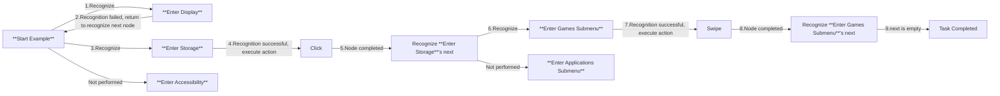
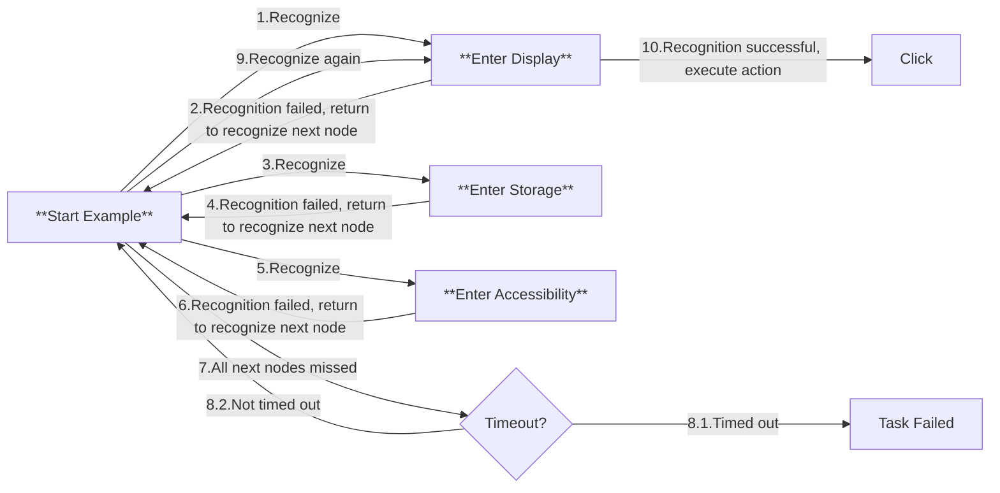
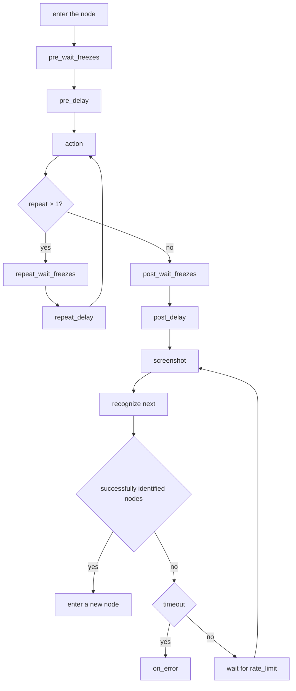
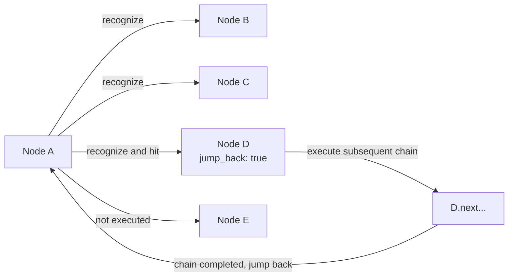

# 3.1 Pipeline Protocol

## Basic Format

The task pipeline is described using JSON format and consists of several nodes. Each node contains the following core attributes:

```jsonc
{
    "NodeA": {
        "recognition": "OCR",    // Recognition algorithm
        "action": "Click",       // Action to be executed
        "next": [                // List of subsequent nodes
            "NodeB",
            "NodeC"
        ],
        // Other extended properties...
    },
    // Other node definitions...
}
```

## Execution Logic

### Process Control Mechanism

1. **Task Triggering**

   - Start the task by specifying the entry node through the `tasker.post_task` interface

2. **Sequential Detection:**

   - Perform sequential detection on the current node's `next` list
   - Attempt to identify the recognition features configured for each sub-node in sequence

3. **Interruption Mechanism:**

   - When a sub-node is successfully matched, immediately terminate subsequent node detections
   - Execute the operation defined by the matched node's `action`

4. **Successor Processing:**

   - After the operation is completed, switch the active node to the current node
   - Repeat the above detection process

### Termination Conditions

The task process terminates when any of the following conditions are met:

- The current node's `next` list is empty
- All subsequent node detections continuously fail until timeout

## Application Examples

### Scenario Description

There are menus `Display`/`Storage`/`Accessibility` in the Android settings interface, among which `Storage` contains the submenus `Games`/`Apps` after opening.

### Configuration Example

```jsonc
{
    "Start Example": {
        "next": [
            "Enter Display",
            "Enter Storage",
            "Enter Accessibility"
        ]
    },
    "Enter Display": {
        "recognition": "XXX",
        "action": "Click",
        // ...
    },
    "Enter Storage": {
        "recognition": "XXX",
        "action": "Click",
        "next": [
            "Enter Games Submenu",
            "Enter Applications Submenu"
        ]
    },
    "Enter Accessibility": {
        // ...
    },
    "Enter Games Submenu": {
        "action": "Swipe",
        "next": []
    },
    "Enter Applications Submenu": {
        // ...
    },
    // ...
}
```

### Execution Process Simulation

#### Case 1



#### Case 2



## Property Fields

> [!TIP]
> **For mandatory fields, they may remain empty in the Pipeline JSON file, but must be set via the interface before actual execution.**  
> Folders and JSON files that begin with a dot (`.`) will not be read.  
> JSON root fields that begin with a `$` will not be parsed.

### Pipeline v1

- `recognition`: *string*  
    Recognition algorithm type. Optional, default is [`DirectHit`](#directhit).  
    Possible values: [`DirectHit`](#directhit) | [`TemplateMatch`](#templatematch) | [`FeatureMatch`](#featurematch) | [`ColorMatch`](#colormatch) | [`OCR`](#ocr) | [`NeuralNetworkClassify`](#neuralnetworkclassify) | [`NeuralNetworkDetect`](#neuralnetworkdetect) | [`And`](#and) | [`Or`](#or) | [`Custom`](#custom)  
    See [Algorithm Types](#algorithm-types) for details.

- `action`: *string*  
    Action to execute. Optional, default is [`DoNothing`](#donothing).  
    Possible values: [`DoNothing`](#donothing) | [`Click`](#click) | [`LongPress`](#longpress) | [`Swipe`](#swipe) | [`MultiSwipe`](#multiswipe) | [`Scroll`](#scroll) | [`ClickKey`](#clickkey) | [`LongPressKey`](#longpresskey) | [`InputText`](#inputtext) | [`StartApp`](#startapp) | [`StopApp`](#stopapp) | [`StopTask`](#stoptask) | [`Command`](#command) | [`Shell`](#shell) | [`Custom`](#custom-1)  
    See [Action Types](#action-types) for details.

- `next` : *string* | *NodeAttr* | *list<string | NodeAttr, >*  
    List of nodes to execute next. Optional, default is empty.  
    It recognizes each node in sequence and executes the first one it recognizes.  
    💡 Since v5.1, nodes with attributes, NodeAttr objects, or heterogeneous arrays combining both are supported. See [Node Attributes](#node-attributes) for details.

- `is_sub`: *bool*  
    **(Deprecated in version 5.1, use `[JumpBack]` in [Node Attributes](#node-attributes) instead)**  
    We provide [a migration script](https://github.com/MaaXYZ/MaaFramework/blob/main/tools/migrate_pipeline_v5.py) to help you automatically convert your pipeline to the new style without loss of quality.

- `interrupt` : *string* | *list<string, >*  
    **(Deprecated in version 5.1, use `[JumpBack]` in [Node Attributes](#node-attributes) instead)**  
    We provide [a migration script](https://github.com/MaaXYZ/MaaFramework/blob/main/tools/migrate_pipeline_v5.py) to help you automatically convert your pipeline to the new style without loss of quality.

- `rate_limit`: *uint*  
    Identification rate limit, in milliseconds. Optional, default 1000.  
    Each round of identification consumes at least `rate_limit` milliseconds, and sleep will wait if the time is less than that.

- `timeout`: *uint*  
    Timeout for recognizing nodes, in milliseconds. Optional, Default is 20,000 milliseconds (20 seconds).  
    The detailed logic is `while(!timeout) { foreach(next); sleep_until(rate_limit); }`

- `on_error` : *string* | *NodeAttr* | *list<string | NodeAttr, >*  
    When recognition timeout or the action fails to execute, the nodes in this list will be executed next. Optional, empty by default.  
    💡 Since v5.1, nodes with attributes, NodeAttr objects, or heterogeneous arrays combining both are supported. See [Node Attributes](#node-attributes) for details.

- `anchor`: *string* | *list<string, >*  
    Anchor name. Optional, default is empty.  
    When the node executes successfully, this anchor name will be set to the current node. Multiple nodes can set the same anchor name, with later executions overwriting earlier ones.  
    In `next` or `on_error`, you can reference this anchor using the `[Anchor]` attribute, which resolves at runtime to the last node that set this anchor.  
    See [Node Attributes](#node-attributes) for details.

- `inverse`: *bool*  
    Reverse the recognition result: recognized as not recognized, and not recognized as recognized. Optional, default is false.  
    Please note that nodes recognized through this setting will have their own clicking actions disabled (because nothing was actually recognized). If there is a need, you can set the `target` separately.

- `enabled`: *bool*  
    Whether to enable this node. Optional, default is true.  
    If set to false, this node will be skipped when it appears in the "next" lists of other nodes, meaning it won't be recognized or executed.

- `max_hit`: *uint*  
    The maximum number of times this node can be recognized successfully. Optional, default is UINT_MAX (unlimited).  
    If this count is exceeded, this node will be skipped when it appears in the "next" lists of other nodes, meaning it won't be recognized or executed.

- `pre_delay`: *uint*  
    Delay in milliseconds between recognizing a node and executing the action. Optional, default is 200 milliseconds.  
    It is recommended to add intermediate nodes whenever possible and use less delay to maintain both speed and stability.

- `post_delay`: *uint*  
    Delay in milliseconds between executing the action and recognizing the "next" nodes. Optional, default is 200 milliseconds.  
    It is recommended to add intermediate nodes whenever possible and use less delay to maintain both speed and stability.

- `pre_wait_freezes`: *uint* | *object*  
    Time in milliseconds to wait for the screen to stop changing between recognizing a node and executing the action. Optional, default is 0 (no waiting).  
    It will exit the action only when the screen has not had significant changes for "pre_wait_freezes" milliseconds in a row.  
    If it's an object, more parameters can be set, see [Waiting for the Screen to Stabilize](#waiting-for-the-screen-to-stabilize) for details. The specific order is `pre_wait_freezes` - `pre_delay` - `action` - `post_wait_freezes` - `post_delay`.

- `post_wait_freezes`: *uint* | *object*  
    Time in milliseconds to wait for the screen to stop changing between executing the action and recognizing the "next" nodes. Optional, default is 0 (no waiting).  
    Other logic is the same as `pre_wait_freezes`.

- `repeat`: *uint*  
    Number of times to repeat the action. Optional, default is 1 (no repeat).  
    The execution flow is `action` - [`repeat_wait_freezes` - `repeat_delay` - `action`] × (repeat-1).

- `repeat_delay`: *uint*  
    Delay between each repeated action in milliseconds. Optional, default is 0.  
    Only effective when `repeat` > 1, waits before the second and subsequent action executions.

- `repeat_wait_freezes`: *uint* | *object*  
    Time in milliseconds to wait for the screen to stop changing between each repeated action. Optional, default is 0 (no waiting).  
    Only effective when `repeat` > 1, waits for the screen to stabilize before the second and subsequent action executions.  
    If it's an object, more parameters can be set, see [Waiting for the Screen to Stabilize](#waiting-for-the-screen-to-stabilize) for details.

- `focus`: *any*  
    Focus on the node, resulting in additional callback messages. Optional, default is null (no messages).  
    See [Node Notifications](#node-notifications) for details.

- `attach`: *object*  
    Additional JSON object for storing additional node configuration. Optional, default is an empty object.  
    This field can be used to store custom configuration information that does not affect the node's execution logic but can be retrieved through related interfaces.  
    **Note**: This field will be merged with the `attach` in the default value using dict merge, not overwritten. That is, the `attach` in the node will be merged with the `attach` in the default value, where values with the same keys will be overwritten by the node's values, but other keys will be preserved.

The lifecycle of a node is as follows:



### Pipeline v2

> [!NOTE]
> MaaFW supports Pipeline v2 protocol since version v4.4.0, and is compatible with v1.

Compared with v1, the main difference is that the fields related to `recognition` and `action` are put into the secondary dictionary (the type is put into the `type` field, and the other parameters are put into the `param` field), and the rest are the same. Example:

```jsonc
{
    "NodeA": {
        "recognition": {
            "type": "TemplateMatch",
            "param": {
                // Recognition related fields are placed in recognition.param, and the keys and values ​​remain unchanged from v1
                "template": "A.png",
                "roi": [100, 100, 10, 10]
            }
        },
        "action": {
            "type": "Click",
            "param": {
                // Action related fields are placed in action.param, and the keys and values ​​remain unchanged from v1
                "target": "XXX"
            }
        },
        // Non-recognition and action fields remain unchanged from v1
        "next": ["NodeB"],
        "pre_delay": 1000,
        // ...
    }
}
```

### Default Properties

Please refer to [`default_pipeline.json`](https://github.com/MaaXYZ/MaaFramework/blob/main/sample/resource/default_pipeline.json)

`default_pipeline.json` is used to set default parameters for all nodes and specific algorithm/action types, reducing redundant configuration. This file is automatically loaded during resource loading, and the configurations within serve as baseline defaults inherited by all nodes.

#### Configuration Structure

```jsonc
{
    "Default": {
        // Default values for common fields, applicable to all nodes
        "rate_limit": 1000,
        "timeout": 20000,
        "pre_delay": 200
    },
    "TemplateMatch": {
        // Default parameters for TemplateMatch algorithm
        // Can use v1 or v2 format
        "recognition": "TemplateMatch",  // v1 format: directly in root object
        "threshold": 0.7
        // Or use v2 format:
        // "recognition": { "type": "TemplateMatch", "param": { "threshold": 0.7 } }
    },
    "Click": {
        // Default parameters for Click action
        "action": "Click",  // v1 format
        "target": true
        // Or use v2 format:
        // "action": { "type": "Click", "param": { "target": true } }
    }
}
```

#### Field Description

- `Default` object: Can set default values for all common Pipeline fields (such as `rate_limit`, `timeout`, `pre_delay`, `post_delay`, etc.)
- **Algorithm name objects** (e.g., `TemplateMatch`, `OCR`, `FeatureMatch`): Can set default parameters for the corresponding recognition algorithm type
- **Action name objects** (e.g., `Click`, `Swipe`, `StartApp`): Can set default parameters for the corresponding action type

#### Inheritance Priority

Parameter priority from highest to lowest:

1. Parameters directly defined in the node
2. Default parameters for the corresponding algorithm/action type in `default_pipeline.json`
3. Default parameters in the `Default` object of `default_pipeline.json`
4. Built-in default values in the framework

#### Usage Example

Assuming `default_pipeline.json` is configured as follows:

```jsonc
{
    "Default": {
        "rate_limit": 2000
    },
    "TemplateMatch": {
        "recognition": "TemplateMatch",
        "threshold": 0.7
    }
}
```

In Pipeline JSON:

```jsonc
{
    "NodeA": {
        "recognition": "TemplateMatch",
        "template": "A.png"
        // rate_limit will inherit 2000 from Default
        // threshold will inherit 0.7 from TemplateMatch
    },
    "NodeB": {
        "recognition": "TemplateMatch",
        "template": "B.png",
        "threshold": 0.9,  // Override default value
        "rate_limit": 1000 // Override default value
    }
}
```

#### Notes

- `default_pipeline.json` should be placed in the root directory of the resource bundle (Bundle), at the same level as the `pipeline` folder
- The key names for algorithm/action objects must exactly match the corresponding algorithm/action type names (e.g., `TemplateMatch`, `OCR`, `Click`), case-sensitive
- The `attach` field will be dictionary merged (dict merge) rather than overwritten, meaning the node's `attach` will merge with the default `attach`
- If you don't need a certain default configuration, simply set it explicitly to another value in the node to override

#### Multiple Bundle Loading Behavior

When loading multiple Bundles sequentially:

- Their `default_pipeline.json` files are merged (dict merge) in order, with later-loaded fields overriding earlier ones
- **Already-loaded nodes are NOT affected by subsequent Bundle's `default_pipeline.json`**
- Each node uses the merged defaults at the time of its first loading, and remains unchanged thereafter

**Example:** `Bundle_Base` → `Bundle_Debug`

```jsonc
// Bundle_Base/default_pipeline.json
{ "Default": { "rate_limit": 2000 } }

// Bundle_Base/pipeline/main.json
{ "NodeA": { "recognition": "OCR" } }  // Uses rate_limit: 2000

// Bundle_Debug/default_pipeline.json  
{ "Default": { "rate_limit": 100 } }   // Overrides defaults

// Bundle_Debug/pipeline/debug.json
{ "NodeB": { "recognition": "OCR" } }  // Uses rate_limit: 100
```

After loading, `NodeA` keeps `rate_limit: 2000`, `NodeB` uses `rate_limit: 100`.

#### Best Practice: Separating Special Configurations

Organize nodes with special configurations into a separate Bundle with dedicated `default_pipeline.json` to achieve configuration isolation.

**Example:** Separate debug nodes into an independent Bundle

```cpp
MaaResourcePostPath(resource, "resource/base");   // base nodes use rate_limit: 2000
MaaResourcePostPath(resource, "resource/debug");  // debug nodes use rate_limit: 100
```

Since already-loaded nodes are not affected by subsequent defaults, `base` Bundle nodes retain their original configuration while `debug` Bundle nodes use the new defaults.

## Algorithm Types

### `DirectHit`

Direct hit, meaning no recognition is performed, and the action is executed directly.

### `TemplateMatch`

Template matching, also known as "find image."

This algorithm property requires additional fields:

- `roi`: *array<int, 4>* | *string*  
    Recognition area coordinates. Optional, default [0, 0, 0, 0], i.e. full screen.
  - *array<int, 4>*: Recognition area coordinates, [x, y, w, h], if you want full screen, you can set it to [0, 0, 0, 0].
  - *string*: Fill in the node name, and identify within the target range identified by a previously executed node.

- `roi_offset`: *array<int, 4>*  
    Move additionally based on `roi` as the range, and add the four values ​​separately. Optional, default [0, 0, 0, 0].

- `template`: *string* | *list<string, >*  
    Path to the template image, relative to the "image" folder. Required.
    The images used need to be cropped from the lossless original image and scaled to 720p. Reference to [here](1.1-QuickStarted.md#image-files).  
    Supports filling in folder paths, and all image files in them will be recursively loaded.

- `threshold`: *double* | *list<double, >*  
    Template matching threshold. Optional, default is 0.7.  
    If it's an array, its length should match the length of the `template` array.

- `order_by`: *string*  
    How the results are sorted. Optional, default is [`Horizontal`](#horizontal).  
    Possible values: [`Horizontal`](#horizontal) | [`Vertical`](#vertical) | [`Score`](#score) | [`Random`](#random).  
    You can use it with the `index` field.

- `index`: *int*  
    Index to hit. Optional, default is `0`.  
    If there are N results in total, the value range of `index` is [-N, N - 1], where negative numbers are converted to N - index using Python-like rules. If it exceeds the range, it is considered that there is no result in the current identification.

- `method`: *int*  
    Template matching algorithm, equivalent to cv::TemplateMatchModes. Optional, default is 5.  
    For more details, refer to the [OpenCV official documentation](https://docs.opencv.org/4.x/df/dfb/group__imgproc__object.html).  
    *10001 is the inverted version of TM_SQDIFF_NORMED, where higher scores indicate better matches (opposite to the original).*

    | method | Algorithm Name | Speed | Color Sensitivity | Lighting Robustness | Use Case |
    |--------|----------------|-------|-------------------|---------------------|----------|
    | 10001 | TM_SQDIFF_NORMED (Inverted) | Fast | Sensitive | Poor | Precise matching, easy threshold setting |
    | 3 | TM_CCORR_NORMED | Medium | Sensitive | Medium | Works well with bright templates |
    | 5 | TM_CCOEFF_NORMED | Slower | Insensitive | Good | **Recommended**, easy threshold setting |

- `green_mask`: *bool*  
    Whether to apply a green mask. Optional, default is false.  
    If set to true, you can paint the unwanted parts in the image green with RGB: (0, 255, 0), and those green parts won't be matched.  
    Note: The algorithm itself has strong robustness, so this feature is usually unnecessary for normal background variations. If you do need to use it, only mask the interfering areas and avoid excessive masking that could cause loss of main subject edge features.

### `FeatureMatch`

Feature matching, a more powerful "find image" with better generalization, resistant to perspective and size changes.

This algorithm property requires additional fields:

- `roi`: *array<int, 4>* | *string*  
    Same as `TemplateMatch`.`roi`.

- `roi_offset`: *array<int, 4>*  
    Same as `TemplateMatch`.`roi_offset`.

- `template`: *string* | *list<string, >*  
    Path to the template image, relative to the "image" folder. Required.  
    Supports filling in folder paths, and all image files in them will be recursively loaded.  
    Notes:
  - Template images should not be too small; at least 64x64 pixels is recommended. Otherwise, too few feature points may cause matching failures or false matches.
  - Templates should contain sufficient texture details (such as edges and corners); solid color or gradient areas have sparse feature points.
  - Avoid templates with large amounts of repetitive textures (such as grids or stripes), which may cause feature point matching confusion.

- `count`: *uint*  
    The minimum number of matching feature points required (threshold). Optional, default is 4.

- `order_by`: *string*  
    How the results are sorted. Optional, default is [`Horizontal`](#horizontal).  
    Possible values: [`Horizontal`](#horizontal) | [`Vertical`](#vertical) | [`Score`](#score) | [`Area`](#area) | [`Random`](#random).
    You can use it with the `index` field.

- `index`: *int*  
    Index to hit. Optional, default is `0`.  
    If there are N results in total, the value range of `index` is [-N, N - 1], where negative numbers are converted to N - index using Python-like rules. If it exceeds the range, it is considered that there is no result in the current identification.

- `green_mask`: *bool*  
    Whether to apply a green mask. Optional, default is false.  
    If set to true, you can paint the unwanted parts in the image green with RGB: (0, 255, 0), and those green parts won't be matched.  
    Note: The algorithm itself has strong robustness, so this feature is usually unnecessary for normal background variations. If you do need to use it, only mask the interfering areas and avoid excessive masking that could cause loss of main subject edge features.

- `detector`: *string*  
    Feature detector. Optional, default is `SIFT`.  

    | Detector | Speed | Scale Invariance | Rotation Invariance | Accuracy | Use Case |
    |----------|-------|------------------|---------------------|----------|----------|
    | SIFT | Slow | Yes | Yes | Highest | **Recommended**, high accuracy requirements |
    | KAZE | Slower | Yes | Yes | High | 2D/3D images, good edge preservation |
    | AKAZE | Medium | Yes | Yes | Good | Balance between speed and accuracy |
    | BRISK | Fast | Yes | Yes | Medium | Real-time requirements |
    | ORB | Fastest | **No** | Yes | Lower | Use when template and target have same scale |

- `ratio`: *double*  
    The distance ratio for KNN matching, [0 - 1.0], where larger values make the matching more lenient (easier to connect). Optional, default is 0.6.

### `ColorMatch`

Color matching, also known as "find color."

This algorithm property requires additional fields:

- `roi`: *array<int, 4>* | *string*  
    Same as `TemplateMatch`.`roi`.

- `roi_offset`: *array<int, 4>*  
    Same as `TemplateMatch`.`roi_offset`.

- `method`: *int*  
    Color matching method, equivalent to cv::ColorConversionCodes. Optional, default is 4 (RGB).  
    Common values are 4 (RGB, 3 channels), 40 (HSV, 3 channels), and 6 (GRAY, 1 channel).  
    For more details, refer to the [OpenCV official documentation](https://docs.opencv.org/4.x/d8/d01/group__imgproc__color__conversions.html).

- `lower`: *list<int, >* | *list<list<int, >>*  
    Lower bound for colors. Required. The innermost list length should match the number of channels in the `method`.

- `upper`: *list<int, >* | *list<list<int, >>*  
    Upper bound for colors. Required. The innermost list length should match the number of channels in the `method`.

- `count`: *uint*  
    The minimum number of matching pixels required (threshold). Optional, default is 1.

- `order_by`: *string*  
    How the results are sorted. Optional, default is [`Horizontal`](#horizontal).  
    Possible values: [`Horizontal`](#horizontal) | [`Vertical`](#vertical) | [`Score`](#score) | [`Area`](#area) | [`Random`](#random).  
    You can use it with the `index` field.

- `index`: *int*  
    Index to hit. Optional, default is `0`.  
    If there are N results in total, the value range of `index` is [-N, N - 1], where negative numbers are converted to N - index using Python-like rules. If it exceeds the range, it is considered that there is no result in the current identification.

- `connected`: *bool*  
    Whether to count only connected points. Optional, default is false.  
    If set to true, after applying color filtering, it will only count the maximum connected block of pixels.
    If set to false, it won't consider whether these pixels are connected.

### `OCR`

Text recognition.

This algorithm property requires additional fields:

- `roi`: *array<int, 4>* | *string*  
    Same as `TemplateMatch`.`roi`.

- `roi_offset`: *array<int, 4>*  
    Same as `TemplateMatch`.`roi_offset`.

- `expected`: *string* | *list<string, >*  
    The expected results, supports regular expressions. Optional, default matches all.

- `threshold`: *double*  
    Model confidence threshold. Optional, default is 0.3.  

- `replace`: *array<string, 2>* | *list<array<string, 2>>*  
    Some text recognition results may not be accurate, so replacements are performed. Optional.

- `order_by`: *string*  
    How the results are sorted. Optional, default is [`Horizontal`](#horizontal).  
    Possible values: [`Horizontal`](#horizontal) | [`Vertical`](#vertical) | [`Area`](#area) | [`Length`](#length) | [`Random`](#random) | [`Expected`](#expected).  
    You can use it with the `index` field.

- `index`: *int*  
    Index to hit. Optional, default is `0`.  
    If there are N results in total, the value range of `index` is [-N, N - 1], where negative numbers are converted to N - index using Python-like rules. If it exceeds the range, it is considered that there is no result in the current identification.

- `only_rec`: *bool*  
    Whether to recognize only (without detection, requires precise `roi`). Optional, default is false.

- `model`: *string*  
    Model **folder** path. Use a relative path to the "model/ocr" folder. Optional, default is empty.  
    If empty, it will use the models in the root of the "model/ocr" folder. The folder should include three files: `rec.onnx`, `det.onnx`, and `keys.txt`.

### `NeuralNetworkClassify`

Deep learning classification, to determine if the image in a **fixed position** matches the expected "category."

This algorithm property requires additional fields:

- `roi`: *array<int, 4>* | *string*  
    Same as `TemplateMatch`.`roi`.

- `roi_offset`: *array<int, 4>*  
    Same as `TemplateMatch`.`roi_offset`.

- `labels`: *list<string, >*  
    Labels, meaning the names of each category. Optional.  
    It only affects debugging images and logs. If not filled, it will be filled with "Unknown."

- `model`: *string*  
    Model file path. Use a relative path to the "model/classify" folder. Required.  
    Currently, only ONNX models are supported. Refer to [NNClassify Recipe](https://github.com/MaaXYZ/MaaNeuralNetworkCookbook/tree/main/NeuralNetworkClassify).

- `expected`: *int* | *list<int, >*  
    The expected category index. Optional, default matches all.

- `order_by`: *string*  
    How the results are sorted. Optional, default is [`Horizontal`](#horizontal).  
    Possible values: [`Horizontal`](#horizontal) | [`Vertical`](#vertical) | [`Score`](#score) | [`Random`](#random) | [`Expected`](#expected).  
    You can use it with the `index` field.

- `index`: *int*  
    Index to hit. Optional, default is `0`.  
    If there are N results in total, the value range of `index` is [-N, N - 1], where negative numbers are converted to N - index using Python-like rules. If it exceeds the range, it is considered that there is no result in the current identification.

For example, if you want to recognize whether a cat or a mouse appears in a **fixed position** in the image, and you've trained a model that supports this three-category classification, and you want to click when it recognizes a cat or a mouse but not when it recognizes a dog, the relevant fields would be:

```jsonc
{
    "labels": ["Cat", "Dog", "Mouse"],
    "expected": [0, 2]
}
```

Please note that these values should match the actual model output.

### `NeuralNetworkDetect`

Deep learning object detection, an advanced version of "find image."

The main difference from classification is the flexibility to find objects at arbitrary positions. However, this often requires more complex models, more training data, longer training times, and significantly higher resource usage during inference.

This algorithm property requires additional fields:

- `roi`: *array<int, 4>* | *string*  
    Same as `TemplateMatch`.`roi`.

- `roi_offset`: *array<int, 4>*  
    Same as `TemplateMatch`.`roi_offset`.

- `labels`: *list<string, >*  
    Labels, meaning the names of each category. Optional.  
    It only affects debugging images and logs. If not filled, it will be automatically read from the model metadata (supports reading from `names`, `name`, `labels`, `class_names` fields), generally no need to set manually. If the model metadata also doesn't contain labels, it will be filled with "Unknown."

- `model`: *string*  
    Model file path. Use a relative path to the "model/detect" folder. Required.  
    Currently supports ONNX models exported from YOLOv8 and YOLOv11. Other Yolo models with the same input/output should theoretically be supported but are untested.  
    Training reference: [NNDetect Recipe](https://github.com/MaaXYZ/MaaNeuralNetworkCookbook/tree/main/NeuralNetworkDetect).

- `expected`: *int* | *list<int, >*  
    The expected category index.

- `threshold`: *double* | *list<double, >*  
    Model confidence threshold. Optional, default is 0.3.  
    If it's an array, its length should match the length of the `expected` array.

- `order_by`: *string*  
    How the results are sorted. Optional, default is [`Horizontal`](#horizontal).  
    Possible values: [`Horizontal`](#horizontal) | [`Vertical`](#vertical) | [`Score`](#score) | [`Area`](#area) | [`Random`](#random) | [`Expected`](#expected).  
    You can use it with the `index` field.  

- `index`: *int*  
    Index to hit. Optional, default is `0`.  
    If there are N results in total, the value range of `index` is [-N, N - 1], where negative numbers are converted to N - index using Python-like rules. If it exceeds the range, it is considered that there is no result in the current identification.

For example, if you want to detect cats, dogs, and mice in an image and only click when a cat or a mouse is detected but not when a dog is detected, the relevant fields would be:

```jsonc
{
    "labels": ["Cat", "Dog", "Mouse"],
    "expected": [0, 2]
}
```

Please note that these values should match the actual model output.

### `And`

Composite recognition (logical AND). All sub-recognitions must succeed for the node to be recognized.

This algorithm property requires additional fields:

- `all_of`: *list<object, >*  
    Sub-recognitions array. All sub-recognitions must succeed for the node to be recognized. Required.  
    Each element uses the same recognition object format as normal nodes (supports both v1 and v2 forms, and they can be mixed).

- `box_index`: *int*  
    Selects which sub-recognition's result box will be used as the overall recognition box. Optional, default is `0`.  
    Must satisfy `0 <= box_index < all_of.length`.

- `sub_name`: *string*  
    Optional alias for a sub-recognition element.  
    Later sub-recognitions can use `roi: sub_name` to reference the `filtered` boxes of a previous sub-recognition.  
    Available only within the current node.

Example:

```jsonc
{
    "NodeA": {
        "recognition": "And",
        "all_of": [
            {
                "sub_name": "icon",
                "recognition": "TemplateMatch",
                "template": "storage_icon.png",
                "threshold": 0.7
            },
            {
                "recognition": "OCR",
                "roi": "icon",
                "roi_offset": [0, 0, 100, 100],
                "expected": "Storage"
            }
        ],
        "box_index": 0
    }
}
```

For Pipeline v2, put these fields in `recognition.param` as usual.

### `Or`

Composite recognition (logical OR). Recognition succeeds when the first sub-recognition matches, subsequent ones are not executed.

This algorithm property requires additional fields:

- `any_of`: *list<object, >*  
    Sub-recognitions array. Recognition succeeds when the first sub-recognition matches, subsequent ones are not executed. Required.  
    Each element uses the same recognition object format as normal nodes (supports both v1 and v2 forms, and they can be mixed).

Example:

```jsonc
{
    "NodeB": {
        "recognition": "Or",
        "any_of": [
            {
                "recognition": "TemplateMatch",
                "template": "confirm.png"
            },
            {
                "recognition": "OCR",
                "expected": ["OK", "Confirm"]
            }
        ]
    }
}
```

For Pipeline v2, put these fields in `recognition.param` as usual.

### `Custom`

Execute the recognition handle passed in through the `MaaResourceRegisterCustomRecognition` interface

This algorithm property requires additional fields:

- `custom_recognition`: *string*  
    Recognition name, same as the one passed in through the registration interface. It will also be passed through `MaaCustomRecognitionCallback`.`custom_recognition_name`. Required.

- `custom_recognition_param`: *any*  
    Recognition parameter, any type, will be passed through `MaaCustomRecognitionCallback`.`custom_recognition_param`. Optional, default `null`.

- `roi`: *array<int, 4>* | *string*  
    Same as `TemplateMatch`.`roi`, will be passed through `MaaCustomRecognitionCallback`.`roi`. Optional, default [0, 0, 0, 0].

- `roi_offset`: *array<int, 4>*  
    Same as `TemplateMatch`.`roi_offset`.

## Action Types

### `DoNothing`

Does nothing.

### `Click`

Clicks.

Additional properties for this action:

- `target`: *true* | *string* | *array<int, 2>* | *array<int, 4>*  
    The position of the click target. Optional, default is true.  
  - *true*: The target is the position just recognized in this node (i.e., itself).
  - *string*: Enter the node name, as the target, to use the position recognized by a previously executed node.
  - *array<int, 2>*: Fixed coordinate point `[x, y]`.
  - *array<int, 4>*: Fixed coordinate area `[x, y, w, h]`. A point is sampled inside the rectangle with higher probability near the center and lower probability near the edges. To target the entire screen, set it to [0, 0, 0, 0].

- `target_offset`: *array<int, 4>*  
    Additional movement from the `target` before clicking, where the four values are added together. Optional, default is [0, 0, 0, 0].

- `contact`: *uint*  
    Contact id used to distinguish different touch points. Optional, default `0`.  
  - Adb Controller: Finger id (0 for first finger, 1 for second finger, etc.)
  - Win32 Controller: Mouse button id (0 for left, 1 for right, 2 for middle, 3 for XBUTTON1, 4 for XBUTTON2)

### `LongPress`

Long press。  

Additional properties for this action:

- `target`: *true* | *string* | *array<int, 2>* | *array<int, 4>*  
    The position of the long press target. Optional, default is true. The values are the same as `Click`.`target`.

- `target_offset`: *array<int, 4>*  
    Additional movement from the `target` before long pressing, where the four values are added together. Optional, default is [0, 0, 0, 0].

- `duration`: *uint*  
    Duration of the long press in milliseconds. Optional, default is 1000.

- `contact`: *uint*  
    Contact id used to distinguish different touch points. Optional, default `0`.  
  - Adb Controller: Finger id (0 for first finger, 1 for second finger, etc.)
  - Win32 Controller: Mouse button id (0 for left, 1 for right, 2 for middle, 3 for XBUTTON1, 4 for XBUTTON2)

### `Swipe`

Linear swipe.

Additional properties for this action:

- `begin`: *true* | *string* | *array<int, 2>* | *array<int, 4>*  
    The starting point of the swipe. Optional, default is true. The values are the same as `Click`.`target`.

- `begin_offset`: *array<int, 4>*  
    Additional movement from the `begin` before swiping, where the four values are added together. Optional, default is [0, 0, 0, 0].

- `end`: *true* | *string* | *array<int, 2>* | *array<int, 4>* | *list<true | string | array<int, 2> | array<int, 4>>*  
    The end point of the swipe. Optional, default is true. The values are the same as `Click`.`target`.  
    💡 v4.5.x version adds support for *list*, which can be used to add swipe waypoints! Unlike multiple swipes, multiple ends will not lift between them, i.e., a single polyline swipe.

- `end_offset`: *array<int, 4>* | *list<array<int, 4>>*  
    Additional movement from the `end` before swiping, where the four values are added together. Optional, default is [0, 0, 0, 0].

- `duration`: *uint* | *list<uint,>*  
    Duration of the swipe in milliseconds. Optional, default is 200.

- `end_hold`: *uint* | *list<uint,>*  
    After swiping to the end point, wait for an additional time before lifting, in ms. Optional, default 0.

- `only_hover`: *bool*  
    Only move the mouse cursor, no press/release action. Optional, default false.

- `contact`: *uint*  
    Contact id used to distinguish different touch points. Optional, default `0`.  
  - Adb Controller: Finger id (0 for first finger, 1 for second finger, etc.)
  - Win32 Controller: Mouse button id (0 for left, 1 for right, 2 for middle, 3 for XBUTTON1, 4 for XBUTTON2)

### `MultiSwipe`

Multi-finger linear swipe.

Additional properties for this action:

- `swipes`: *list<object,>*  
    Multi swipe array. Required.  
    The order of the array elements has no effect, only based on `starting`.

  - `starting`: *uint*  
      Swipe start time, in milliseconds. Optional, default 0.  
      `MultiSwipe` additional field, the swipe will start pressing at the `starting` millisecond in this action.

  - `begin`: *true* | *string* | *array<int, 2>* | *array<int, 4>*  
      The starting point of the swipe. Optional, default is true. The values are the same as `Click`.`target`.

  - `begin_offset`: *array<int, 4>*  
      Additional movement from the `begin` before swiping, where the four values are added together. Optional, default is [0, 0, 0, 0].

  - `end`: *true* | *string* | *array<int, 2>* | *array<int, 4>* | *list<true | string | array<int, 2> | array<int, 4>>*  
      The end point of the swipe. Optional, default is true. The values are the same as `Click`.`target`.  
      💡 v4.5.x version adds support for *list*, which can be used to add swipe waypoints! Unlike multiple swipes, multiple ends will not lift between them, i.e., a single polyline swipe.

  - `end_offset`: *array<int, 4>* | *list<array<int, 4>>*  
      Additional movement from the `end` before swiping, where the four values are added together. Optional, default is [0, 0, 0, 0].

  - `duration`: *uint* | *list<uint,>*  
      Duration of the swipe in milliseconds. Optional, default is 200.

  - `end_hold`: *uint* | *list<uint,>*  
      After swiping to the end point, wait for an additional time before lifting, in ms. Optional, default 0.

  - `only_hover`: *bool*  
      Only move the mouse cursor, no press/release action. Optional, default false.

  - `contact`: *uint*  
      Contact id used to distinguish different touch points. Optional, default `0`.  
    - Adb Controller: Finger id (0 for first finger, 1 for second finger, etc.)
    - Win32 Controller: Mouse button id (0 for left, 1 for right, 2 for middle, 3 for XBUTTON1, 4 for XBUTTON2)  
      **Note**: In `MultiSwipe`, if `contact` is 0, the index of the swipe in the array will be used as the contact id.

For example:

```jsonc
{
    "A": {
        "action": "MultiSwipe",
        "swipes": [
            {
                "begin": [],
                "end": []
            },
            {
                "starting": 500,
                "begin": [],
                "end": []
            }
        ]
    }
}
```

### `TouchDown`

Press a touch contact.

Additional properties for this action:

- `contact`: *uint*  
    Contact id used to distinguish different touch points. Optional, default `0`.  
  - Adb Controller: Finger id (0 for first finger, 1 for second finger, etc.)
  - Win32 Controller: Mouse button id (0 for left, 1 for right, 2 for middle, 3 for XBUTTON1, 4 for XBUTTON2)

- `target`: *true* | *string* | *array<int, 4>* | *array<int, 2>*  
    Touch target position. Optional, default `true`. Same semantics as `Click`.`target`.

- `target_offset`: *array<int, 4>*  
    Offset applied on top of `target`. Optional, default `[0, 0, 0, 0]`.

- `pressure`: *int*  
    Touch pressure. Optional, default `0`. The actual range depends on the controller implementation.

### `TouchMove`

Move an existing touch contact. Fields are identical to `TouchDown` and update the contact position.

### `TouchUp`

Release a touch contact.

- `contact`: *uint*  
    Contact id used to distinguish different touch points. Optional, default `0`.  
  - Adb Controller: Finger id (0 for first finger, 1 for second finger, etc.)
  - Win32 Controller: Mouse button id (0 for left, 1 for right, 2 for middle, 3 for XBUTTON1, 4 for XBUTTON2)

### `Scroll`

Mouse wheel scroll.

Additional properties for this action:

- `dx`: *int*  
    Horizontal scroll distance, positive values scroll right, negative values scroll left. Optional, default is 0.  

- `dy`: *int*  
    Vertical scroll distance, positive values scroll up, negative values scroll down. Optional, default is 0.  

> [!NOTE]
>
> - Adb Controller and PlayCover Controller do not support scroll operations. Only Win32 Controller is supported.
> - The `dx`/`dy` values are sent directly as scroll increments. The Windows standard wheel increment is 120 (WHEEL_DELTA) per notch. Using multiples of 120 is recommended for best compatibility.

### `ClickKey`

Click a key.

Additional properties for this action:

- `key`: *int* | *list<int, >*  
    The key(s) to click, supporting only virtual key code of corresponding controller. Required.

  - [Adb Controller](https://developer.android.com/reference/android/view/KeyEvent)
  - [Win32 Controller](https://learn.microsoft.com/en-us/windows/win32/inputdev/virtual-key-codes)

> [!NOTE]
>
> PlayCover Controller does not support key operations.

### `LongPressKey`

Long Press a key.

Additional properties for this action:

- `key`: *int* | *list<int, >*  
    The key to press, supporting only virtual key code of corresponding controller. Required.

- `duration`: *uint*  
    Duration of the long press in milliseconds. Optional, default is 1000.

### `KeyDown`

Press a key without releasing. Combine with `KeyUp` to customize key sequences.

Additional properties for this action:

- `key`: *int*  
    The key to press, supporting only virtual key code of corresponding controller. Required.

### `KeyUp`

Release a key. Typically follows a `KeyDown` to end the key press state.

Additional properties for this action:

- `key`: *int*  
    The key to release, supporting only virtual key code of corresponding controller. Required.

### `InputText`

Inputs text.

Additional properties for this action:

- `input_text`: *string*  
    The text to input; some controllers only support ASCII. Required.

> [!NOTE]
>
> PlayCover Controller does not support text input.

### `StartApp`

Starts an app.

Additional properties for this action:

- `package`: *string*  
    Launch entry. Required.  
    You need to enter the package name or activity, for example, `com.hypergryph.arknights` or `com.hypergryph.arknights/com.u8.sdk.U8UnityContext`.

> [!NOTE]
>
> PlayCover Controller does not support starting apps. You need to manually start the app in PlayCover.

### `StopApp`

Closes an app.

Additional properties for this action:

- `package`: *string*  
    The app to close. Required.  
    You need to enter the package name, for example, `com.hypergryph.arknights`.

### `StopTask`

Stops the current task chain (the individual task chain passed to MaaTaskerPostTask).

### `Command`

Execute a command.

This action attribute requires additional fields:

- `exec`: *string*  
    The path of the program to be executed. Required.

- `args`: *list<string,>*  
    The arguments to be executed. Optional.  
    supports runtime parameters replacement:

  - `{ENTRY}`: Entry name.
  - `{NODE}`: Node name.
  - `{IMAGE}`: The path to the file where the screenshot is saved. The file is deleted before the process exits. Please copy it by yourself if you want to save it permanently.
  - `{BOX}`: Identify the hit target, the format is `[x, y, w, h]`.
  - `{RESOURCE_DIR}`: The path of the resource folder loaded last time.
  - `{LIBRARY_DIR}`: The path of the folder where the MaaFW library is located.

- `detach`: *bool*  
    Detach the child process, that is, do not wait for the child process to complete, and continue directly to the next task. Optional, default false.

Example:

```jsonc
{
    "NodeA": {
        "action": "Command",
        "exec": "Python",
        "args": [
            "{RESOURCE_DIR}/my_script/test.py"
            "Haha",
            "{IMAGE}",
            "{NODE}",
            "{BOX}"
        ]
    },
    "NodeB": {
        "action": "Command",
        "exec": "{RESOURCE_DIR}/my_exec/my_exec.exe"
    }
}
```

The actual command is:

```bash
# NodeA
Python C:/MaaXXX/resource/my_script/test.py Haha C:/temp/123.png NodeA [0,0,0,0]

# NodeB
C:/MaaXXX/resource/my_exec/my_exec.exe
```

### `Shell`

Executes a shell command on an ADB device.

Additional properties for this action:

- `cmd`: *string*  
    The shell command to execute. Required.  
    For example, `getprop ro.build.version.sdk` or `settings put global animator_duration_scale 0`.

> Note: This action is only valid for ADB controllers. The command output can be retrieved via `MaaTaskerGetActionDetail` in the action detail.

### `Custom`

Execute the action handle passed in through the `MaaResourceRegisterCustomAction` interface

This action attribute requires additional fields:

- `custom_action`: *string*  
    Action name, same as the one passed in through the registration interface. It will also be passed through `MaaCustomActionCallback`.`custom_action_name`. Required.

- `custom_action_param`: *any*  
    Action parameter, any type, will be passed through `MaaCustomActionCallback`.`custom_action_param`. Optional, default `null`.

- `target`: *true* | *string* | *array<int, 2>* | *array<int, 4>*  
    The position of the target, which will be passed through `MaaCustomActionCallback`.`box`. Optional, default true. Same as `Click`.`target`.

- `target_offset`: *array<int, 4>*  
    Same as `Click`.`target_offset`.

## Node Attributes

Node Attributes allow you to specify additional behavioral control parameters for each node in `next` and `on_error` lists. Since v5.1, node attributes can be set using two syntax forms.

### Basic Syntax

By default, node lists contain only node names:

```jsonc
{
    "A": {
        "next": [
            "B",
            "C",
            "D"
        ]
    }
}
```

### Attribute Setting Methods

#### Object Form

Use a `NodeAttr` object to explicitly specify the node name and attributes:

```jsonc
{
    "A": {
        "next": [
            "B",
            {
                "name": "C",
                "jump_back": true
            },
            "D"
        ]
    }
}
```

#### Prefix Form

Use square bracket prefixes to specify attributes directly before the node name:

```jsonc
{
    "A": {
        "next": [
            "B",
            "[JumpBack]C",
            "D"
        ]
    }
}
```

Both forms are functionally equivalent. You can choose based on your preference. The two forms can be mixed within an array, creating a heterogeneous array.

### Available Attributes

#### `jump_back` / `[JumpBack]`

**Type**: *boolean*  
**Default**: `false`  
**Description**: Enables jump-back mechanism. When this node is recognized and matched, after all subsequent nodes in its chain have completed execution, the system will return to the parent node and continue attempting to recognize the parent node's `next` list.

**Execution Flow**:

1. The parent node recognizes nodes in the `next` list sequentially
2. If a node with `jump_back` attribute is recognized and matched, execute that node and its subsequent node chain
3. After the node chain completes execution, return to the parent node
4. The parent node continues recognition from the beginning of the `next` list

**Example**:

```jsonc
{
    "A": {
        "next": [
            "B",
            "C",
            "[JumpBack]D",
            "E"
        ]
    }
}
```

Execution flow:

- Node A attempts to recognize B, C, D, E in sequence
- If D is recognized and matched (assuming B and C are not), execute D and its subsequent node chain
- After D's node chain completes, return to node A
- Node A restarts recognition from B, continuing to attempt B, C, D, E

**Use Cases**:  
Suitable for exception handling scenarios, such as recognizing and handling network disconnection prompts, permission request dialogs, and other temporary interfaces. After handling, the original flow continues.

**Compatibility Note**:  
Similar to the deprecated `is_sub` field, but `jump_back` only applies to specific nodes in the current `next` list, rather than the entire node definition.



#### `anchor` / `[Anchor]`

**Type**: *boolean*  
**Default**: `false`  
**Description**: Enables anchor reference. When this attribute is true, the `name` field is treated as an anchor name rather than a node name, and resolves at runtime to the last node that set this anchor.

**Usage**:

1. First, set an anchor name in a node using the `anchor` field
2. Then, reference this anchor in `next` or `on_error` using `[Anchor]` or `anchor`

**Example**:

```jsonc
{
    "A": {
        "anchor": "X",
        "next": ["C"]
    },
    "B": {
        "anchor": "X",
        "next": ["C"]
    },
    "C": {
        "next": [
            "D",
            "[Anchor]X"
        ]
    }
}
```

Equivalent object form:

```jsonc
{
    "C": {
        "next": [
            "D",
            { "name": "X", "anchor": true }
        ]
    }
}
```

**Use Cases**:  
Suitable for scenarios requiring dynamic node references, such as when multiple nodes may handle the same type of event and you need to return to "the last node that handled this event" to continue execution.

### Future Extensions

More node attributes are planned and will be introduced in future versions.

## Result Sorting Methods

Recognition algorithms may return multiple results. Use the `order_by` field to specify the sorting method, combined with the `index` field to select a specific result.

### `Horizontal`

Sort horizontally (left to right, then top to bottom for same column).  
Sorting rule: Sort by x coordinate ascending first, then by y coordinate ascending when x is equal.

```txt
| 1 3 5 7 |
| 2 4 6 8 |
```

### `Vertical`

Sort vertically (top to bottom, then left to right for same row).  
Sorting rule: Sort by y coordinate ascending first, then by x coordinate ascending when y is equal.

```txt
| 1 2 3 4 |
| 5 6 7 8 |
```

### `Score`

Sort by matching score in descending order. Higher scores are ranked first.  
Suitable for scenarios where you want to prioritize the highest confidence result.

### `Area`

Sort by bounding box area in descending order. Larger areas are ranked first.  
Applicable to `FeatureMatch`, `ColorMatch`, `OCR`, and `NeuralNetworkDetect` algorithms.

### `Length`

Sort by recognized text length. Only applicable to `OCR` algorithm.  
Longer text results are ranked first.

### `Random`

Randomly shuffle the result order.  
Suitable for scenarios requiring random selection.

### `Expected`

Sort by the order specified in the `expected` field.  
For `OCR`, sort by the order of regex patterns in the `expected` list; results matching earlier patterns are ranked first.  
For `NeuralNetworkClassify` and `NeuralNetworkDetect`, sort by the order of class indices in the `expected` list.  
Results not matching any expected value are ranked last.

## Waiting for the Screen to Stabilize

Waits for the screen to stabilize. It exits the action only when there is no significant change in the screen for a certain continuous time.

The field value can be a uint or an object. For example:

```jsonc
{
    "NodeA": {
        "pre_wait_freezes": 500
    },
    "NodeB": {
        "post_wait_freezes": {
            // more properties ...
        }
    }
}
```

If the value is an object, you can set additional fields:

- `time`: *uint*  
    It exits the action only when there has been no significant change in the screen for "time" milliseconds in a row. Optional, default is 1.

- `target`: *true* | *string* | *array<int, 2>* | *array<int, 4>*  
    The position of the target to wait for. Optional, default is true. The values are the same as `Click`.`target`.

- `target_offset`: *array<int, 4>*  
    Additional movement from the `target` to be used as the waiting target, where the four values are added together. Optional, default is [0, 0, 0, 0].

- `threshold`: *double*  
    The template matching threshold to determine "no significant change." Optional, default is 0.95.

- `method`: *int*  
    The template matching algorithm to determine "no significant change," i.e., cv::TemplateMatchModes. Optional, default is 5. The same as `TemplateMatch`.`method`.

- `rate_limit`: *uint*  
    Identification rate limit, in milliseconds. Optional, default 1000.  
    Each identification consumes at least `rate_limit` milliseconds, and sleep will be executed if the time is less than that.

- `timeout`: *uint*  
    Timeout for recognizing, in milliseconds. Optional, default is 20,000 milliseconds (20 seconds).  

## Node Notifications

By configuring the `focus` field, you can have the UI display custom messages to users at specific stages of node execution.

### Configuration

Add a `focus` field to the node, where keys are message types and values are template strings to display. The template string supports file paths, URLs, or direct text, and the content supports Markdown format and internationalization (starting with $).  In the template, placeholders in the `{field_name}` format can be used, and the UI will automatically replace them with actual values.

```jsonc
{
  "NodeA": {
    "focus": {
      "Node.Recognition.Succeeded": "{name} recognition hit, ready to start execution",
      "Node.Action.Starting": "{name} starts execution, task ID: {task_id}"
    }
  }
}
```

### Available Message Types

| Message Type | Trigger | Available Placeholders |
| --- | --- | --- |
| `Node.Recognition.Starting` | Recognition starts | `task_id`, `reco_id`, `name` |
| `Node.Recognition.Succeeded` | Recognition succeeded | `task_id`, `reco_id`, `name` |
| `Node.Recognition.Failed` | Recognition failed | `task_id`, `reco_id`, `name` |
| `Node.Action.Starting` | Action starts | `task_id`, `action_id`, `name` |
| `Node.Action.Succeeded` | Action succeeded | `task_id`, `action_id`, `name` |
| `Node.Action.Failed` | Action failed | `task_id`, `action_id`, `name` |

### More Message Types

For a complete list of callback messages and detailed descriptions, please refer to [Callback Protocol](2.3-CallbackProtocol.md) and [MaaMsg.h](https://github.com/MaaXYZ/MaaFramework/blob/main/include/MaaFramework/MaaMsg.h).
