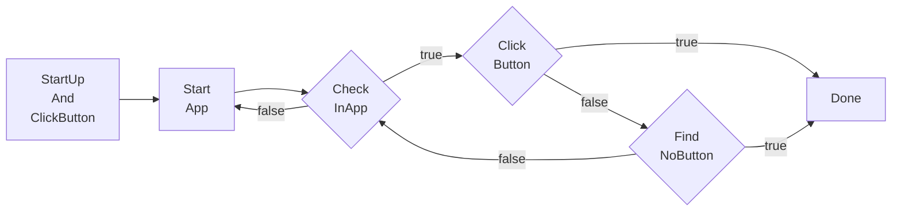
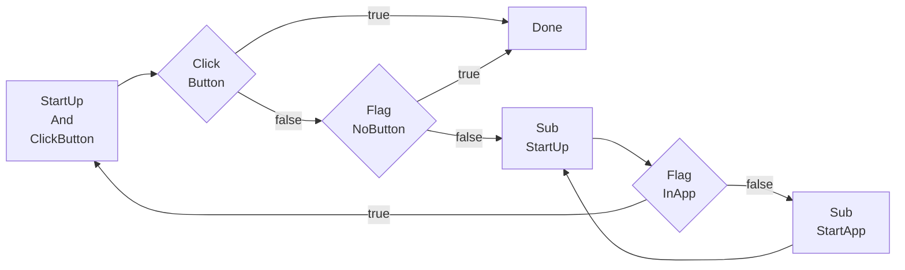

# Pipeline Protocol

## Overview

```jsonc
{
    "TaskA": {
        "next: [
            "TaskB",
            "TaskC"
        ]
        // properties ...
    },
    "TaskB": {
        // properties ...
    },
    // other task ...
}
```

When we execute a task (passing the task name to the MaaPostTask interface), it will recognize the tasks in the "next" list one by one (based on the recognition settings for each task). Once a match is found, it will exit the recognition of the "next" list and proceed to execute the matched task. It's similar to traversing and comparing, and as soon as a match is found, it will break and execute the found task.

## Example

For example, let's say we have a game where different fruits, such as apples, oranges, and bananas, can appear on the screen, and we need to click them. Here's a simple JSON representation:

```jsonc
{
    "StartFruit": {
        "next": [
            "Apple",
            "Orange",
            "Banana"
        ]
    },
    "Apple": {
        "recognition": XXX,
        "action": "Click",
        // ...
    },
    "Orange": {
        "recognition": XXX,
        "action": "Click",
        "next": [
            "Cat",
            "Dog"
        ]
    },
    "Banana": {
        // ...
    },
    // ...
}
```

Let's assume there are no apples on the screen, but there are oranges and bananas. In the above JSON, if we execute "StartFruit" (i.e., pass "StartFruit" to the MaaPostTask interface), it will first recognize "Apple." Since there are no apples on the screen, it will continue to recognize "Orange." If it recognizes an orange, it will start executing the "Orange" task, and it won't attempt to recognize "Banana." After executing "Orange" according to its action, it will continue to recognize "Orange's" "next" tasks.

Within "Orange's" "next," if it recognizes "Cat," it won't continue to recognize "Dog." It will execute the "Cat" action and continue to recognize "Cat's" "next" after the action is completed. If neither "Cat" nor "Dog" is recognized, it will continue to attempt recognition for these two tasks until a timeout occurs.

This loop continues until the "next" of a task is empty, which signifies that the task is complete.

### Real Business Logic Example

As shown in the previous example, the task chain is executed sequentially.

However, in real business logic within the task pipeline, most tasks require reverse order checking. Here's an example of a typical reverse order business logic:

- Implement the business of starting an **App** and clicking a **Button** on the App's page.

- When the Button is not present on the App's page, it displays a **NoButton** message.

The normal and complete sequence is as follows:



To reuse "StartApp" and "CheckInApp" and decouple the core business "ClickButton," we introduce the "is_sub" field (it is recommended to read the explanation of "is_sub" later in this document before continuing).

If you need to use the "is_sub" field for subtasks, you need to reverse the order of tasks in the task pipeline:



This is because in a reversed order check pipeline, we need to place:

1. The task's exit (i.e., the core business "ClickButton" or the next step) in the first position.
2. The task's exception check (i.e., "NoButton") in the second position.
3. The task's entry (i.e., "StartUp") as a **subtask** in the third position.
4. Subtasks (e.g., "Sub_StartUp") are treated the same way (exit: "Flag_InApp," entry: "Sub_StartApp").
5. A business that needs to be executed only once (or a limited number of times) can be placed before the task's exit, i.e., in the zeroth position for faster checking.

Here's the actual business logic JSON:

```jsonc
{
    "StartUpAndClickButton": {
        "next": [
            "Click_Button",
            "Flag_NoButton",
            "Sub_StartUp"
        ]
    },
    "Sub_StartUp": {
        "is_sub": true,
        "next": [
            "Flag_InApp",
            "Sub_StartApp"
        ]
    },
    "Sub_StartApp": {
        "is_sub": true,
        "action": "StartApp"
    },
    "Flag_InApp": {
        "recognition": "TemplateMatch",
        "template": "App.png"
    },
    "Flag_NoButton": {
        "recognition": "OCR",
        "text": "NoButton"
    },
    "Click_Button": {
        "recognition": "OCR",
        "text": "Button",
        "action": "Click"
    }
}
```

## Property Fields

- `recognition`: *string*  
    Recognition algorithm type. Optional, default is `DirectHit`.  
    Possible values: `DirectHit` | `TemplateMatch` | `FeatureMatch` | `ColorMatch` | `OCR` | `NeuralNetworkClassify` | `NeuralNetworkDetect` | `Custom`.  
    See [Algorithm Types](#algorithm-types) for details.

- `action`: *string*  
    Action to execute. Optional, default is `DoNothing`.  
    Possible values: `DoNothing` | `Click` | `Swipe` | `Key` | `Text` | `StartApp` | `StopApp` | `StopTask` | `Custom`.  
    See [Action Types](#action-types) for details.

- `next`: *string* | *list<string, >*  
    List of tasks to execute next. Optional, default is empty.  
    It recognizes each task in sequence and executes the first one it recognizes.

- `is_sub`: *bool*  
    Whether it is a subtask. Optional, default is false.  
    If it's a subtask, after completing this task (and subsequent tasks such as "next"), it will return to re-recognize the "next" list of this task.  
    For example: A.next = [B, Sub_C, D], where Sub_C.is_sub = true. If Sub_C is matched

, after fully executing Sub_C and subsequent tasks, it will return to re-recognize [B, Sub_C, D] and execute the matching items and subsequent tasks.

- `inverse`: *bool*  
    Reverse the recognition result: recognized as not recognized, and not recognized as recognized. Optional, default is false.  
    Please note that tasks recognized through this setting will have their own clicking actions disabled (because nothing was actually recognized). If there is a need, you can set the `target` separately.

- `enabled`: *bool*  
    Whether to enable this task. Optional, default is true.  
    If set to false, this task will be skipped when it appears in the "next" lists of other tasks, meaning it won't be recognized or executed.

- `timeout`: *uint*  
    Timeout for recognizing "next" tasks, in milliseconds. Default is 20,000 milliseconds (20 seconds).

- `timeout_next`: *string* | *list<string, >*  
    List of tasks to execute after a timeout. Optional, default is empty.

- `times_limit`: *uint*  
    Number of times the task is executed. Optional, default is UINT_MAX (effectively unlimited).

- `runout_next`: *string* | *list<string, >*  
    List of tasks to execute when the task execution limit is reached. Optional, default is empty.

- `pre_delay`: *uint*  
    Delay in milliseconds between recognizing a task and executing the action. Optional, default is 200 milliseconds.  
    It is recommended to add intermediate tasks whenever possible and use less delay to maintain both speed and stability.

- `post_delay`: *uint*  
    Delay in milliseconds between executing the action and recognizing the "next" tasks. Optional, default is 500 milliseconds.  
    It is recommended to add intermediate tasks whenever possible and use less delay to maintain both speed and stability.

- `pre_wait_freezes`: *uint* | *object*  
    Time in milliseconds to wait for the screen to stop changing between recognizing a task and executing the action. Optional, default is 0 (no waiting).  
    It will exit the action only when the screen has not had significant changes for "pre_wait_freezes" milliseconds in a row.  
    If it's an object, more parameters can be set, see [Waiting for the Screen to Stabilize](#waiting-for-the-screen-to-stabilize) for details. The specific order is `pre_wait_freezes` - `pre_delay` - `action` - `post_wait_freezes` - `post_delay`.

- `post_wait_freezes`: *uint* | *object*  
    Time in milliseconds to wait for the screen to stop changing between executing the action and recognizing the "next" tasks. Optional, default is 0 (no waiting).  
    Other logic is the same as `pre_wait_freezes`.

- `focus`: *bool*  
    Whether to focus on the task, resulting in additional callback messages. Optional, default is false (no messages).  
    See [Task Notifications](#task-notifications) for details.

## Algorithm Types

### `DirectHit`

Direct hit, meaning no recognition is performed, and the action is executed directly.

### `TemplateMatch`

Template matching, also known as "find image."

This task property requires additional fields:

- `roi`: *array<int, 4>* | *list<array<int, 4>>*  
    Recognition area coordinates. Optional, default is [0, 0, 0, 0], which represents the full screen.  
    The four values are [x, y, w, h].

- `template`: *string* | *list<string, >*  
    Path to the template image, relative to the "image" folder. Required.

- `threshold`: *double* | *list<double, >*  
    Template matching threshold. Optional, default is 0.7.  
    If it's an array, its length should match the length of the `template` array.

- `method`: *int*  
    Template matching algorithm, equivalent to cv::TemplateMatchModes. Optional, default is 5.  
    Only supports 1, 3, and 5, with higher values providing greater accuracy but also taking more time.  
    For more details, refer to the [OpenCV official documentation](https://docs.opencv.org/4.x/df/dfb/group__imgproc__object.html).

- `green_mask`: *bool*  
    Whether to apply a green mask. Optional, default is false.  
    If set to true, you can paint the unwanted parts in the image green with RGB: (0, 255, 0), and those green parts won't be matched.

### `FeatureMatch`

Feature matching, a more powerful "find image" with better generalization, resistant to perspective and size changes.

This task property requires additional fields:

- `roi`: *array<int, 4>* | *list<array<int, 4>>*  
    Recognition area coordinates. Optional, default is [0, 0, 0, 0], which represents the full screen.  
    The four values are [x, y, w, h].

- `template`: *string*  
    Path to the template image, relative to the "image" folder. Required.  
    Currently, only a single image is supported.

- `count`: *int*  
    The number of required matching feature points (threshold), default is 4.

- `green_mask`: *bool*  
    Whether to apply a green mask. Optional, default is false.  
    If set to true, you can paint the unwanted parts in the image green with RGB: (0, 255, 0), and those green parts won't be matched.

- `detector`: *string*  
    Feature detector. Optional, default is `SIFT`.  
    Currently, it supports the following algorithms:

  - SIFT  
    High computational complexity, scale invariance, and rotation invariance. Best performance.
  - KAZE  
    Suitable for 2D and 3D images, scale invariance, and rotation invariance.
  - AKAZE  
    Faster computation speed, scale invariance, and rotation invariance.
  - BRISK  
    Very fast computation speed, scale invariance, and rotation invariance.
  - ORB  
    Very fast computation speed, rotation invariance, but lacks scale invariance.

  You can look up detailed characteristics of each algorithm on your own.

- `ratio`: *double*  
    The distance ratio for KNN matching, [0 - 1.0], where larger values make the matching more lenient (easier to connect). Optional, default is 0.6.

### `ColorMatch`

Color matching, also known as "find color."

This task property requires additional fields:

- `roi`: *array<int, 4>* | *list<array<int, 4>>*  
    Recognition area coordinates. Optional, default is [0, 0, 0, 0], which represents the full screen.  
    The four values are [x, y, w, h].

- `method`: *int*  
    Color matching method, equivalent to cv::ColorConversionCodes. Optional, default is 4 (RGB).  
    Common values are 4 (RGB, 3 channels), 40 (HSV, 3 channels), and 6 (GRAY, 1 channel).  
    For more details, refer to the [OpenCV official documentation](https://docs.opencv.org/4.x/d8/d01/group__imgproc__color__conversions.html).

- `lower`: *list<int, >* | *list<list<int, >>*  
    Lower bound for colors. Required. The innermost list length should match the number of channels in the `method`.

- `upper`: *list<int, >* | *list<list<int, >>*  
    Upper bound for colors. Required. The innermost list length should match the number of channels in the `method`.

- `count`: *int*  
    The threshold for the number of matching points required. Optional, default is 1.

- `connected`: *bool*  
    Whether to count only connected points. Optional, default is false.  
    If set to true, after applying color filtering, it will only count the maximum connected block of pixels.
    If set to false, it won't consider whether these pixels are connected.

### `OCR`

Text recognition.

This task property requires additional fields:

- `roi`: *array<int, 4>* | *list<array<int, 4>>*  
    Same as `TemplateMatch`.`roi`.

- `text`: *string* | *list<string, >*  
    The text to match, supports regular expressions. Required (unless set separately through the interface).

- `replace`: *array<string, 2>* | *list<array<string, 2>>*  
    Some text recognition results may not be accurate, so replacements are performed. Optional.

- `only_rec`: *bool*  
    Whether to recognize only (without detection, requires precise `roi`). Optional, default is false.

- `model`: *string*  
    Model **folder** path. Use a relative path to the "model/ocr" folder. Optional, default is empty.  
    If empty, it will use the models in the root of the "model/ocr" folder. The folder should include three files: `rec.onnx`, `det.onnx`, and `keys.txt`.

### `NeuralNetworkClassify`

Deep learning classification, to determine if the image in a **fixed position** matches the expected "category."

This task property requires additional fields:

- `roi`: *array<int, 4>* | *list<array<int, 4>>*  
    Same as `TemplateMatch`.`roi`.

- `cls_size`: *int*  
    The total number of categories. Required.

- `labels`: *list<string, >*  
    Labels, meaning the names of each category. Optional.  
    It only affects debugging images and logs. If not filled, it will be filled with "Unknown."

- `model`: *string*  
    Model file path. Use a relative path to the "model/classify" folder. Required.  
    Currently, only ONNX models are

 supported.

- `expected`: *int* | *list<int, >*  
    The expected category index.

For example, if you want to recognize whether a cat or a mouse appears in a **fixed position** in the image, and you've trained a model that supports this three-category classification, and you want to click when it recognizes a cat or a mouse but not when it recognizes a dog, the relevant fields would be:

```jsonc
{
    "cls_size": 3,
    "labels": ["Cat", "Dog", "Mouse"],
    "expected": [0, 2]
}
```

Please note that these values should match the actual model output.

### `NeuralNetworkDetect`

Deep learning object detection, an advanced version of "find image."

The main difference from classification is the flexibility to find objects at arbitrary positions. However, this often requires more complex models, more training data, longer training times, and significantly higher resource usage during inference.

This task property requires additional fields:

- `roi`: *array<int, 4>* | *list<array<int, 4>>*  
    Same as `TemplateMatch`.`roi`.

- `cls_size`: *int*  
    The total number of categories. Required.

- `labels`: *list<string, >*  
    Labels, meaning the names of each category. Optional.  
    It only affects debugging images and logs. If not filled, it will be filled with "Unknown."

- `model`: *string*  
    Model file path. Use a relative path to the "model/detect" folder. Required.  
    Currently, only YoloV8 ONNX models are supported.

- `expected`: *int* | *list<int, >*  
    The expected category index.

- `threshold`: *double* | *list<double, >*  
    Model confidence threshold. Optional, default is 0.3.  
    If it's an array, its length should match the length of the `expected` array.

For example, if you want to detect cats, dogs, and mice in an image and only click when a cat or a mouse is detected but not when a dog is detected, the relevant fields would be:

```jsonc
{
    "cls_size": 3,
    "labels": ["Cat", "Dog", "Mouse"],
    "expected": [0, 2]
}
```

Please note that these values should match the actual model output.

### `Custom`

Execute the recognizer handle passed through the `MaaRegisterCustomRecognizer` interface.

This task property requires additional fields:

- `custom_recognition`: *string*  
    Task name, matching the recognizer name passed through the `MaaRegisterCustomRecognizer` interface. Required.

- `custom_recognition_param`: *any*  
    Task parameter, any type, which will be passed during execution. Optional, default is an empty JSON object, `{}`.

## Action Types

### `DoNothing`

Does nothing.

### `Click`

Clicks.

Additional properties for this task:

- `target`: *true* | *string* | *array<int, 4>*  
    The position to click. Optional, default is true.  
        - *true*: Clicks the target just recognized in this task (i.e., clicks itself).
        - *string*: Enter the task name to click a target recognized by a previously executed task.
        - *array<int, 4>*: Clicks a random point within a fixed coordinate area [x, y, w, h]. To click the entire screen, set it to [0, 0, 0, 0].

- `target_offset`: *array<int, 4>*  
    Additional movement from the `target` before clicking, where the four values are added together. Optional, default is [0, 0, 0, 0].

### `Swipe`

Swipes.

Additional properties for this task:

- `begin`: *true* | *string* | *array<int, 4>*  
    The starting point of the swipe. Optional, default is true. The values are the same as `Click`.`target`.

- `begin_offset`: *array<int, 4>*  
    Additional movement from the `begin` before swiping, where the four values are added together. Optional, default is [0, 0, 0, 0].

- `end`: *true* | *string* | *array<int, 4>*  
    The end point of the swipe. Required. The values are the same as `Click`.`target`.

- `end_offset`: *array<int, 4>*  
    Additional movement from the `end` before swiping, where the four values are added together. Optional, default is [0, 0, 0, 0].

- `duration`: *uint*  
    Duration of the swipe in milliseconds. Optional, default is 200.

### `Key`

Presses a key.

- `key`: *int* | *list<int, >*  
    The key(s) to press, supporting only ASCII keys.

### `Text`

Inputs text.

- `text`: *string*  
    The text to input, some controller only supports ascii.

### `StartApp`

Starts an app.

Additional properties for this task:

- `package`: *string*  
    Launch entry. Optional, default is empty.  
    You need to enter the activity, for example, `com.hypergryph.arknights/com.u8.sdk.U8UnityContext`. If left empty, it will launch the entry set in `MaaControllerSetOption` - `MaaCtrlOption_DefaultAppPackageEntry`.

### `StopApp`

Closes an app.

Additional properties for this task:

- `package`: *string*  
    The app to close. Optional, default is empty.  
    You need to enter the package name, for example, `com.hypergryph.arknights`. If left empty, it will close the app set in `MaaControllerSetOption` - `MaaCtrlOption_DefaultAppPackage`.

### `StopTask`

Stops the current task chain (the individual task chain passed to MaaPostTask).

### `Custom`

Executes an action handle passed via the `MaaRegisterCustomAction` interface.

Additional properties for this task:

- `custom_action`: *string*  
    The task name, the same as the action name passed via the `MaaRegisterCustomAction` interface. Required.

- `custom_action_param`: *any*  
    Task parameters, of any type, passed as a JSON string via the MaaCustomRecognizerAPI. Optional, default is an empty JSON object, i.e., `{}`.

## Waiting for the Screen to Stabilize

Waits for the screen to stabilize. It exits the action only when there is no significant change in the screen for a certain continuous time.

The field value can be a uint or an object. For example:

```jsonc
{
    "TaskA": {
        "pre_wait_freezes": 500
    },
    "TaskB": {
        "pre_wait_freezes": {
            // more properties ...
        }
    }
}
```

If the value is an object, you can set additional fields:

- `time`: *uint*  
    It exits the action only when there has been no significant change in the screen for "time" milliseconds in a row. Optional, default is 1.

- `target`: *true* | *string* | *array<int, 4>*  
    The target to wait for. Optional, default is true. The values are the same as `Click`.`target`.

- `target_offset`: *array<int, 4>*  
    Additional movement from the `target` to be used as the waiting target, where the four values are added together. Optional, default is [0, 0, 0, 0].

- `threshold`: *double*  
    The template matching threshold to determine "no significant change." Optional, default is 0.95.

- `method`: *int*  
    The template matching algorithm to determine "no significant change," i.e., cv::TemplateMatchModes. Optional, default is 5. The same as `TemplateMatch`.`method`.

## Task Notifications

See [Callback Protocol](2.2-CallbackProtocol.md) (not written yet).

```c++
/*
    {
        id: number,
        entry: string,
        name: string,
        uuid: string,
        hash: string,
        recognition: object,
        run_times: number,
        last_time: string,
        status: string
    }
*/
#define MaaMsg_Task_Focus_Hit ("Task.Focus.Hit")
#define MaaMsg_Task_Focus_Runout ("Task.Focus.Runout")
#define MaaMsg_Task_Focus_Completed ("Task.Focus.Completed")
```
