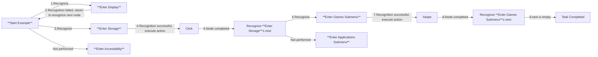
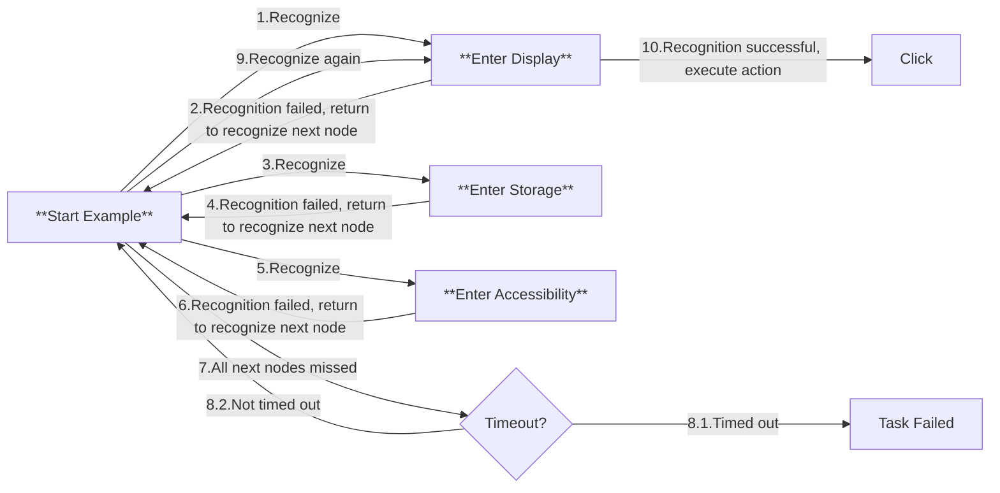
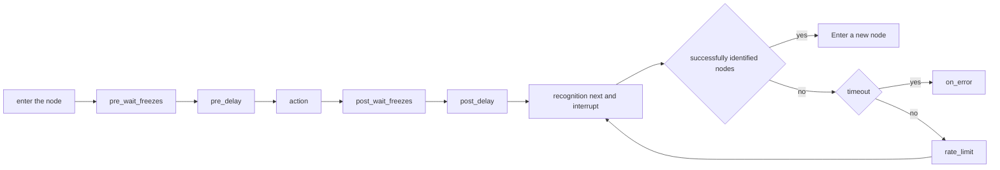

# Pipeline Protocol

## Basic Format

The task pipeline is described using JSON format and consists of several nodes. Each node contains the following core attributes:

```jsonc
{
    "NodeA": {
        "recognition": "OCR",    // Recognition algorithm
        "action": "Click",       // Action to be executed
        "next": [                // List of subsequent nodes
            "NodeB",
            "NodeC"
        ],
        // Other extended properties...
    },
    // Other node definitions...
}
```

## Execution Logic

### Process Control Mechanism

1. **Task Triggering**

   - Start the task by specifying the entry node through the `tasker.post_task` interface

2. **Sequential Detection:**

   - Perform sequential detection on the current node's `next` list
   - Attempt to identify the recognition features configured for each sub-node in sequence

3. **Interruption Mechanism:**

   - When a sub-node is successfully matched, immediately terminate subsequent node detections
   - Execute the operation defined by the matched node's `action`

4. **Successor Processing:**

   - After the operation is completed, switch the active node to the current node
   - Repeat the above detection process

### Termination Conditions

The task process terminates when any of the following conditions are met:

- The current node's `next` list is empty
- All subsequent node detections continuously fail until timeout

## Application Examples

### Scenario Description

There are menus `Display`/`Storage`/`Accessibility` in the Android settings interface, among which `Storage` contains the submenus `Games`/`Apps` after opening.

### Configuration Example

```jsonc
{
    "Start Example": {
        "next": [
            "Enter Display",
            "Enter Storage",
            "Enter Accessibility"
        ]
    },
    "Enter Display": {
        "recognition": "XXX",
        "action": "Click",
        // ...
    },
    "Enter Storage": {
        "recognition": "XXX",
        "action": "Click",
        "next": [
            "Enter Games Submenu",
            "Enter Applications Submenu"
        ]
    },
    "Enter Accessibility": {
        // ...
    },
    "Enter Games Submenu": {
        "action": "Swipe",
        "next": []
    },
    "Enter Applications Submenu": {
        // ...
    },
    // ...
}
```

### Execution Process Simulation

#### Case 1



#### Case 2



## Property Fields

> [!TIP]
> **For mandatory fields, they may remain empty in the Pipeline JSON file, but must be set via the interface before actual execution.**

### Pipeline v1

- `recognition`: *string*  
    Recognition algorithm type. Optional, default is [`DirectHit`](#directhit).  
    Possible values: [`DirectHit`](#directhit) | [`TemplateMatch`](#templatematch) | [`FeatureMatch`](#featurematch) | [`ColorMatch`](#colormatch) | [`OCR`](#ocr) | [`NeuralNetworkClassify`](#neuralnetworkclassify) | [`NeuralNetworkDetect`](#neuralnetworkdetect) | [`Custom`](#custom)  
    See [Algorithm Types](#algorithm-types) for details.

- `action`: *string*  
    Action to execute. Optional, default is [`DoNothing`](#donothing).  
    Possible values: [`DoNothing`](#donothing) | [`Click`](#click) | [`LongPress`](#longpress) | [`Swipe`](#swipe) | [`MultiSwipe`](#multiswipe) | [`ClickKey`](#clickkey) | [`LongPressKey`](#longpresskey) | [`InputText`](#inputtext) | [`StartApp`](#startapp) | [`StopApp`](#stopapp) | [`StopTask`](#stoptask) | [`Command`](#command) | [`Custom`](#custom-1)  
    See [Action Types](#action-types) for details.

- `next`: *string* | *list<string, >*  
    List of nodes to execute next. Optional, default is empty.  
    It recognizes each node in sequence and executes the first one it recognizes.

- `interrupt` : *string* | *list<string, >*  
    The list of candidate nodes when all nodes in `next` are not recognized, and similar interrupt operations will be performed. Optional, empty by default.  
    If all nodes in `next` are not recognized, each node in the interrupt list will be recognized in order, and the first recognized one will be executed. After all subsequent nodes are executed, jump back to this node to try to recognize it again.  
    For example: A: { next: [B, C], interrupt: [D, E] }  
    When B and C are not recognized and D is recognized, D and D.next will be fully executed. But when the pipeline of D is fully executed. It will return to node A again and continue to try to recognize B, C, D, E.  
    This field is mostly used for exception handling. For example, D is to recognize the "network disconnection prompt box". After clicking confirm and waiting for the network connection to succeed, continue the previous node flow.  

    ```mermaid
    graph LR
     A -->|next| B
     A -->|next| C
     A -->|interrupt| D
     A -->|interrupt| E
     D -->|next| D.next...
    ```

- `is_sub`: *bool*  
    **(Deprecated in version 2.x, but retains compatibility. `interrupt` is recommended instead.)**  
    Whether it is a sub-node. Optional, default is false.  
    If it's a sub-node, after completing this node (and subsequent nodes such as "next"), it will return to re-recognize the "next" list of this node.  
    For example: A.next = [B, Sub_C, D], where Sub_C.is_sub = true. If Sub_C is matched, after fully executing Sub_C and subsequent nodes, it will return to re-recognize [B, Sub_C, D] and execute the matching items and subsequent nodes.

- `rate_limit`: *uint*  
    Identification rate limit, in milliseconds. Optional, default 1000.  
    Each round of identification "next" + "interrupt" consumes at least `rate_limit` milliseconds, and sleep will wait if the time is less than that.

- `timeout`: *uint*  
    Timeout for recognizing "next" + "interrupt" nodes, in milliseconds. Optional, Default is 20,000 milliseconds (20 seconds).  
    The detailed logic is `while(!timeout) { foreach(next + interrupt); sleep_until(rate_limit); }`

- `on_error` : *string* | *list<string, >*  
    When recognition timeout or the action fails to execute, the nodes in this list will be executed next. Optional, empty by default.

- `inverse`: *bool*  
    Reverse the recognition result: recognized as not recognized, and not recognized as recognized. Optional, default is false.  
    Please note that nodes recognized through this setting will have their own clicking actions disabled (because nothing was actually recognized). If there is a need, you can set the `target` separately.

- `enabled`: *bool*  
    Whether to enable this node. Optional, default is true.  
    If set to false, this node will be skipped when it appears in the "next" lists of other nodes, meaning it won't be recognized or executed.

- `pre_delay`: *uint*  
    Delay in milliseconds between recognizing a node and executing the action. Optional, default is 200 milliseconds.  
    It is recommended to add intermediate nodes whenever possible and use less delay to maintain both speed and stability.

- `post_delay`: *uint*  
    Delay in milliseconds between executing the action and recognizing the "next" nodes. Optional, default is 200 milliseconds.  
    It is recommended to add intermediate nodes whenever possible and use less delay to maintain both speed and stability.

- `pre_wait_freezes`: *uint* | *object*  
    Time in milliseconds to wait for the screen to stop changing between recognizing a node and executing the action. Optional, default is 0 (no waiting).  
    It will exit the action only when the screen has not had significant changes for "pre_wait_freezes" milliseconds in a row.  
    If it's an object, more parameters can be set, see [Waiting for the Screen to Stabilize](#waiting-for-the-screen-to-stabilize) for details. The specific order is `pre_wait_freezes` - `pre_delay` - `action` - `post_wait_freezes` - `post_delay`.

- `post_wait_freezes`: *uint* | *object*  
    Time in milliseconds to wait for the screen to stop changing between executing the action and recognizing the "next" nodes. Optional, default is 0 (no waiting).  
    Other logic is the same as `pre_wait_freezes`.

- `focus`: *any*  
    Focus on the node, resulting in additional callback messages. Optional, default is null (no messages).  
    See [Node Notifications](#node-notifications) for details.

- `attach`: *object*  
    Additional JSON object for storing additional node configuration. Optional, default is an empty object.  
    This field can be used to store custom configuration information that does not affect the node's execution logic but can be retrieved through related interfaces.  
    **Note**: This field will be merged with the `attach` in the default value using dict merge, not overwritten. That is, the `attach` in the node will be merged with the `attach` in the default value, where values with the same keys will be overwritten by the node's values, but other keys will be preserved.

The lifecycle of a node is as follows:



### Pipeline v2

> [!NOTE]
> MaaFW supports Pipeline v2 protocol since version v4.4.0, and is compatible with v1.

Compared with v1, the main difference is that the fields related to `recognition` and `action` are put into the secondary dictionary (the type is put into the `type` field, and the other parameters are put into the `param` field), and the rest are the same. Example:

```jsonc
{
    "NodeA": {
        "recognition": {
            "type": "TemplateMatch",
            "param": {
                // Recognition related fields are placed in recognition.param, and the keys and values ​​remain unchanged from v1
                "template": "A.png",
                "roi": [100, 100, 10, 10]
            }
        },
        "action": {
            "type": "Click",
            "param": {
                // Action related fields are placed in action.param, and the keys and values ​​remain unchanged from v1
                "target": "XXX"
            }
        },
        // Non-recognition and action fields remain unchanged from v1
        "next": ["NodeB"],
        "pre_delay": 1000,
        // ...
    }
}
```

### Default Properties

Please refer to [`default_pipeline.json`](https://github.com/MaaXYZ/MaaFramework/blob/main/sample/resource/default_pipeline.json)  
`Default` can set the default values ​​of all fields. And the object of algorithm/action name can set the default parameter value of the corresponding algorithm/action.

## Algorithm Types

### `DirectHit`

Direct hit, meaning no recognition is performed, and the action is executed directly.

### `TemplateMatch`

Template matching, also known as "find image."

This algorithm property requires additional fields:

- `roi`: *array<int, 4>* | *string*  
    Recognition area coordinates. Optional, default [0, 0, 0, 0], i.e. full screen.
  - *array<int, 4>*: Recognition area coordinates, [x, y, w, h], if you want full screen, you can set it to [0, 0, 0, 0].
  - *string*: Fill in the node name, and identify within the target range identified by a previously executed node.

- `roi_offset`: *array<int, 4>*  
    Move additionally based on `roi` as the range, and add the four values ​​separately. Optional, default [0, 0, 0, 0].

- `template`: *string* | *list<string, >*  
    Path to the template image, relative to the "image" folder. Required.
    The images used need to be cropped from the lossless original image and scaled to 720p. Reference to [here](1.1-QuickStarted.md#image-files).  
    Supports filling in folder paths, and all image files in them will be recursively loaded.

- `threshold`: *double* | *list<double, >*  
    Template matching threshold. Optional, default is 0.7.  
    If it's an array, its length should match the length of the `template` array.

- `order_by`: *string*  
    How the results are sorted. Optional, default is `Horizontal`  
    Possible values: `Horizontal` | `Vertical` | `Score` | `Random`  
    You can use it with the `index` field.

- `index`: *int*  
    Index to hit. Optional, default is `0`.  
    If there are N results in total, the value range of `index` is [-N, N - 1], where negative numbers are converted to N - index using Python-like rules. If it exceeds the range, it is considered that there is no result in the current identification.

- `method`: *int*  
    Template matching algorithm, equivalent to cv::TemplateMatchModes. Optional, default is 5.  
    Only supports 1, 3, and 5, with higher values providing greater accuracy but also taking more time.  
    For more details, refer to the [OpenCV official documentation](https://docs.opencv.org/4.x/df/dfb/group__imgproc__object.html).

- `green_mask`: *bool*  
    Whether to apply a green mask. Optional, default is false.  
    If set to true, you can paint the unwanted parts in the image green with RGB: (0, 255, 0), and those green parts won't be matched.

### `FeatureMatch`

Feature matching, a more powerful "find image" with better generalization, resistant to perspective and size changes.

This algorithm property requires additional fields:

- `roi`: *array<int, 4>* | *string*  
    Same as `TemplateMatch`.`roi`.

- `roi_offset`: *array<int, 4>*  
    Same as `TemplateMatch`.`roi_offset`.

- `template`: *string* | *list<string, >*  
    Path to the template image, relative to the "image" folder. Required.  
    Supports filling in folder paths, and all image files in them will be recursively loaded.

- `count`: *uint*  
    The minimum number of matching feature points required (threshold). Optional, default is 4.

- `order_by`: *string*  
    How the results are sorted. Optional, default is `Horizontal`  
    Possible values: `Horizontal` | `Vertical` | `Score` | `Area` | `Random`
    You can use it with the `index` field.

- `index`: *int*  
    Index to hit. Optional, default is `0`.  
    If there are N results in total, the value range of `index` is [-N, N - 1], where negative numbers are converted to N - index using Python-like rules. If it exceeds the range, it is considered that there is no result in the current identification.

- `green_mask`: *bool*  
    Whether to apply a green mask. Optional, default is false.  
    If set to true, you can paint the unwanted parts in the image green with RGB: (0, 255, 0), and those green parts won't be matched.

- `detector`: *string*  
    Feature detector. Optional, default is `SIFT`.  
    Currently, it supports the following algorithms:

  - SIFT  
    High computational complexity, scale invariance, and rotation invariance. Best performance.
  - KAZE  
    Suitable for 2D and 3D images, scale invariance, and rotation invariance.
  - AKAZE  
    Faster computation speed, scale invariance, and rotation invariance.
  - BRISK  
    Very fast computation speed, scale invariance, and rotation invariance.
  - ORB  
    Very fast computation speed, rotation invariance, but lacks scale invariance.

  You can look up detailed characteristics of each algorithm on your own.

- `ratio`: *double*  
    The distance ratio for KNN matching, [0 - 1.0], where larger values make the matching more lenient (easier to connect). Optional, default is 0.6.

### `ColorMatch`

Color matching, also known as "find color."

This algorithm property requires additional fields:

- `roi`: *array<int, 4>* | *string*  
    Same as `TemplateMatch`.`roi`.

- `roi_offset`: *array<int, 4>*  
    Same as `TemplateMatch`.`roi_offset`.

- `method`: *int*  
    Color matching method, equivalent to cv::ColorConversionCodes. Optional, default is 4 (RGB).  
    Common values are 4 (RGB, 3 channels), 40 (HSV, 3 channels), and 6 (GRAY, 1 channel).  
    For more details, refer to the [OpenCV official documentation](https://docs.opencv.org/4.x/d8/d01/group__imgproc__color__conversions.html).

- `lower`: *list<int, >* | *list<list<int, >>*  
    Lower bound for colors. Required. The innermost list length should match the number of channels in the `method`.

- `upper`: *list<int, >* | *list<list<int, >>*  
    Upper bound for colors. Required. The innermost list length should match the number of channels in the `method`.

- `count`: *uint*  
    The minimum number of matching pixels required (threshold). Optional, default is 1.

- `order_by`: *string*  
    How the results are sorted. Optional, default is `Horizontal`  
    Possible values: `Horizontal` | `Vertical` | `Score` | `Area` | `Random`  
    You can use it with the `index` field.

- `index`: *int*  
    Index to hit. Optional, default is `0`.  
    If there are N results in total, the value range of `index` is [-N, N - 1], where negative numbers are converted to N - index using Python-like rules. If it exceeds the range, it is considered that there is no result in the current identification.

- `connected`: *bool*  
    Whether to count only connected points. Optional, default is false.  
    If set to true, after applying color filtering, it will only count the maximum connected block of pixels.
    If set to false, it won't consider whether these pixels are connected.

### `OCR`

Text recognition.

This algorithm property requires additional fields:

- `roi`: *array<int, 4>* | *string*  
    Same as `TemplateMatch`.`roi`.

- `roi_offset`: *array<int, 4>*  
    Same as `TemplateMatch`.`roi_offset`.

- `expected`: *string* | *list<string, >*  
    The expected results, supports regular expressions. Required.

- `threshold`: *double*  
    Model confidence threshold. Optional, default is 0.3.  

- `replace`: *array<string, 2>* | *list<array<string, 2>>*  
    Some text recognition results may not be accurate, so replacements are performed. Optional.

- `order_by`: *string*  
    How the results are sorted. Optional, default is `Horizontal`  
    Possible values: `Horizontal` | `Vertical` | `Area` | `Length` | `Random`  
    You can use it with the `index` field.

- `index`: *int*  
    Index to hit. Optional, default is `0`.  
    If there are N results in total, the value range of `index` is [-N, N - 1], where negative numbers are converted to N - index using Python-like rules. If it exceeds the range, it is considered that there is no result in the current identification.

- `only_rec`: *bool*  
    Whether to recognize only (without detection, requires precise `roi`). Optional, default is false.

- `model`: *string*  
    Model **folder** path. Use a relative path to the "model/ocr" folder. Optional, default is empty.  
    If empty, it will use the models in the root of the "model/ocr" folder. The folder should include three files: `rec.onnx`, `det.onnx`, and `keys.txt`.

### `NeuralNetworkClassify`

Deep learning classification, to determine if the image in a **fixed position** matches the expected "category."

This algorithm property requires additional fields:

- `roi`: *array<int, 4>* | *string*  
    Same as `TemplateMatch`.`roi`.

- `roi_offset`: *array<int, 4>*  
    Same as `TemplateMatch`.`roi_offset`.

- `labels`: *list<string, >*  
    Labels, meaning the names of each category. Optional.  
    It only affects debugging images and logs. If not filled, it will be filled with "Unknown."

- `model`: *string*  
    Model file path. Use a relative path to the "model/classify" folder. Required.  
    Currently, only ONNX models are supported. Refer to [NNClassify Recipe](https://github.com/MaaXYZ/MaaNeuralNetworkCookbook/tree/main/NeuralNetworkClassify).

- `expected`: *int* | *list<int, >*  
    The expected category index. Required.

- `order_by`: *string*  
    How the results are sorted. Optional, default is `Horizontal`  
    Possible values: `Horizontal` | `Vertical` | `Score` | `Random`
    You can use it with the `index` field.

- `index`: *int*  
    Index to hit. Optional, default is `0`.  
    If there are N results in total, the value range of `index` is [-N, N - 1], where negative numbers are converted to N - index using Python-like rules. If it exceeds the range, it is considered that there is no result in the current identification.

For example, if you want to recognize whether a cat or a mouse appears in a **fixed position** in the image, and you've trained a model that supports this three-category classification, and you want to click when it recognizes a cat or a mouse but not when it recognizes a dog, the relevant fields would be:

```jsonc
{
    "labels": ["Cat", "Dog", "Mouse"],
    "expected": [0, 2]
}
```

Please note that these values should match the actual model output.

### `NeuralNetworkDetect`

Deep learning object detection, an advanced version of "find image."

The main difference from classification is the flexibility to find objects at arbitrary positions. However, this often requires more complex models, more training data, longer training times, and significantly higher resource usage during inference.

This algorithm property requires additional fields:

- `roi`: *array<int, 4>* | *string*  
    Same as `TemplateMatch`.`roi`.

- `roi_offset`: *array<int, 4>*  
    Same as `TemplateMatch`.`roi_offset`.

- `labels`: *list<string, >*  
    Labels, meaning the names of each category. Optional.  
    It only affects debugging images and logs. If not filled, it will be automatically read from the model metadata (supports reading from `names`, `name`, `labels`, `class_names` fields), generally no need to set manually. If the model metadata also doesn't contain labels, it will be filled with "Unknown."

- `model`: *string*  
    Model file path. Use a relative path to the "model/detect" folder. Required.  
    Currently supports ONNX models exported from YOLOv8 and YOLOv11. Other Yolo models with the same input/output should theoretically be supported but are untested.  
    Training reference: [NNDetect Recipe](https://github.com/MaaXYZ/MaaNeuralNetworkCookbook/tree/main/NeuralNetworkDetect).

- `expected`: *int* | *list<int, >*  
    The expected category index.

- `threshold`: *double* | *list<double, >*  
    Model confidence threshold. Optional, default is 0.3.  
    If it's an array, its length should match the length of the `expected` array.

- `order_by`: *string*  
    How the results are sorted. Optional, default is `Horizontal`  
    Possible values: `Horizontal` | `Vertical` | `Score` | `Area` | `Random`  
    You can use it with the `index` field.

- `index`: *int*  
    Index to hit. Optional, default is `0`.  
    If there are N results in total, the value range of `index` is [-N, N - 1], where negative numbers are converted to N - index using Python-like rules. If it exceeds the range, it is considered that there is no result in the current identification.

For example, if you want to detect cats, dogs, and mice in an image and only click when a cat or a mouse is detected but not when a dog is detected, the relevant fields would be:

```jsonc
{
    "labels": ["Cat", "Dog", "Mouse"],
    "expected": [0, 2]
}
```

Please note that these values should match the actual model output.

### `Custom`

Execute the recognition handle passed in through the `MaaResourceRegisterCustomRecognition` interface

This algorithm property requires additional fields:

- `custom_recognition`: *string*  
    Recognition name, same as the one passed in through the registration interface. It will also be passed through `MaaCustomRecognitionCallback`.`custom_recognition_name`. Required.

- `custom_recognition_param`: *any*  
    Recognition parameter, any type, will be passed through `MaaCustomRecognitionCallback`.`custom_recognition_param`. Optional, default `null`.

- `roi`: *array<int, 4>* | *string*  
    Same as `TemplateMatch`.`roi`, will be passed through `MaaCustomRecognitionCallback`.`roi`. Optional, default [0, 0, 0, 0].

- `roi_offset`: *array<int, 4>*  
    Same as `TemplateMatch`.`roi_offset`.

## Action Types

### `DoNothing`

Does nothing.

### `Click`

Clicks.

Additional properties for this action:

- `target`: *true* | *string* | *array<int, 2>* | *array<int, 4>*  
    The position of the click target. Optional, default is true.  
  - *true*: The target is the position just recognized in this node (i.e., itself).
  - *string*: Enter the node name, as the target, to use the position recognized by a previously executed node.
  - *array<int, 2>*: Fixed coordinate point `[x, y]`.
  - *array<int, 4>*: Fixed coordinate area `[x, y, w, h]`. A point is sampled inside the rectangle with higher probability near the center and lower probability near the edges. To target the entire screen, set it to [0, 0, 0, 0].

- `target_offset`: *array<int, 4>*  
    Additional movement from the `target` before clicking, where the four values are added together. Optional, default is [0, 0, 0, 0].

- `contact`: *uint*  
    Contact id used to distinguish different touch points. Optional, default `0`.  
  - Adb Controller: Finger id (0 for first finger, 1 for second finger, etc.)
  - Win32 Controller: Mouse button id (0 for left, 1 for right, 2 for middle, 3 for XBUTTON1, 4 for XBUTTON2)

### `LongPress`

Long press。  

Additional properties for this action:

- `target`: *true* | *string* | *array<int, 2>* | *array<int, 4>*  
    The position of the long press target. Optional, default is true. The values are the same as `Click`.`target`.

- `target_offset`: *array<int, 4>*  
    Additional movement from the `target` before long pressing, where the four values are added together. Optional, default is [0, 0, 0, 0].

- `duration`: *uint*  
    Duration of the long press in milliseconds. Optional, default is 1000.

- `contact`: *uint*  
    Contact id used to distinguish different touch points. Optional, default `0`.  
  - Adb Controller: Finger id (0 for first finger, 1 for second finger, etc.)
  - Win32 Controller: Mouse button id (0 for left, 1 for right, 2 for middle, 3 for XBUTTON1, 4 for XBUTTON2)

### `Swipe`

Linear swipe.

Additional properties for this action:

- `begin`: *true* | *string* | *array<int, 2>* | *array<int, 4>*  
    The starting point of the swipe. Optional, default is true. The values are the same as `Click`.`target`.

- `begin_offset`: *array<int, 4>*  
    Additional movement from the `begin` before swiping, where the four values are added together. Optional, default is [0, 0, 0, 0].

- `end`: *true* | *string* | *array<int, 2>* | *array<int, 4>* | *list<true | string | array<int, 2> | array<int, 4>>*  
    The end point of the swipe. Optional, default is true. The values are the same as `Click`.`target`.  
    💡 v4.5.x version adds support for *list*, which can be used to add swipe waypoints! Unlike multiple swipes, multiple ends will not lift between them, i.e., a single polyline swipe.

- `end_offset`: *array<int, 4>* | *list<array<int, 4>>*  
    Additional movement from the `end` before swiping, where the four values are added together. Optional, default is [0, 0, 0, 0].

- `duration`: *uint* | *list<uint,>*  
    Duration of the swipe in milliseconds. Optional, default is 200.

- `end_hold`: *uint* | *list<uint,>*  
    After swiping to the end point, wait for an additional time before lifting, in ms. Optional, default 0.

- `only_hover`: *bool*  
    Only move the mouse cursor, no press/release action. Optional, default false.

- `contact`: *uint*  
    Contact id used to distinguish different touch points. Optional, default `0`.  
  - Adb Controller: Finger id (0 for first finger, 1 for second finger, etc.)
  - Win32 Controller: Mouse button id (0 for left, 1 for right, 2 for middle, 3 for XBUTTON1, 4 for XBUTTON2)

### `MultiSwipe`

Multi-finger linear swipe.

Additional properties for this action:

- `swipes`: *list<object,>*  
    Multi swipe array. Required.  
    The order of the array elements has no effect, only based on `starting`.

  - `starting`: *uint*  
    Swipe start time, in milliseconds. Optional, default 0.  
    `MultiSwipe` additional field, the swipe will start pressing at the `starting` millisecond in this action.

- `begin`: *true* | *string* | *array<int, 2>* | *array<int, 4>*  
      The starting point of the swipe. Optional, default is true. The values are the same as `Click`.`target`.

  - `begin_offset`: *array<int, 4>*  
      Additional movement from the `begin` before swiping, where the four values are added together. Optional, default is [0, 0, 0, 0].

- `end`: *true* | *string* | *array<int, 2>* | *array<int, 4>* | *list<true | string | array<int, 2> | array<int, 4>>*  
      The end point of the swipe. Optional, default is true. The values are the same as `Click`.`target`.  
      💡 v4.5.x version adds support for *list*, which can be used to add swipe waypoints! Unlike multiple swipes, multiple ends will not lift between them, i.e., a single polyline swipe.

  - `end_offset`: *array<int, 4>* | *list<array<int, 4>>*  
      Additional movement from the `end` before swiping, where the four values are added together. Optional, default is [0, 0, 0, 0].

  - `duration`: *uint* | *list<uint,>*  
      Duration of the swipe in milliseconds. Optional, default is 200.

  - `end_hold`: *uint* | *list<uint,>*  
      After swiping to the end point, wait for an additional time before lifting, in ms. Optional, default 0.

  - `only_hover`: *bool*  
      Only move the mouse cursor, no press/release action. Optional, default false.

  - `contact`: *uint*  
      Contact id used to distinguish different touch points. Optional, default `0`.  
    - Adb Controller: Finger id (0 for first finger, 1 for second finger, etc.)
    - Win32 Controller: Mouse button id (0 for left, 1 for right, 2 for middle, 3 for XBUTTON1, 4 for XBUTTON2)  
      **Note**: In `MultiSwipe`, if `contact` is 0, the index of the swipe in the array will be used as the contact id.

For example:

```jsonc
{
    "A": {
        "action": "MultiSwipe",
        "swipes": [
            {
                "begin": [],
                "end": []
            },
            {
                "starting": 500,
                "begin": [],
                "end": []
            }
        ]
    }
}
```

### `TouchDown`

Press a touch contact.

Additional properties for this action:

- `contact`: *uint*  
    Contact id used to distinguish different touch points. Optional, default `0`.  
  - Adb Controller: Finger id (0 for first finger, 1 for second finger, etc.)
  - Win32 Controller: Mouse button id (0 for left, 1 for right, 2 for middle, 3 for XBUTTON1, 4 for XBUTTON2)

- `target`: *true* | *string* | *array<int, 4>*  
    Touch target position. Optional, default `true`. Same semantics as `Click`.`target`.

- `target_offset`: *array<int, 4>*  
    Offset applied on top of `target`. Optional, default `[0, 0, 0, 0]`.

- `pressure`: *int*  
    Touch pressure. Optional, default `0`. The actual range depends on the controller implementation.

### `TouchMove`

Move an existing touch contact. Fields are identical to `TouchDown` and update the contact position.

### `TouchUp`

Release a touch contact.

- `contact`: *uint*  
    Contact id used to distinguish different touch points. Optional, default `0`.  
  - Adb Controller: Finger id (0 for first finger, 1 for second finger, etc.)
  - Win32 Controller: Mouse button id (0 for left, 1 for right, 2 for middle, 3 for XBUTTON1, 4 for XBUTTON2)

### `ClickKey`

Click a key.

Additional properties for this action:

- `key`: *int* | *list<int, >*  
    The key(s) to click, supporting only virtual key code of corresponding controller. Required.

  - [Adb Controller](https://developer.android.com/reference/android/view/KeyEvent)
  - [Win32 Controller](https://learn.microsoft.com/en-us/windows/win32/inputdev/virtual-key-codes)

### `LongPressKey`

Long Press a key.

Additional properties for this action:

- `key`: *int*  
    The key to press, supporting only virtual key code of corresponding controller. Required.

- `duration`: *uint*  
    Duration of the long press in milliseconds. Optional, default is 1000.

### `KeyDown`

Press a key without releasing. Combine with `KeyUp` to customize key sequences.

Additional properties for this action:

- `key`: *int*  
    The key to press, supporting only virtual key code of corresponding controller. Required.

### `KeyUp`

Release a key. Typically follows a `KeyDown` to end the key press state.

Additional properties for this action:

- `key`: *int*  
    The key to release, supporting only virtual key code of corresponding controller. Required.

### `InputText`

Inputs text.

Additional properties for this action:

- `input_text`: *string*  
    The text to input, some controller only supports ascii. Required.

### `StartApp`

Starts an app.

Additional properties for this action:

- `package`: *string*  
    Launch entry. Required.  
    You need to enter the package name or activity, for example, `com.hypergryph.arknights` or `com.hypergryph.arknights/com.u8.sdk.U8UnityContext`.

### `StopApp`

Closes an app.

Additional properties for this action:

- `package`: *string*  
    The app to close. Required.  
    You need to enter the package name, for example, `com.hypergryph.arknights`.

### `StopTask`

Stops the current task chain (the individual task chain passed to MaaTaskerPostTask).

### `Command`

Execute a command.

This action attribute requires additional fields:

- `exec`: *string*  
    The path of the program to be executed. Required.

- `args`: *list<string,>*  
    The arguments to be executed. Optional.  
    supports runtime parameters replacement:

  - `{ENTRY}`: Entry name.
  - `{NODE}`: Node name.
  - `{IMAGE}`: The path to the file where the screenshot is saved. The file is deleted before the process exits. Please copy it by yourself if you want to save it permanently.
  - `{BOX}`: Identify the hit target, the format is `[x, y, w, h]`.
  - `{RESOURCE_DIR}`: The path of the resource folder loaded last time.
  - `{LIBRARY_DIR}`: The path of the folder where the MaaFW library is located.

- `detach`: *bool*  
    Detach the child process, that is, do not wait for the child process to complete, and continue directly to the next task. Optional, default false.

Example:

```jsonc
{
    "NodeA": {
        "action": "Command",
        "exec": "Python",
        "args": [
            "{RESOURCE_DIR}/my_script/test.py"
            "Haha",
            "{IMAGE}",
            "{NODE}",
            "{BOX}"
        ]
    },
    "NodeB": {
        "action": "Command",
        "exec": "{RESOURCE_DIR}/my_exec/my_exec.exe"
    }
}
```

The actual command is:

```bash
# NodeA
Python C:/MaaXXX/resource/my_script/test.py Haha C:/temp/123.png NodeA [0,0,0,0]

# NodeB
C:/MaaXXX/resource/my_exec/my_exec.exe
```

### `Custom`

Execute the action handle passed in through the `MaaResourceRegisterCustomAction` interface

This action attribute requires additional fields:

- `custom_action`: *string*  
    Action name, same as the one passed in through the registration interface. It will also be passed through `MaaCustomActionCallback`.`custom_action_name`. Required.

- `custom_action_param`: *any*  
    Action parameter, any type, will be passed through `MaaCustomActionCallback`.`custom_action_param`. Optional, default `null`.

- `target`: *true* | *string* | *array<int, 2>* | *array<int, 4>*  
    The position of the target, which will be passed through `MaaCustomActionCallback`.`box`. Optional, default true. Same as `Click`.`target`.

- `target_offset`: *array<int, 4>*  
    Same as `Click`.`target_offset`.

## Waiting for the Screen to Stabilize

Waits for the screen to stabilize. It exits the action only when there is no significant change in the screen for a certain continuous time.

The field value can be a uint or an object. For example:

```jsonc
{
    "NodeA": {
        "pre_wait_freezes": 500
    },
    "NodeB": {
        "pre_wait_freezes": {
            // more properties ...
        }
    }
}
```

If the value is an object, you can set additional fields:

- `time`: *uint*  
    It exits the action only when there has been no significant change in the screen for "time" milliseconds in a row. Optional, default is 1.

- `target`: *true* | *string* | *array<int, 2>* | *array<int, 4>*  
    The position of the target to wait for. Optional, default is true. The values are the same as `Click`.`target`.

- `target_offset`: *array<int, 4>*  
    Additional movement from the `target` to be used as the waiting target, where the four values are added together. Optional, default is [0, 0, 0, 0].

- `threshold`: *double*  
    The template matching threshold to determine "no significant change." Optional, default is 0.95.

- `method`: *int*  
    The template matching algorithm to determine "no significant change," i.e., cv::TemplateMatchModes. Optional, default is 5. The same as `TemplateMatch`.`method`.

- `rate_limit`: *uint*  
    Identification rate limit, in milliseconds. Optional, default 1000.  
    Each identification consumes at least `rate_limit` milliseconds, and sleep will be executed if the time is less than that.

- `timeout`: *uint*  
    Timeout for recognizing, in milliseconds. Optional, default is 20,000 milliseconds (20 seconds).  

## Node Notifications

The specific implementation of node notifications is determined by the upper-level UI. A message template mechanism based on JSON objects is recommended, using placeholder replacements to achieve dynamic content display.

### Message Template Mechanism

When MaaFW sends a callback message, it provides the following information:

- **message**: Message type identifier

- **details**: An object containing specific data

### Node Notification Configuration Example

```jsonc
// Configure message templates in the Pipeline
{
  "NodeA": {
    "focus": {
      "Node.Recognition.Succeeded": "{name} recognition hit, ready to start execution",
      "Node.Action.Starting": "{name} starts execution, task ID: {task_id}",
    }
  }
}

// When this node starts execution, the UI will receive a callback
{
  "message": "Node.Action.Starting",
  "details_json": {
    "task_id": 12345,
    "node_id": 67890,
    "action_id": 11111,
    "name": "NodeA",
    "focus": {
      "Node.Recognition.Succeeded": "{name} recognition hit, ready to start execution",
      "Node.Action.Starting": "{name} starts execution, task ID: {task_id}"
    }
  }
}

```

### Processing Flow

1. UI receives the node notification message sent by the framework
2. Find the corresponding template string in focus based on the message
3. Use data in details_json to replace placeholders in the template (such as `{name}`, `{task_id}`)
4. Display the processed text to the user in the interface. In the example, it displays `NodeA starts execution, task ID: 12345`

### More Message Types

For a complete list of callback messages and detailed descriptions, please refer to [Callback Protocol](2.3-CallbackProtocol.md).
