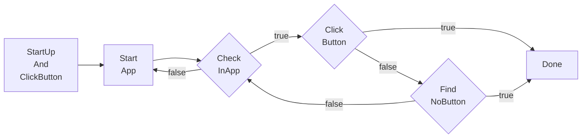
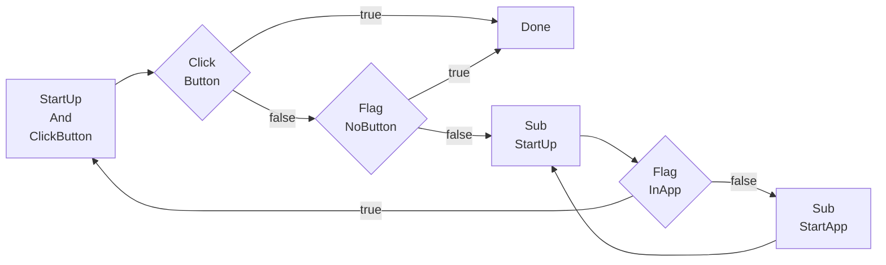

# 任务流水线（Pipeline）协议

## 整体介绍

```jsonc
{
    "TaskA": {
        "next: [
            "TaskB",
            "TaskC"
        ]
        // properties ...
    },
    "TaskB": {
        // properties ...
    },
    // other task ...
}
```

我们执行某个 Task 时（MaaPostTask 接口传入任务名），会对其 next 列表中的 Task **依次** 进行识别（根据每个 Task 的 recognition 相关设置）  
且一旦匹配上了，则会退出 next 列表识别，转而去执行匹配上的任务。类似遍历比较，一旦找到了，就直接 break 转而去执行找到的那个 Task。

## 举例

例如我们有一个游戏，画面中可能出现一种水果，可能是苹果、橘子、香蕉，我们需要点击它。一个简单的演示 JSON：

```jsonc
{
    "StartFruit": {
        "next": [
            "Apple",
            "Orange",
            "Banana"
        ]
    },
    "Apple": {
        "recognition": XXX,
        "action": "Click",
        // ...
    },
    "Orange": {
        "recognition": XXX,
        "action": "Click",
        "next": [
            "Cat",
            "Dog"
        ]
    },
    "Banana": {
        // ...
    },
    // ...
}
```

假设现在画面中没有 Apple，但有 Orange 和 Banana。
在上述 JSON 中，若我们执行 "StartFruit"（即 MaaPostTask 接口传入 "StartFruit"），会先识别 Apple，画面中没有，所以继续识别 Orange，这次识别到了，则我们开始执行 Orange，不会再去识别 Banana 了。  
执行 Orange 就是根据其 action 去进行对应的操作，当执行完成后，我们会再去识别 Orange 的 next。  

Orange 的 next 中，  
若识别到了 Cat，则不会继续去识别 Dog 了。这时同样会去执行 Cat 的 action，并在 action 完成后继续识别 Cat 的 next。  
若 Cat, Dog 都没有识别到，我们会再次尝试识别这两个，直至超时为止。  

如此循环，直至某个任务的 next 为空，即认为任务完成。

### 实际业务逻辑举例

如前面举例，任务链是顺序执行的。

但实际业务逻辑在任务流水线中，大多是需要倒序判断的，以下就是一段典型的倒序判断的业务逻辑：

- 实现启动 **App** 并点击 App 页面中的 **Button** 的业务。

- 当 App 页面中不存在 Button 时会提示 **NoButton**。

正常且完备的顺序如下：



为了复用 `StartApp` 和 `CheckInApp` 并解耦出业务核心 `ClickButton` ，我们引入了 `is_sub` 字段（建议先阅读[后面的 is_sub 说明](#属性字段)，再返回阅读下一段）。

如果需要使用子任务 `is_sub` 字段，则需要将任务流水线中的判断倒序：



这是因为在一个判断倒序的流水线中，我们需要把：

1. 任务的出口（即业务核心 ClickButton ，或者下一步）放在第一位。
2. 任务的异常判断（即 NoButton ）放在第二位。
3. 任务的入口（即 StartUp ）作为 **子任务** 放在第三位。
4. 子任务（即 Sub_StartUp ）也是如此（出口： Flag_InApp 、入口：Sub_StartApp ）。
5. 有且仅有一次（或有限次）的业务可以放在任务的出口之前，即第零位以便更快判断，例如弹出广告需要进行关闭。

实际业务的 json：

```jsonc
{
    "StartUpAndClickButton": {
        "next": [
            "Click_Button",
            "Flag_NoButton",
            "Sub_StartUp"
        ]
    },
    "Sub_StartUp": {
        "is_sub": true,
        "next": [
            "Flag_InApp",
            "Sub_StartApp"
        ]
    },
    "Sub_StartApp": {
        "is_sub": true,
        "action": "StartApp"
    },
    "Flag_InApp": {
        "recognition": "TemplateMatch",
        "template": "App.png"
    },
    "Flag_NoButton": {
        "recognition": "OCR",
        "text": "NoButton"
    },
    "Click_Button": {
        "recognition": "OCR",
        "text": "Button",
        "action": "Click"
    }
}
```

## 属性字段

- `recognition` : *string*  
    识别算法类型。可选，默认 `DirectHit`。  
    可选的值：`DirectHit` | `TemplateMatch` | `FeatureMatch` | `ColorMatch` | `OCR` | `NeuralNetworkClassify` | `NeuralNetworkDetect` | `Custom`  
    详见 [算法类型](#算法类型)。

- `action`: *string*  
    执行的动作。可选，默认 `DoNothing`。  
    可选的值：`DoNothing` | `Click` | `Swipe` | `Key` | `Text` | `StartApp` | `StopApp` | `StopTask` | `Custom`  
    详见 [动作类型](#动作类型)。

- `next` : *string* | *list<string, >*  
    接下来要执行的任务列表。可选，默认空。  
    按序识别每个任务，只执行第一个识别到的。

- `is_sub`: *bool*  
    是否是子任务。可选，默认否。  
    如果是子任务，执行完本任务（及后续 next 等）后，会返回来再次识别本任务 **所在的** next 列表。  
    例如：A.next = [B, Sub_C, D]，这里的 Sub_C.is_sub = true，  
    若匹配上了 Sub_C，在完整执行完 Sub_C 及后续任务后，会返回来再次识别 [B, Sub_C, D] 并执行命中项及后续任务。

- `inverse`: *bool*  
    反转识别结果，识别到了当做没识别到，没识别到的当做识别到了。可选，默认否。  
    请注意由此识别出的任务，Click 等动作的点击自身将失效（因为实际并没有识别到东西），若有需求可单独设置 `target`。  

- `enabled`: *bool*  
    是否启用该 task。可选，默认 true。  
    若为 false，则其他 task 的 next 列表中的该 task，会被跳过，既不会被识别也不会被执行。

- `timeout`: *uint*  
    `next` 识别超时时间，毫秒。默认 20 * 1000。  

- `timeout_next`: *string* | *list<string, >*  
    超时后执行的任务列表。可选，默认空。

- `times_limit`: *uint*  
    任务执行次数。可选，默认 UINT_MAX。

- `runout_next`: *string* | *list<string, >*  
    任务执行次数达到了后执行的任务列表，可选，默认空。

- `pre_delay`: *uint*  
    识别到 到 执行动作前 的延迟，毫秒。可选，默认 200。  
    推荐尽可能增加中间过程任务，少用延迟，不然既慢还不稳定。

- `post_delay`: *uint*  
    执行动作后 到 识别 next 的延迟，毫秒。可选，默认 500。  
    推荐尽可能增加中间过程任务，少用延迟，不然既慢还不稳定。

- `pre_wait_freezes`: *uint* | *object*  
    识别到 到 执行动作前，等待画面不动了的时间，毫秒。可选，默认 0，即不等待。  
    连续 `pre_wait_freezes` 毫秒 画面 **没有较大变化** 才会退出动作。  
    若为 object，可设置更多参数，详见 [等待画面静止](#等待画面静止)。  
    具体的顺序为 `pre_wait_freezes` - `pre_delay` - `action` - `post_wait_freezes` - `post_delay`。

- `post_wait_freezes`: *uint* | *object*  
    行动动作后 到 识别 next，等待画面不动了的时间，毫秒。可选，默认 0，即不等待。  
    其余逻辑同 `pre_wait_freezes`。

- `focus`: *bool*  
    是否关注任务，会额外产生部分回调消息。可选，默认 false，即不产生。  
    详见 [任务通知](#任务通知)。

## 算法类型

### `DirectHit`

直接命中，即不进行识别，直接执行动作。

### `TemplateMatch`

模板匹配，即“找图”。  

该任务属性需额外部分字段：

- `roi`: *array<int, 4>* | *list<array<int, 4>>*  
    识别区域坐标。可选，默认 [0, 0, 0, 0]，即全屏。  
    四个值分别为 [x, y, w, h]。

- `template`: *string* | *list<string, >*  
    模板图片路径，需要 `image` 文件夹的相对路径。必选。

- `threshold`: *double* | *list<double, >*  
    模板匹配阈值。可选，默认 0.7 。  
    若为数组，长度需和 `template` 数组长度相同。

- `method`: *int*  
    模板匹配算法，即 cv::TemplateMatchModes。可选，默认 5 。  
    仅支持 1、3、5，可简单理解为越大的越精确，但也会更慢。  
    详情请参考 [OpenCV 官方文档](https://docs.opencv.org/4.x/df/dfb/group__imgproc__object.html)。

- `green_mask`: *bool*  
    是否进行绿色掩码。可选，默认 false。  
    若为 true，可以将图片中不希望匹配的部分涂绿 RGB: (0, 255, 0)，则不对绿色部分进行匹配。

### `FeatureMatch`

特征匹配，泛化能力更强的“找图”，具有抗透视、抗尺寸变化等特点。  

该任务属性需额外部分字段：

- `roi`: *array<int, 4>* | *list<array<int, 4>>*  
    识别区域坐标。可选，默认 [0, 0, 0, 0]，即全屏。  
    四个值分别为 [x, y, w, h]。

- `template`: *string*  
    模板图片路径，需要 `image` 文件夹的相对路径。必选。  
    目前仅支持单张图片。

- `count`: *int*  
    匹配的特征点的数量要求（阈值），默认 4.

- `green_mask`: *bool*  
    是否进行绿色掩码。可选，默认 false。  
    若为 true，可以将图片中不希望匹配的部分涂绿 RGB: (0, 255, 0)，则不对绿色部分进行匹配。

- `detector`: *string*  
    特征检测器。可选，默认 `SIFT`。  
    目前支持以下算法：

  - SIFT  
    计算复杂度高，具有尺度不变性、旋转不变性。效果最好。  
  - KAZE  
    适用于2D和3D图像，具有尺度不变性、旋转不变性。  
  - AKAZE  
    计算速度较快，具有尺度不变性、旋转不变性。  
  - BRISK  
    计算速度非常快，具有尺度不变性、旋转不变性。  
  - ORB  
    计算速度非常快，具有旋转不变性。但不具有尺度不变性。  

  各算法特点详情可自行进一步查询。

- `ratio`: *double*  
    KNN 匹配算法的距离比值，[0 - 1.0], 越大则匹配越宽松（更容易连线）。可选，默认 0.6。

### `ColorMatch`

颜色匹配，即“找色”。  

该任务属性需额外部分字段：

- `roi`: *array<int, 4>* | *list<array<int, 4>>*  
    识别区域坐标。可选，默认 [0, 0, 0, 0]，即全屏。  
    四个值分别为 [x, y, w, h]。

- `method`: *int*  
    颜色匹配方式。即 cv::ColorConversionCodes。可选，默认 4 (RGB)。  
    常用值：4 (RGB, 3 通道), 40 (HSV, 3 通道), 6 (GRAY, 1 通道)。  
    详情请参考 [OpenCV 官方文档](https://docs.opencv.org/4.x/d8/d01/group__imgproc__color__conversions.html)。

- `lower`: *list<int, >* | *list<list<int, >>*  
    颜色下限值。必选。最内层 list 长度需和 `method` 的通道数一致。

- `upper`:  *list<int, >* | *list<list<int, >>*  
    颜色上限值。必选。最内层 list 长度需和 `method` 的通道数一致。

- `count`: *int*  
    符合的点的数量要求（阈值）。可选，默认 1。

- `connected`: *bool*  
    是否是相连的点才会被计数。可选，默认否。  
    若为是，在完成颜色过滤后，则只会计数像素点 **全部相连** 的最大块。  
    若为否，则不考虑这些像素点是否相连。

### `OCR`

文字识别。  

该任务属性需额外部分字段：

- `roi`: *array<int, 4>* | *list<array<int, 4>>*  
    同 `TemplateMatch`.`roi`

- `text`: *string* | *list<string, >*  
    要匹配的文字，支持正则。必选（除非通过接口单独设置）。

- `replace`: *array<string, 2>* | *list<array<string, 2>>*  
    部分文字识别结果不准确，进行替换。可选。

- `only_rec`: *bool*  
    是否仅识别（不进行检测，需要精确设置 `roi`）。可选，默认 false。

- `model`: *string*  
    模型 **文件夹** 路径。使用 `model/ocr` 文件夹的相对路径。可选，默认为空。  
    若为空，则为 `model/ocr` 根目录下的模型文件。  
    文件夹中需要包含 `rec.onnx`, `det.onnx`, `keys.txt` 三个文件。

### `NeuralNetworkClassify`

深度学习分类，判断图像中的 **固定位置** 是否为预期的“类别”。  

该任务属性需额外部分字段：

- `roi`: *array<int, 4>* | *list<array<int, 4>>*  
    同 `TemplateMatch`.`roi`

- `cls_size`: *int*  
    总分类数，必选。

- `labels`: *list<string, >*  
    标注，即每个分类的名字。可选。  
    仅影响调试图片及日志等，若未填写则会填充 "Unknown"。

- `model`: *string*  
    模型文件路径。使用 `model/classify` 文件夹的相对路径。必选。  
    目前仅支持 ONNX 模型。

- `expected`: *int* | *list<int, >*  
    期望的分类下标。

举例：例如画面中 **固定位置** 可能出现 猫、狗、老鼠，我们训练了支持该三分类的模型。  
希望识别到 猫 或 老鼠 才点击，而识别到 狗 不点击，则相关字段为  

```jsonc
{
    "cls_size": 3,
    "labels": ["Cat", "Dog", "Mouse"],
    "expected": [0, 2]
}
```

注意这些值需要与模型实际输出相符。

### `NeuralNetworkDetect`

深度学习目标检测，高级版“找图”。  

与分类器主要区别在于“找”，即支持任意位置。但通常来说模型复杂度会更高，需要更多的训练集、训练时间，使用时的资源占用（推理开销）也会成倍上涨。  

该任务属性需额外部分字段：

- `roi`: *array<int, 4>* | *list<array<int, 4>>*  
    同 `TemplateMatch`.`roi`

- `cls_size`: *int*  
    总分类数，必选。

- `labels`: *list<string, >*  
    标注，即每个分类的名字。可选。  
    仅影响调试图片及日志等，若未填写则会填充 "Unknown"。

- `model`: *string*  
    模型文件路径。使用 `model/detect` 文件夹的相对路径。必选。  
    目前仅支持 YoloV8 ONNX 模型。

- `expected`: *int* | *list<int, >*  
    期望的分类下标。

- `threshold`: *double* | *list<double, >*  
    模型置信度阈值。可选，默认 0.3 。  
    若为数组，长度需和 `expected` 数组长度相同。

举例：例如画面中可能出现 猫、狗、老鼠，我们训练了支持该三分类的检测模型。  
希望检测到 猫 或 老鼠 才点击，而识别到 狗 不点击，则相关字段为  

```jsonc
{
    "cls_size": 3,
    "labels": ["Cat", "Dog", "Mouse"],
    "expected": [0, 2]
}
```

注意这些值需要与模型实际输出相符。

### `Custom`

执行通过 `MaaRegisterCustomRecognizer` 接口传入的识别器句柄  

该任务属性需额外部分字段：

- `custom_recognition`: *string*  
    任务名，同 `MaaRegisterCustomRecognizer` 接口传入的识别器名。必选。
- `custom_recognition_param`: *any*  
    任务参数，任意类型，会在执行时透传（。可选，默认空 json，即 `{}`

## 动作类型

### `DoNothing`

什么都不做。

### `Click`

点击。  

该任务属性需额外部分字段：

- `target`: *true* | *string* | *array<int, 4>*  
    点击的位置。可选，默认 true。  
        - *true*: 点击本任务中刚刚识别到的目标（即点击自身）。  
        - *string*: 填写任务名，点击之前执行过的某任务识别到的目标。  
        - *array<int, 4>*: 点击固定坐标区域内随机一点，[x, y, w, h]，若希望全屏可设为 [0, 0, 0, 0]。

- `target_offset`: *array<int, 4>*  
    在 `target` 的基础上额外移动再点击，四个值分别相加。可选，默认 [0, 0, 0, 0]。

### `Swipe`

滑动。  

该任务属性需额外部分字段：

- `begin`: *true* | *string* | *array<int, 4>*  
    滑动起点。可选，默认 true。值同上述 `Click`.`target`

- `begin_offset`: *array<int, 4>*  
    在 `begin` 的基础上额外移动再作为起点，四个值分别相加。可选，默认 [0, 0, 0, 0]。

- `end`: *true* | *string* | *array<int, 4>*  
    滑动终点。必选。值同上述 `Click`.`target`

- `end_offset`: *array<int, 4>*  
    在 `end` 的基础上额外移动再作为终点，四个值分别相加。可选，默认 [0, 0, 0, 0]。

- `duration`: *uint*  
    滑动持续时间，单位毫秒。可选，默认 200

### `Key`

按键。  

- `key`: *int* | *list<int, >*  
    要按的键，仅支持 ascii。

### `Text`

输入文本。  

- `text`: *string*  
    要输入的文本，部分控制器仅支持 ascii。

### `StartApp`

启动 App。  

该任务属性需额外部分字段：

- `package`: *string*  
    启动入口。可选，默认空。  
    需要填入 activity，例如 `com.hypergryph.arknights/com.u8.sdk.U8UnityContext`  
    若为空，将启动 `MaaControllerSetOption` - `MaaCtrlOption_DefaultAppPackageEntry` 设置的入口。

### `StopApp`

关闭 App。  

该任务属性需额外部分字段：

- `package`: *string*  
    关闭要关闭的程序。可选，默认空。  
    需要填入 package name，例如 `com.hypergryph.arknights`  
    若为空，将关闭 `MaaControllerSetOption` - `MaaCtrlOption_DefaultAppPackage` 设置的 APP。

### `StopTask`

停止当前任务链（MaaPostTask 传入的单个任务链）

### `Custom`

执行通过 `MaaRegisterCustomAction` 接口传入的动作句柄  

该任务属性需额外部分字段：

- `custom_action`: *string*  
    任务名，同 `MaaRegisterCustomAction` 接口传入的动作名。必选。
- `custom_action_param`: *any*  
    任务参数，任意类型，通过 MaaCustomRecognizerAPI 传入 json string。可选，默认空 json，即 `{}`

## 等待画面静止

等待画面静止。需连续一定时间 画面 **没有较大变化** 才会退出动作。  

字段值为 uint 或 object，举例：

```jsonc
{
    "TaskA": {
        "pre_wait_freezes": 500,
    },
    "TaskB": {
        "pre_wait_freezes": {
            // more properties ...
        },
    },
}
```

若值为 object，可设置部分额外字段：  

- `time`: *uint*  
    连续 `time` 毫秒 画面 **没有较大变化** 才会退出动作。可选，默认 1。

- `target`: *true* | *string* | *array<int, 4>*  
    等待的目标。可选，默认 true。值同上述 `Click`.`target`

- `target_offset`: *array<int, 4>*  
    在 `target` 的基础上额外移动再作为等待目标，四个值分别相加。可选，默认 [0, 0, 0, 0]。

- `threshold`: *double*  
    判断“没有较大变化”的模板匹配阈值。可选，默认 0.95 。  

- `method`: *int*  
    判断“没有较大变化”的模板匹配算法，即 cv::TemplateMatchModes。可选，默认 5 。  
    同 `TemplateMatch`.`method`。

## 任务通知

详见 [回调协议](2.2-回调协议.md)（还没写x

```c++
/*
    {
        id: number,
        entry: string,
        name: string,
        uuid: string,
        hash: string,
        recognition: object,
        run_times: number,
        last_time: string,
        status: string
    }
*/
#define MaaMsg_Task_Focus_Hit ("Task.Focus.Hit")
#define MaaMsg_Task_Focus_Runout ("Task.Focus.Runout")
#define MaaMsg_Task_Focus_Completed ("Task.Focus.Completed")
```
