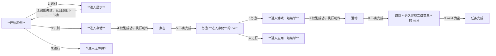
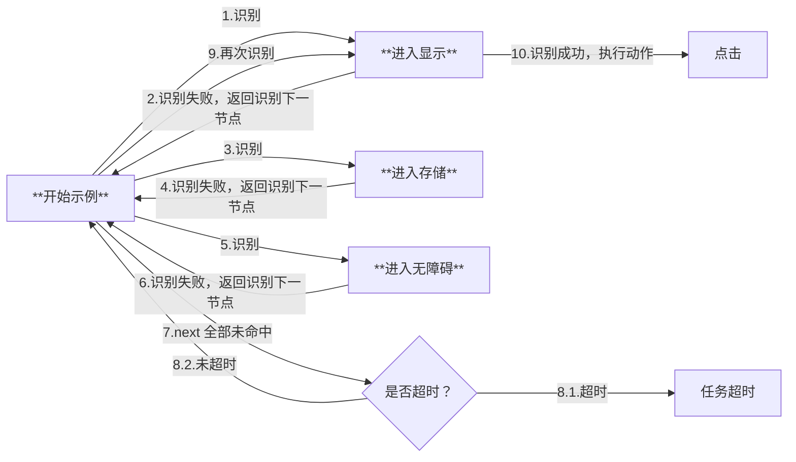
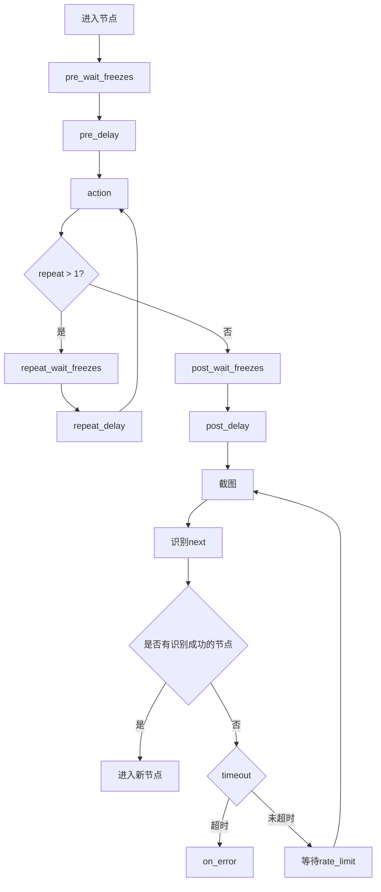
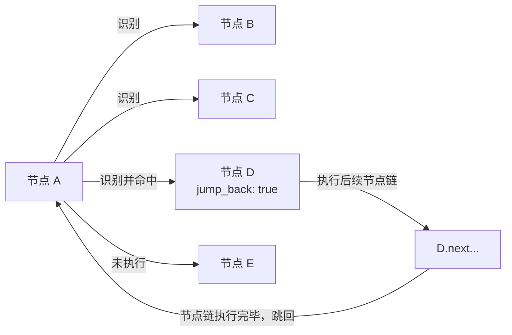

# 3.1 任务流水线（Pipeline）协议

## 基础格式

任务流水线采用 JSON 格式描述，由若干节点（Node）构成，每个节点包含以下核心属性：

```jsonc
{
    "NodeA": {
        "recognition": "OCR",    // 识别算法
        "action": "Click",       // 执行动作
        "next": [                // 后继节点列表
            "NodeB",
            "NodeC"
        ],
        // 其他扩展属性...
    },
    // 其他节点定义...
}
```

## 执行逻辑

### 流程控制机制

1. **任务触发**

   - 通过 tasker.post_task 接口指定入口节点启动任务

2. **顺序检测**

   - 对当前节点的 next 列表进行顺序检测
   - 依次尝试识别每个子节点配置的 recognition 特征

3. **中断机制**

   - 当检测到某个子节点匹配成功时，立即终止后续节点检测
   - 执行匹配节点的 action 定义的操作

4. **后继处理**

   - 操作执行完成后，将激活节点切换为当前节点
   - 重复执行上述检测流程

### 终止条件

当满足以下任意条件时，任务流程终止：

- 当前节点的 next 列表为空
- 所有后继节点持续检测失败直至超时

## 应用示例

### 场景描述

Android 设置界面存在菜单 `显示`/`存储`/`无障碍`，其中 `存储` 打开后包含二级菜单 `游戏`/`应用`。

### 配置示例

```jsonc
{
    "开始示例": {
        "next": [
            "进入显示",
            "进入存储",
            "进入无障碍"
        ]
    },
    "进入显示": {
        "recognition": "XXX",
        "action": "Click",
        // ...
    },
    "进入存储": {
        "recognition": "XXX",
        "action": "Click",
        "next": [
            "进入游戏二级菜单",
            "进入应用二级菜单"
        ]
    },
    "进入无障碍": {
        // ...
    },
    "进入游戏二级菜单": {
        "action": "Swipe",
        "next": []
    },
    "进入应用二级菜单": {
        // ...
    },
    // ...
}
```

### 执行过程推演

#### 情况一



#### 情况二



## 属性字段

> [!TIP]
> **对于必选字段，Pipeline JSON 文件中仍可为空，但需在实际执行前通过接口设置。**  
> 以点（`.`）开头的文件夹、JSON 文件将不会被读取。  
> 以 `$` 开头的 JSON root field 将不会被解析。

### Pipeline v1

- `recognition` : *string*  
    识别算法类型。可选，默认 [`DirectHit`](#directhit) 。  
    可选的值：[`DirectHit`](#directhit) | [`TemplateMatch`](#templatematch) | [`FeatureMatch`](#featurematch) | [`ColorMatch`](#colormatch) | [`OCR`](#ocr) | [`NeuralNetworkClassify`](#neuralnetworkclassify) | [`NeuralNetworkDetect`](#neuralnetworkdetect) | [`And`](#and) | [`Or`](#or) | [`Custom`](#custom)  
    详见 [算法类型](#算法类型)。

- `action`: *string*  
    执行的动作。可选，默认 [`DoNothing`](#donothing) 。  
    可选的值：[`DoNothing`](#donothing) | [`Click`](#click) | [`LongPress`](#longpress) | [`Swipe`](#swipe) | [`MultiSwipe`](#multiswipe) | [`Scroll`](#scroll) | [`ClickKey`](#clickkey) | [`LongPressKey`](#longpresskey) | [`InputText`](#inputtext) | [`StartApp`](#startapp) | [`StopApp`](#stopapp) | [`StopTask`](#stoptask) | [`Command`](#command) | [`Shell`](#shell) | [`Custom`](#custom-1)  
    详见 [动作类型](#动作类型)。

- `next` : *string* | *NodeAttr* | *list<string | NodeAttr, >*  
    接下来要执行的节点列表。可选，默认空。  
    按顺序识别 next 中的每个节点，只执行第一个识别到的。  
    💡 v5.1 版本起新增支持带属性节点、 NodeAttr 形式对象，或两者结合的异质数组。详情请参考 [节点属性](#节点属性)。

- `is_sub`: *bool*  
    **（已在 5.1 版本中废弃，推荐使用 [节点属性](#节点属性) 中的 `[JumpBack]` 功能替代）**  
    我们提供了 [迁移脚本](https://github.com/MaaXYZ/MaaFramework/blob/main/tools/migrate_pipeline_v5.py)，可帮助您无损地将 Pipeline 自动转换为新风格~

- `interrupt` : *string* | *list<string, >*  
    **（已在 5.1 版本中废弃，推荐使用 [节点属性](#节点属性) 中的 `[JumpBack]` 功能替代）**  
    我们提供了 [迁移脚本](https://github.com/MaaXYZ/MaaFramework/blob/main/tools/migrate_pipeline_v5.py)，可帮助您无损地将 Pipeline 自动转换为新风格~

- `rate_limit`: *uint*  
    识别速率限制，单位毫秒。可选，默认 1000 。  
    每轮识别最低消耗 `rate_limit` 毫秒，不足的时间将会 sleep 等待。

- `timeout`: *uint*  
    识别超时时间，毫秒。可选，默认 20 * 1000 。  
    具体逻辑为 `while(!timeout) { foreach(next); sleep_until(rate_limit); }` 。

- `on_error` : *string* | *NodeAttr* | *list<string | NodeAttr, >*  
    当识别超时，或动作执行失败后，接下来会执行该列表中的节点。可选，默认空。  
    💡 v5.1 版本起新增支持带属性节点、 NodeAttr 形式对象，或两者结合的异质数组。详情请参考 [节点属性](#节点属性)。

- `anchor`: *string* | *list<string, >*  
    锚点名称。可选，默认空。  
    当节点执行成功后，会将该锚点名设置为当前节点。多个节点可设置同一个锚点名，后执行的会覆盖先执行的。  
    在 `next` 或 `on_error` 中可通过 `[Anchor]` 属性引用该锚点，运行时会解析为最后设置该锚点的节点。  
    详见 [节点属性](#节点属性)。

- `inverse`: *bool*  
    反转识别结果，识别到了当做没识别到，没识别到的当做识别到了。可选，默认 false 。  
    请注意由此识别出的节点，Click 等动作的点击自身将失效（因为实际并没有识别到东西），若有需求可单独设置 `target` 。  

- `enabled`: *bool*  
    是否启用该 node。可选，默认 true 。  
    若为 false，其他 node 的 next 列表中的该 node 会被跳过，既不会被识别也不会被执行。

- `max_hit`: *uint*  
    该节点最多可被识别成功多少次。可选，默认 UINT_MAX ，即无限制。  
    若超过该次数，其他 node 的 next 列表中的该 node 会被跳过，既不会被识别也不会被执行。

- `pre_delay`: *uint*  
    识别到 到 执行动作前 的延迟，毫秒。可选，默认 200 。  
    推荐尽可能增加中间过程节点，少用延迟，不然既慢还不稳定。

- `post_delay`: *uint*  
    执行动作后 到 识别 next 的延迟，毫秒。可选，默认 200 。  
    推荐尽可能增加中间过程节点，少用延迟，不然既慢还不稳定。

- `pre_wait_freezes`: *uint* | *object*  
    识别到 到 执行动作前，等待画面不动了的时间，毫秒。可选，默认 0 ，即不等待。  
    连续 `pre_wait_freezes` 毫秒 画面 **没有较大变化** 才会退出动作。  
    若为 object，可设置更多参数，详见 [等待画面静止](#等待画面静止)。  
    具体的顺序为 `pre_wait_freezes` - `pre_delay` - `action` - `post_wait_freezes` - `post_delay` 。

- `post_wait_freezes`: *uint* | *object*  
    行动动作后 到 识别 next，等待画面不动了的时间，毫秒。可选，默认 0 ，即不等待。  
    其余逻辑同 `pre_wait_freezes`。

- `repeat`: *uint*  
    动作重复执行次数。可选，默认 1 ，即不重复。  
    执行流程为 `action` - [`repeat_wait_freezes` - `repeat_delay` - `action`] × (repeat-1) 。

- `repeat_delay`: *uint*  
    每次重复动作之间的延迟，毫秒。可选，默认 0 。  
    仅当 `repeat` > 1 时生效，在第二次及之后的每次动作执行前等待。

- `repeat_wait_freezes`: *uint* | *object*  
    每次重复动作之间等待画面不动了的时间，毫秒。可选，默认 0 ，即不等待。  
    仅当 `repeat` > 1 时生效，在第二次及之后的每次动作执行前等待画面静止。  
    若为 object，可设置更多参数，详见 [等待画面静止](#等待画面静止)。

- `focus`: *any*  
    关注节点，会额外产生部分回调消息。可选，默认 null，不产生回调消息。  
    详见 [节点通知](#节点通知)。

- `attach`: *object*  
    附加 JSON 对象，用于保存节点的附加配置。可选，默认空对象。  
    该字段可用于存储自定义的配置信息，这些信息不会影响节点的执行逻辑，但可以通过相关接口获取。  
    **注意**：该字段会与默认值中的 `attach` 进行字典合并（dict merge），而不是覆盖。即节点中的 `attach` 会与默认值中的 `attach` 合并，相同键的值会被节点中的值覆盖，但其他键会保留。

一个节点的生命周期如下



### Pipeline v2

> [!NOTE]
> MaaFW 自 v4.4.0 版本起支持 Pipeline v2 协议，同时兼容 v1。

相较 v1，主要将 `recognition` 和 `action` 相关字段放入了二级字典中（类型放入 `type` 字段，其余参数放入 `param` 字段中），其余并无不同。举例：

```jsonc
{
    "NodeA": {
        "recognition": {
            "type": "TemplateMatch",
            "param": {
                // 识别相关字段放入 recognition.param 中，键和值均无变化
                "template": "A.png",
                "roi": [100, 100, 10, 10]
            }
        },
        "action": {
            "type": "Click",
            "param": {
                // 动作相关字段放入 action.param 中，键和值均无变化
                "target": "XXX"
            }
        },
        // 非 recognition 和 action 的字段与 v1 无变化
        "next": ["NodeB"],
        "pre_delay": 1000,
        // ...
    }
}
```

### 默认属性

请参考 [`default_pipeline.json`](https://github.com/MaaXYZ/MaaFramework/blob/main/sample/resource/default_pipeline.json)

`default_pipeline.json` 用于为所有节点和特定算法/动作类型设置默认参数，减少重复配置。该文件会在资源加载时自动读取，其中的配置会作为基础默认值，被所有节点继承。

#### 配置结构

```jsonc
{
    "Default": {
        // 通用字段的默认值，适用于所有节点
        "rate_limit": 1000,
        "timeout": 20000,
        "pre_delay": 200
    },
    "TemplateMatch": {
        // TemplateMatch 算法的默认参数
        // 可使用 v1 或 v2 格式
        "recognition": "TemplateMatch",  // v1 格式：直接写在根对象
        "threshold": 0.7
        // 或使用 v2 格式：
        // "recognition": { "type": "TemplateMatch", "param": { "threshold": 0.7 } }
    },
    "Click": {
        // Click 动作的默认参数
        "action": "Click",  // v1 格式
        "target": true
        // 或使用 v2 格式：
        // "action": { "type": "Click", "param": { "target": true } }
    }
}
```

#### 字段说明

- `Default` 对象：可设置所有 Pipeline 通用字段的默认值（如 `rate_limit`、`timeout`、`pre_delay`、`post_delay` 等）
- **算法名称对象**（如 `TemplateMatch`、`OCR`、`FeatureMatch` 等）：可设置对应识别算法类型的默认参数
- **动作名称对象**（如 `Click`、`Swipe`、`StartApp` 等）：可设置对应动作类型的默认参数

#### 继承优先级

参数的优先级从高到低为：

1. 节点中直接定义的参数
2. `default_pipeline.json` 中对应算法/动作类型的默认参数
3. `default_pipeline.json` 中 `Default` 对象的默认参数
4. 框架内置的默认值

#### 使用示例

假设 `default_pipeline.json` 配置如下：

```jsonc
{
    "Default": {
        "rate_limit": 2000
    },
    "TemplateMatch": {
        "recognition": "TemplateMatch",
        "threshold": 0.7
    }
}
```

在 Pipeline JSON 中：

```jsonc
{
    "NodeA": {
        "recognition": "TemplateMatch",
        "template": "A.png"
        // rate_limit 将继承 Default 中的 2000
        // threshold 将继承 TemplateMatch 中的 0.7
    },
    "NodeB": {
        "recognition": "TemplateMatch",
        "template": "B.png",
        "threshold": 0.9,  // 覆盖默认值
        "rate_limit": 1000 // 覆盖默认值
    }
}
```

#### 注意事项

- `default_pipeline.json` 应放置在资源包（Bundle）的根目录下，与 `pipeline` 文件夹同级
- 算法/动作对象的键名需与对应的算法/动作类型名称完全一致（如 `TemplateMatch`、`OCR`、`Click`），大小写敏感
- `attach` 字段会进行字典合并（dict merge）而非覆盖，即节点中的 `attach` 会与默认值中的 `attach` 合并
- 若不需要某项默认配置，只需在节点中显式设置为其他值即可覆盖

#### 多 Bundle 加载行为

依次加载多个 Bundle 时：

- 各 Bundle 的 `default_pipeline.json` 会按顺序合并（dict merge），后加载的同名字段会覆盖先加载的
- **已加载的节点不会被后续 Bundle 的 `default_pipeline.json` 影响**
- 每个节点在首次加载时使用当时的合并后默认值，之后不再变化

**示例：** `Bundle_Base` → `Bundle_Debug`

```jsonc
// Bundle_Base/default_pipeline.json
{ "Default": { "rate_limit": 2000 } }

// Bundle_Base/pipeline/main.json
{ "NodeA": { "recognition": "OCR" } }  // 使用 rate_limit: 2000

// Bundle_Debug/default_pipeline.json  
{ "Default": { "rate_limit": 100 } }   // 覆盖默认值

// Bundle_Debug/pipeline/debug.json
{ "NodeB": { "recognition": "OCR" } }  // 使用 rate_limit: 100
```

加载后，`NodeA` 保持 `rate_limit: 2000`，`NodeB` 使用 `rate_limit: 100`。

#### 最佳实践：分离特殊配置

可将特殊配置的节点单独组织到一个 Bundle，配置专用的 `default_pipeline.json`，实现配置隔离。

**示例：** 将调试节点分离到独立 Bundle

```cpp
MaaResourcePostPath(resource, "resource/base");   // base 节点使用 rate_limit: 2000
MaaResourcePostPath(resource, "resource/debug");  // debug 节点使用 rate_limit: 100
```

由于已加载的节点不受后续默认值影响，`base` Bundle 的节点保持其原有配置，`debug` Bundle 的节点使用新的默认值。

## 算法类型

### `DirectHit`

直接命中，即不进行识别，直接执行动作。

### `TemplateMatch`

模板匹配，即“找图”。  

该算法属性需额外部分字段：

- `roi`: *array<int, 4>* | *string*  
    识别区域坐标。可选，默认 [0, 0, 0, 0] ，即全屏。  
  - *array<int, 4>*: 识别区域坐标，[x, y, w, h]，若希望全屏可设为 [0, 0, 0, 0] 。
  - *string*: 填写节点名，在之前执行过的某节点识别到的目标范围内识别。  

- `roi_offset`: *array<int, 4>*  
    在 `roi` 的基础上额外移动再作为范围，四个值分别相加。可选，默认 [0, 0, 0, 0] 。

- `template`: *string* | *list<string, >*  
    模板图片路径，需要 `image` 文件夹的相对路径。必选。  
    所使用的图片需要是无损原图缩放到 720p 后的裁剪。请参考 [这里](1.1-快速开始.md#图片文件)。  
    支持填写文件夹路径，将递归加载其中所有图片文件。

- `threshold`: *double* | *list<double, >*  
    模板匹配阈值。可选，默认 0.7 。  
    若为数组，长度需和 `template` 数组长度相同。

- `order_by`: *string*  
    结果排序方式。可选，默认 [`Horizontal`](#horizontal)。  
    可选的值：[`Horizontal`](#horizontal) | [`Vertical`](#vertical) | [`Score`](#score) | [`Random`](#random) 。  
    可结合 `index` 字段使用。

- `index`: *int*  
    命中第几个结果。可选，默认 0 。  
    假设共有 N 个结果，则 `index` 的取值范围为 [-N, N - 1] ，其中负数使用类 Python 的规则转换为 N - index 。若超出范围，则视为当前识别无结果。

- `method`: *int*  
    模板匹配算法，即 cv::TemplateMatchModes。可选，默认 5 。  
    详情请参考 [OpenCV 官方文档](https://docs.opencv.org/4.x/df/dfb/group__imgproc__object.html)。  
    *10001 为 TM_SQDIFF_NORMED 的反转版本，分数越高越匹配（与原版相反）。*

    | method | 算法名称 | 速度 | 颜色敏感度 | 光照鲁棒性 | 适用场景 |
    |--------|---------|------|-----------|-----------|---------|
    | 10001 | TM_SQDIFF_NORMED (Inverted) | 快 | 敏感 | 差 | 精确匹配，阈值易设定 |
    | 3 | TM_CCORR_NORMED | 中等 | 敏感 | 中 | 模板较亮时效果好 |
    | 5 | TM_CCOEFF_NORMED | 较慢 | 不敏感 | 好 | **推荐**，阈值易设定 |

- `green_mask`: *bool*  
    是否进行绿色掩码。可选，默认 false 。  
    若为 true，可以将图片中不希望匹配的部分涂绿 RGB: (0, 255, 0)，则不对绿色部分进行匹配。  
    注意：算法本身具有较强鲁棒性，常规背景变化通常无需使用此功能。若确需使用，应仅遮盖干扰区域，避免过度涂抹导致主体边缘特征丢失。

### `FeatureMatch`

特征匹配，泛化能力更强的“找图”，具有抗透视、抗尺寸变化等特点。  

该算法属性需额外部分字段：

- `roi`: *array<int, 4>* | *string*  
    同 `TemplateMatch`.`roi` 。

- `roi_offset`: *array<int, 4>*  
    同 `TemplateMatch`.`roi_offset` 。

- `template`: *string* | *list<string, >*  
    模板图片路径，需要 `image` 文件夹的相对路径。必选。
    支持填写文件夹路径，将递归加载其中所有图片文件。  
    注意事项：
  - 模板图片不宜过小，建议至少 64x64 像素，否则特征点过少可能导致匹配失败或误匹配。
  - 模板应包含足够的纹理细节（如边缘、角点），纯色或渐变区域特征点稀少。
  - 避免模板中包含大量重复纹理（如格子、条纹），可能导致特征点匹配混乱。

- `count`: *uint*  
    匹配的特征点的最低数量要求（阈值）。可选，默认 4 。  

- `order_by`: *string*  
    结果排序方式。可选，默认 [`Horizontal`](#horizontal) 。  
    可选的值：[`Horizontal`](#horizontal) | [`Vertical`](#vertical) | [`Score`](#score) | [`Area`](#area) | [`Random`](#random) 。  
    可结合 `index` 字段使用。

- `index`: *int*  
    命中第几个结果。可选，默认 0 。  
    假设共有 N 个结果，则 `index` 的取值范围为 [-N, N - 1] ，其中负数使用类 Python 的规则转换为 N - index 。若超出范围，则视为当前识别无结果。

- `green_mask`: *bool*  
    是否进行绿色掩码。可选，默认 false 。  
    若为 true，可以将图片中不希望匹配的部分涂绿 RGB: (0, 255, 0)，则不对绿色部分进行匹配。  
    注意：算法本身具有较强的鲁棒性，一般背景变化无需使用此功能。若确需使用，应仅遮盖干扰区域，避免过度涂抹导致主体边缘特征丢失。

- `detector`: *string*  
    特征检测器。可选，默认 `SIFT` 。  

    | 检测器 | 速度 | 尺度不变性 | 旋转不变性 | 精度 | 适用场景 |
    |--------|------|-----------|-----------|------|---------|
    | SIFT | 慢 | 有 | 有 | 最高 | **推荐**，对精度要求高的场景 |
    | KAZE | 较慢 | 有 | 有 | 高 | 2D/3D 图像，边缘保持好 |
    | AKAZE | 中等 | 有 | 有 | 较高 | 速度与精度平衡 |
    | BRISK | 快 | 有 | 有 | 中等 | 实时性要求高的场景 |
    | ORB | 最快 | **无** | 有 | 较低 | 模板与目标尺寸一致时使用 |

- `ratio`: *double*  
    KNN 匹配算法的距离比值，[0 - 1.0] , 越大则匹配越宽松（更容易连线）。可选，默认 0.6 。

### `ColorMatch`

颜色匹配，即“找色”。  

该算法属性需额外部分字段：

- `roi`: *array<int, 4>* | *string*  
    同 `TemplateMatch`.`roi` 。

- `roi_offset`: *array<int, 4>*  
    同 `TemplateMatch`.`roi_offset` 。

- `method`: *int*  
    颜色匹配方式。即 cv::ColorConversionCodes。可选，默认 4 (RGB) 。  
    常用值：4 (RGB, 3 通道), 40 (HSV, 3 通道), 6 (GRAY, 1 通道)。  
    详情请参考 [OpenCV 官方文档](https://docs.opencv.org/4.x/d8/d01/group__imgproc__color__conversions.html)。

- `lower`: *list<int, >* | *list<list<int, >>*  
    颜色下限值。必选。最内层 list 长度需和 `method` 的通道数一致。

- `upper`:  *list<int, >* | *list<list<int, >>*  
    颜色上限值。必选。最内层 list 长度需和 `method` 的通道数一致。

- `count`: *uint*  
    符合的像素点的最低数量要求（阈值）。可选，默认 1。

- `order_by`: *string*  
    结果排序方式。可选，默认 [`Horizontal`](#horizontal) 。  
    可选的值：[`Horizontal`](#horizontal) | [`Vertical`](#vertical) | [`Score`](#score) | [`Area`](#area) | [`Random`](#random) 。  
    可结合 `index` 字段使用。

- `index`: *int*  
    命中第几个结果。可选，默认 0 。  
    假设共有 N 个结果，则 `index` 的取值范围为 [-N, N - 1] ，其中负数使用类 Python 的规则转换为 N - index 。若超出范围，则视为当前识别无结果。

- `connected`: *bool*  
    是否是相连的点才会被计数。可选，默认 false 。  
    若为是，在完成颜色过滤后，则只会计数像素点 **全部相连** 的最大块。  
    若为否，则不考虑这些像素点是否相连。

### `OCR`

文字识别。  

该算法属性需额外部分字段：

- `roi`: *array<int, 4>* | *string*  
    同 `TemplateMatch`.`roi` 。

- `roi_offset`: *array<int, 4>*  
    同 `TemplateMatch`.`roi_offset` 。

- `expected`: *string* | *list<string, >*  
    期望的结果，支持正则。可选，默认匹配所有结果。

- `threshold`: *double*  
    模型置信度阈值。可选，默认 0.3 。

- `replace`: *array<string, 2>* | *list<array<string, 2>>*  
    部分文字识别结果不准确，进行替换。可选。

- `order_by`: *string*  
    结果排序方式。可选，默认 [`Horizontal`](#horizontal)。  
    可选的值：[`Horizontal`](#horizontal) | [`Vertical`](#vertical) | [`Area`](#area) | [`Length`](#length) | [`Random`](#random) | [`Expected`](#expected) 。  
    可结合 `index` 字段使用。

- `index`: *int*  
    命中第几个结果。可选，默认 0 。  
    假设共有 N 个结果，则 `index` 的取值范围为 [-N, N - 1] ，其中负数使用类 Python 的规则转换为 N - index 。若超出范围，则视为当前识别无结果。

- `only_rec`: *bool*  
    是否仅识别（不进行检测，需要精确设置 `roi`）。可选，默认 false 。

- `model`: *string*  
    模型 **文件夹** 路径。使用 `model/ocr` 文件夹的相对路径。可选，默认为空。  
    若为空，则为 `model/ocr` 根目录下的模型文件。  
    文件夹中需要包含 `rec.onnx`, `det.onnx`, `keys.txt` 三个文件。

### `NeuralNetworkClassify`

深度学习分类，判断图像中的 **固定位置** 是否为预期的“类别”。  

该算法属性需额外部分字段：

- `roi`: *array<int, 4>* | *string*  
    同 `TemplateMatch`.`roi` 。

- `roi_offset`: *array<int, 4>*  
    同 `TemplateMatch`.`roi_offset` 。

- `labels`: *list<string, >*  
    标注，即每个分类的名字。可选。  
    仅影响调试图片及日志等，若未填写则会填充 "Unknown" 。

- `model`: *string*  
    模型文件路径。使用 `model/classify` 文件夹的相对路径。必选。  
    目前仅支持 ONNX 模型，参考 [NNClassify 食谱](https://github.com/MaaXYZ/MaaNeuralNetworkCookbook/tree/main/NeuralNetworkClassify)。

- `expected`: *int* | *list<int, >*  
    期望的分类下标。可选，默认匹配所有结果。

- `order_by`: *string*  
    结果排序方式。可选，默认 [`Horizontal`](#horizontal) 。  
    可选的值：[`Horizontal`](#horizontal) | [`Vertical`](#vertical) | [`Score`](#score) | [`Random`](#random) | [`Expected`](#expected) 。  
    可结合 `index` 字段使用。

- `index`: *int*  
    命中第几个结果。可选，默认 0 。  
    假设共有 N 个结果，则 `index` 的取值范围为 [-N, N - 1] ，其中负数使用类 Python 的规则转换为 N - index 。若超出范围，则视为当前识别无结果。

举例：例如画面中 **固定位置** 可能出现 猫、狗、老鼠，我们训练了支持该三分类的模型。  
希望识别到 猫 或 老鼠 才点击，而识别到 狗 不点击，则相关字段为：

```jsonc
{
    "labels": ["Cat", "Dog", "Mouse"],
    "expected": [0, 2]
}
```

注意这些值需要与模型实际输出相符。

### `NeuralNetworkDetect`

深度学习目标检测，高级版“找图”。  

与分类器主要区别在于“找”，即支持任意位置。但通常来说模型复杂度会更高，需要更多的训练集、训练时间，使用时的资源占用（推理开销）也会成倍上涨。  

该算法属性需额外部分字段：

- `roi`: *array<int, 4>* | *string*  
    同 `TemplateMatch`.`roi` 。

- `roi_offset`: *array<int, 4>*  
    同 `TemplateMatch`.`roi_offset` 。

- `labels`: *list<string, >*  
    标注，即每个分类的名字。可选。  
    仅影响调试图片及日志等。若未填写，会自动从模型 metadata 中读取（支持从 `names`、`name`、`labels`、`class_names` 字段读取），一般无需手动设置。若模型 metadata 中也没有，则会填充 "Unknown" 。

- `model`: *string*  
    模型文件路径。使用 `model/detect` 文件夹的相对路径。必选。  
    目前支持由 YOLOv8 和 YOLOv11 导出的 ONNX 格式的模型，其他同样输入输出的 YOLO 模型理论上也可以支持，但未经测试。  
    训练参考 [NNDetect 食谱](https://github.com/MaaXYZ/MaaNeuralNetworkCookbook/tree/main/NeuralNetworkDetect)。

- `expected`: *int* | *list<int, >*  
    期望的分类下标。可选，默认匹配所有结果。

- `threshold`: *double* | *list<double, >*  
    模型置信度阈值。可选，默认 0.3 。  
    若为数组，长度需和 `expected` 数组长度相同。

- `order_by`: *string*  
    结果排序方式。可选，默认 [`Horizontal`](#horizontal) 。  
    可选的值：[`Horizontal`](#horizontal) | [`Vertical`](#vertical) | [`Score`](#score) | [`Area`](#area) | [`Random`](#random) | [`Expected`](#expected) 。  
    可结合 `index` 字段使用。  

- `index`: *int*  
    命中第几个结果。可选，默认 0 。  
    假设共有 N 个结果，则 `index` 的取值范围为 [-N, N - 1] ，其中负数使用类 Python 的规则转换为 N - index 。若超出范围，则视为当前识别无结果。

举例：例如画面中可能出现 猫、狗、老鼠，我们训练了支持该三分类的检测模型。  
希望检测到 猫 或 老鼠 才点击，而识别到 狗 不点击，则相关字段为：

```jsonc
{
    "labels": ["Cat", "Dog", "Mouse"],
    "expected": [0, 2]
}
```

注意这些值需要与模型实际输出相符。

### `And`

组合识别（逻辑与）。所有子识别都命中才算成功。

该算法属性需额外部分字段：

- `all_of`: *list<object,>*  
    子识别列表。所有子识别都命中才算成功。必选。  
    列表元素写法与普通节点的 `recognition` 一致（兼容 v1/v2，允许混用）。

- `box_index`: *int*  
    指定输出哪个子识别的识别框（box）作为当前节点的识别框。可选，默认 0。  
    需要满足 `0 <= box_index < all_of.size`。

- `sub_name`: *string*  
    子识别别名。可选。  
    后续子识别可通过 `roi: sub_name` 引用之前子识别的 `filtered` 作为 ROI；同名以最后一个为准。  
    仅当前节点内有效。

示例：

```jsonc
{
    "NodeA": {
        "recognition": "And",
        "all_of": [
            {
                "sub_name": "icon",
                "recognition": "TemplateMatch",
                "template": "A.png",
                "threshold": 0.7
            },
            {
                "recognition": "OCR",
                "roi": "icon",
                "roi_offset": [0, 0, 100, 100],
                "expected": "OK"
            }
        ],
        "box_index": 0
    }
}
```

Pipeline v2 时，将这些字段放到 `recognition.param` 中即可。

### `Or`

组合识别（逻辑或）。命中第一个即成功，后续不再识别。

该算法属性需额外部分字段：

- `any_of`: *list<object,>*  
    子识别列表。命中第一个即成功，后续不再识别。必选。  
    列表元素写法与普通节点的 `recognition` 一致（兼容 v1/v2，允许混用）。

示例：

```jsonc
{
    "NodeB": {
        "recognition": "Or",
        "any_of": [
            {
                "recognition": "TemplateMatch",
                "template": "确定.png"
            },
            {
                "recognition": "OCR",
                "expected": ["OK", "确定"]
            }
        ]
    }
}
```

Pipeline v2 时，将这些字段放到 `recognition.param` 中即可。

### `Custom`

执行通过 `MaaResourceRegisterCustomRecognition` 接口传入的识别器句柄。

该算法属性需额外部分字段：

- `custom_recognition`: *string*  
    识别名，同注册接口传入的识别名。同时会通过 `MaaCustomRecognitionCallback`.`custom_recognition_name` 传出。必选。

- `custom_recognition_param`: *any*  
    识别参数，任意类型，会通过 `MaaCustomRecognitionCallback`.`custom_recognition_param` 传出。可选，默认 `null` 。

- `roi`: *array<int, 4>* | *string*  
    同 `TemplateMatch`.`roi`，会通过 `MaaCustomRecognitionCallback`.`roi` 传出。可选，默认 [0, 0, 0, 0] 。

- `roi_offset`: *array<int, 4>*  
    同 `TemplateMatch`.`roi_offset` 。

## 动作类型

### `DoNothing`

什么都不做。

### `Click`

点击。  

该动作属性需额外部分字段：

- `target`: *true* | *string* | *array<int, 2>* | *array<int, 4>*  
    点击目标的位置。可选，默认 true 。  
  - *true*: 目标为本节点中刚刚识别到的位置（即自身）。  
  - *string*: 填写节点名，目标为之前执行过的某节点识别到的位置。  
  - *array<int, 2>*: 固定坐标点 `[x, y]`。  
  - *array<int, 4>*: 固定坐标区域 `[x, y, w, h]`，会在矩形内随机选取一点（越靠近中心概率越高，边缘概率相对较低），若希望全屏可设为 [0, 0, 0, 0] 。

- `target_offset`: *array<int, 4>*  
    在 `target` 的基础上额外移动再作为点击目标，四个值分别相加。可选，默认 [0, 0, 0, 0] 。

- `contact`: *uint*  
    触点编号，用于区分不同的触控点。可选，默认 0 。  
  - Adb 控制器：表示手指编号（0 为第一根手指，1 为第二根手指，以此类推）
  - Win32 控制器：表示鼠标按键编号（0 为左键，1 为右键，2 为中键，3 为 XBUTTON1，4 为 XBUTTON2）

### `LongPress`

长按。  

该动作属性需额外部分字段：

- `target`: *true* | *string* | *array<int, 2>* | *array<int, 4>*  
    长按目标的位置。可选，默认 true 。值同上述 `Click`.`target` 。

- `target_offset`: *array<int, 4>*  
    在 `target` 的基础上额外移动再作为长按目标，四个值分别相加。可选，默认 [0, 0, 0, 0] 。

- `duration`: *uint*  
    长按持续时间，单位毫秒。可选，默认 1000 。

- `contact`: *uint*  
    触点编号，用于区分不同的触控点。可选，默认 0 。  
  - Adb 控制器：表示手指编号（0 为第一根手指，1 为第二根手指，以此类推）
  - Win32 控制器：表示鼠标按键编号（0 为左键，1 为右键，2 为中键，3 为 XBUTTON1，4 为 XBUTTON2）

### `Swipe`

线性滑动。  

该动作属性需额外部分字段：

- `begin`: *true* | *string* | *array<int, 2>* | *array<int, 4>*  
    滑动起点。可选，默认 true 。值同上述 `Click`.`target` 。

- `begin_offset`: *array<int, 4>*  
    在 `begin` 的基础上额外移动再作为起点，四个值分别相加。可选，默认 [0, 0, 0, 0] 。

- `end`: *true* | *string* | *array<int, 2>* | *array<int, 4>* | *list<true | string | array<int, 2> | array<int, 4>>*  
    滑动终点。可选，默认 true 。值同上述 `Click`.`target` 。  
    💡 v4.5.x 版本新增支持 *list*，可用于添加滑动途径点！相较多次 swipe 的区别是多个 end 之间不会抬手，即一次折线滑动。

- `end_offset`: *array<int, 4>* | *list<array<int, 4>>*  
    在 `end` 的基础上额外移动再作为终点，四个值分别相加。可选，默认 [0, 0, 0, 0] 。

- `duration`: *uint* | *list<uint,>*  
    滑动持续时间，单位毫秒。可选，默认 200 。

- `end_hold`: *uint* | *list<uint,>*  
    滑动到终点后，额外等待一定时间再抬起，单位 ms。可选，默认 0。

- `only_hover`: *bool*  
    仅鼠标悬停移动，无按下/抬起动作。可选，默认 false。

- `contact`: *uint*  
    触点编号，用于区分不同的触控点。可选，默认 0 。  
  - Adb 控制器：表示手指编号（0 为第一根手指，1 为第二根手指，以此类推）
  - Win32 控制器：表示鼠标按键编号（0 为左键，1 为右键，2 为中键，3 为 XBUTTON1，4 为 XBUTTON2）

### `MultiSwipe`

多指线性滑动。  

该动作属性需额外部分字段：

- `swipes`: *list<object,>*  
    多个滑动的数组。必选。  
    数组元素顺序没有影响，只基于 `starting` 确定顺序。

  - `starting`: *uint*  
    滑动起始时间，单位毫秒。可选，默认 0 。  
    `MultiSwipe` 额外字段，该滑动会在本 action 中第 `starting` 毫秒才开始。

  - `begin`: *true* | *string* | *array<int, 2>* | *array<int, 4>*  
    滑动起点。可选，默认 true 。值同上述 `Click`.`target` 。

  - `begin_offset`: *array<int, 4>*  
    在 `begin` 的基础上额外移动再作为起点，四个值分别相加。可选，默认 [0, 0, 0, 0] 。

  - `end`: *true* | *string* | *array<int, 2>* | *array<int, 4>* | *list<true | string | array<int, 2> | array<int, 4>>*  
    滑动终点。可选，默认 true 。值同上述 `Click`.`target` 。  
    💡 v4.5.x 版本新增支持 *list*，可用于添加滑动途径点！相较多次 swipe 的区别是多个 end 之间不会抬手，即一次折线滑动。

  - `end_offset`: *array<int, 4>* | *list<array<int, 4>>*  
    在 `end` 的基础上额外移动再作为终点，四个值分别相加。可选，默认 [0, 0, 0, 0] 。

  - `duration`: *uint* | *list<uint,>*  
    滑动持续时间，单位毫秒。可选，默认 200 。

  - `end_hold`: *uint* | *list<uint,>*  
    滑动到终点后，额外等待一定时间再抬起，单位 ms。可选，默认 0。

  - `only_hover`: *bool*  
    仅鼠标悬停移动，无按下/抬起动作。可选，默认 false。

  - `contact`: *uint*  
    触点编号，用于区分不同的触控点。可选，默认 0 。  
    - Adb 控制器：表示手指编号（0 为第一根手指，1 为第二根手指，以此类推）
    - Win32 控制器：表示鼠标按键编号（0 为左键，1 为右键，2 为中键，3 为 XBUTTON1，4 为 XBUTTON2）  
    **注意**：在 `MultiSwipe` 中，如果 `contact` 为 0，将使用该滑动在数组中的索引作为触点编号。

举例：

```jsonc
{
    "A": {
        "action": "MultiSwipe",
        "swipes": [
            {
                "begin": [],
                "end": [],
            },
            {
                "starting": 500,
                "begin": [],
                "end": []
            }
        ]
    }
}
```

### `TouchDown`

按下触控点。  

该动作属性需额外部分字段：

- `contact`: *uint*  
    触点编号，用于区分不同的触控点。可选，默认 0 。  
  - Adb 控制器：表示手指编号（0 为第一根手指，1 为第二根手指，以此类推）
  - Win32 控制器：表示鼠标按键编号（0 为左键，1 为右键，2 为中键，3 为 XBUTTON1，4 为 XBUTTON2）

- `target`: *true* | *string* | *array<int, 4>* | *array<int, 2>*  
    触控目标的位置。可选，默认 true ，取值含义同 `Click`.`target` 。

- `target_offset`: *array<int, 4>*  
    在 `target` 的基础上额外移动再作为触控目标，四个值分别相加。可选，默认 [0, 0, 0, 0] 。

- `pressure`: *int*  
    触控压力，范围取决于控制器实现。可选，默认 0 。

### `TouchMove`

移动触控点。字段含义与 `TouchDown` 一致，用于更新触点位置。

### `TouchUp`

抬起触控点。  

- `contact`: *uint*  
    触点编号，用于区分不同的触控点。可选，默认 0 。  
  - Adb 控制器：表示手指编号（0 为第一根手指，1 为第二根手指，以此类推）
  - Win32 控制器：表示鼠标按键编号（0 为左键，1 为右键，2 为中键，3 为 XBUTTON1，4 为 XBUTTON2）

### `Scroll`

鼠标滚轮滚动。  

该动作属性需额外部分字段：

- `dx`: *int*  
    水平滚动距离，正值向右滚动，负值向左滚动。可选，默认 0 。  

- `dy`: *int*  
    垂直滚动距离，正值向上滚动，负值向下滚动。可选，默认 0 。  

> [!NOTE]
>
> - Adb 控制器和 PlayCover 控制器不支持滚动操作。仅 Win32 控制器支持。
> - `dx`/`dy` 的值会直接作为滚动增量发送。Windows 标准滚轮每格增量为 120（WHEEL_DELTA），建议使用 120 的整数倍以获得最佳兼容性。

### `ClickKey`

单击按键。  

该动作属性需额外部分字段：

- `key`: *int* | *list<int, >*  
    要单击的键，仅支持对应控制器的虚拟按键码。必选。

  - [Adb 控制器](https://developer.android.com/reference/android/view/KeyEvent)
  - [Win32 控制器](https://learn.microsoft.com/en-us/windows/win32/inputdev/virtual-key-codes)

> [!NOTE]
>
> PlayCover 控制器不支持按键操作。

### `LongPressKey`

长按按键。  

该动作属性需额外部分字段：

- `key`: *int* | *list<int, >*  
    要按的键，仅支持对应控制器的虚拟按键码。必选。

- `duration`: *uint*  
    长按持续时间，单位毫秒。可选，默认 1000 。

### `KeyDown`

按下按键但不立即松开。可与 `KeyUp` 配合实现自定义按键时序。

该动作属性需额外部分字段：

- `key`: *int*  
    要按下的键，仅支持对应控制器的虚拟按键码。必选。

### `KeyUp`

松开按键。用于结束 `KeyDown` 建立的按键状态。

该动作属性需额外部分字段：

- `key`: *int*  
    要松开的键，仅支持对应控制器的虚拟按键码。必选。

### `InputText`

输入文本。  

该动作属性需额外部分字段：

- `input_text`: *string*  
    要输入的文本，部分控制器仅支持 ascii 。必选。

> [!NOTE]
>
> PlayCover 控制器不支持文本输入。

### `StartApp`

启动 App 。  

该动作属性需额外部分字段：

- `package`: *string*  
    启动入口。必选。  
    需要填入 package name 或 activity ，例如 `com.hypergryph.arknights` 或 `com.hypergryph.arknights/com.u8.sdk.U8UnityContext` 。

> [!NOTE]
>
> PlayCover 控制器不支持启动应用，需要手动在 PlayCover 中启动。

### `StopApp`

关闭 App 。  

该动作属性需额外部分字段：

- `package`: *string*  
    要关闭的程序。必选。  
    需要填入 package name ，例如 `com.hypergryph.arknights` 。

### `StopTask`

停止当前任务链（MaaTaskerPostTask 传入的单个任务链）。

### `Command`

执行命令。

该动作属性需额外部分字段：

- `exec`: *string*  
    执行的程序路径。必选。

- `args`: *list<string,>*  
    执行的参数。可选。  
    支持部分运行期参数替换：

  - `{ENTRY}`: 任务入口名。
  - `{NODE}`: 当前节点名。
  - `{IMAGE}`: 截图保存到文件的路径。该文件在进程退出前删除，若要持久保存请自行复制。
  - `{BOX}`: 识别命中的目标，格式为 `[x, y, w, h]`。
  - `{RESOURCE_DIR}`: 最后一次加载的资源文件夹路径。
  - `{LIBRARY_DIR}`: MaaFW 库所在的文件夹路径。

- `detach`: *bool*  
    分离子进程，即不等待子进程执行完成，直接继续执行后面的任务。可选，默认 false。

举例：

```jsonc
{
    "NodeA": {
        "action": "Command",
        "exec": "Python",
        "args": [
            "{RESOURCE_DIR}/my_script/test.py",
            "Haha",
            "{IMAGE}",
            "{NODE}",
            "{BOX}"
        ]
    },
    "NodeB": {
        "action": "Command",
        "exec": "{RESOURCE_DIR}/my_exec/my_exec.exe"
    }
}
```

实际将会执行命令

```bash
# NodeA
Python C:/MaaXXX/resource/my_script/test.py Haha C:/temp/123.png NodeA [0,0,0,0]

# NodeB
C:/MaaXXX/resource/my_exec/my_exec.exe
```

### `Shell`

在 ADB 设备上执行 shell 命令。

该动作属性需额外部分字段：

- `cmd`: *string*  
    要执行的 shell 命令。必选。  
    例如 `getprop ro.build.version.sdk` 或 `settings put global animator_duration_scale 0`。

> 注意：此动作仅对 ADB 控制器有效。命令输出可以通过 `MaaTaskerGetActionDetail` 在动作详情中获取。

### `Custom`

执行通过 `MaaResourceRegisterCustomAction` 接口传入的动作句柄。

该动作属性需额外部分字段：

- `custom_action`: *string*  
    动作名，同注册接口传入的识别器名。同时会通过 `MaaCustomActionCallback`.`custom_action_name` 传出。必选。

- `custom_action_param`: *any*  
    动作参数，任意类型，会通过 `MaaCustomActionCallback`.`custom_action_param` 传出。可选，默认 `null` 。

- `target`: *true* | *string* | *array<int, 2>* | *array<int, 4>*  
    目标的位置，会通过 `MaaCustomActionCallback`.`box` 传出。可选，默认 true 。值同 `Click`.`target`，

- `target_offset`: *array<int, 4>*  
    值同 `Click`.`target_offset` 。

## 节点属性

节点属性（Node Attributes）允许在 `next` 和 `on_error` 列表中为每个节点指定额外的行为控制参数。自 v5.1 版本起，支持通过两种语法形式设置节点属性。

### 基本语法

默认情况下，节点列表仅包含节点名称：

```jsonc
{
    "A": {
        "next": [
            "B",
            "C",
            "D"
        ]
    }
}
```

### 属性设置方式

#### 对象形式（Object Form）

使用 `NodeAttr` 对象显式指定节点名称和属性：

```jsonc
{
    "A": {
        "next": [
            "B",
            {
                "name": "C",
                "jump_back": true
            },
            "D"
        ]
    }
}
```

#### 前缀形式（Prefix Form）

使用方括号前缀在节点名称前直接指定属性：

```jsonc
{
    "A": {
        "next": [
            "B",
            "[JumpBack]C",
            "D"
        ]
    }
}
```

两种形式功能等价，可根据实际需求选择。在数组中可混合使用两种形式，构成异质数组。

### 可用属性

#### `jump_back` / `[JumpBack]`

**类型**: *boolean*  
**默认值**: `false`  
**说明**: 启用跳回机制。当该节点识别命中，系统会在其后续节点链全部执行完毕后，重新返回到该节点所在的父节点，继续尝试识别该父节点的 `next` 列表。

**执行流程**：

1. 父节点按顺序识别 `next` 列表中的节点
2. 若识别命中带有 `jump_back` 属性的节点，执行该节点及其后续节点链
3. 该节点链执行完毕后，返回到父节点
4. 父节点继续从 `next` 列表的起始位置重新开始识别

**示例**：

```jsonc
{
    "A": {
        "next": [
            "B",
            "C",
            "[JumpBack]D",
            "E"
        ]
    }
}
```

执行流程：

- 节点 A 依次尝试识别 B、C、D、E
- 若识别命中 D（假设 B、C 未识别到），执行 D 及其后续节点链
- D 的节点链执行完毕后，返回到节点 A
- 节点 A 重新从 B 开始识别，继续尝试 B、C、D、E

**应用场景**：  
适用于异常处理场景，例如识别并处理网络断开提示框、权限请求弹窗等临时性界面，处理完成后继续执行原有流程。

**兼容性说明**：  
功能类似已废弃的 `is_sub` 字段，但 `jump_back` 仅作用于当前 `next` 列表中的特定节点，而非整个节点定义。



#### `anchor` / `[Anchor]`

**类型**: *boolean*  
**默认值**: `false`  
**说明**: 启用锚点引用。当该属性为 true 时，`name` 字段将被视为锚点名称而非节点名称，运行时会解析为最后设置该锚点的节点。

**使用方式**：

1. 首先在节点中通过 `anchor` 字段设置锚点名称
2. 然后在 `next` 或 `on_error` 中通过 `[Anchor]` 或 `anchor` 引用该锚点

**示例**：

```jsonc
{
    "A": {
        "anchor": "X",
        "next": ["C"]
    },
    "B": {
        "anchor": "X",
        "next": ["C"]
    },
    "C": {
        "next": [
            "D",
            "[Anchor]X"
        ]
    }
}
```

等价的对象形式：

```jsonc
{
    "C": {
        "next": [
            "D",
            { "name": "X", "anchor": true }
        ]
    }
}
```

**应用场景**：  
适用于需要动态引用节点的场景，例如多个节点可能处理同一类事件，后续需要回到"最后处理该事件的节点"继续执行。

### 未来扩展

更多节点属性功能正在规划中，将在后续版本中逐步推出。

## 结果排序方式

识别算法可能返回多个结果，通过 `order_by` 字段指定排序方式，再结合 `index` 字段选取特定结果。

### `Horizontal`

按水平方向排序（从左到右，同列则从上到下）。  
排序规则：优先按 x 坐标升序，x 相同时按 y 坐标升序。

```txt
| 1 3 5 7 |
| 2 4 6 8 |
```

### `Vertical`

按垂直方向排序（从上到下，同行则从左到右）。  
排序规则：优先按 y 坐标升序，y 相同时按 x 坐标升序。

```txt
| 1 2 3 4 |
| 5 6 7 8 |
```

### `Score`

按匹配得分降序排序。得分越高的结果排在越前面。  
适用于需要优先选择置信度最高结果的场景。

### `Area`

按识别框面积降序排序。面积越大的结果排在越前面。  
适用于 `FeatureMatch`、`ColorMatch`、`OCR`、`NeuralNetworkDetect` 算法。

### `Length`

按识别文本长度排序。仅适用于 `OCR` 算法。  
文本越长的结果排在越前面。

### `Random`

随机打乱结果顺序。  
适用于需要随机选择结果的场景。

### `Expected`

按 `expected` 字段中指定的顺序排序。  
对于 `OCR`，按 `expected` 正则表达式列表的顺序排序，先匹配到的正则对应的结果排在前面。  
对于 `NeuralNetworkClassify` 和 `NeuralNetworkDetect`，按 `expected` 分类下标列表的顺序排序。  
未匹配到任何 expected 的结果将被排在最后。

## 等待画面静止

等待画面静止。需连续一定时间 画面 **没有较大变化** 才会退出动作。  

字段值为 uint 或 object，举例：

```jsonc
{
    "A": {
        "pre_wait_freezes": 500,
    },
    "B": {
        "post_wait_freezes": {
            // more properties ...
        },
    },
}
```

若值为 object，可设置部分额外字段：  

- `time`: *uint*  
    连续 `time` 毫秒 画面 **没有较大变化** 才会退出动作。可选，默认 1 。

- `target`: *true* | *string* | *array<int, 2>* | *array<int, 4>*  
    等待目标的位置。可选，默认 true。值同上述 `Click`.`target` 。

- `target_offset`: *array<int, 4>*  
    在 `target` 的基础上额外移动再作为等待目标，四个值分别相加。可选，默认 [0, 0, 0, 0] 。

- `threshold`: *double*  
    判断“没有较大变化”的模板匹配阈值。可选，默认 0.95 。  

- `method`: *int*  
    判断“没有较大变化”的模板匹配算法，即 cv::TemplateMatchModes。可选，默认 5 。  
    同 `TemplateMatch`.`method` 。

- `rate_limit`: *uint*  
    识别速率限制，单位毫秒。可选，默认 1000 。  
    每次识别最低消耗 `rate_limit` 毫秒，不足的时间将会 sleep 等待。

- `timeout`: *uint*  
    识别超时时间，毫秒。可选，默认 20 * 1000 。

## 节点通知

通过配置 `focus` 字段，可以让 UI 在节点执行的特定阶段向用户展示自定义消息。

### 配置方式

在节点中添加 `focus` 字段，键为消息类型，值为要展示的模板字符串，模板字符串支持文件路径、URL或直接文本，内容支持Markdown格式，支持国际化（以$开头）。模板中可使用 `{字段名}` 格式的占位符，UI 会自动替换为实际值。

```jsonc
{
  "NodeA": {
    "focus": {
      "Node.Recognition.Succeeded": "{name} 识别命中，准备开始执行",
      "Node.Action.Starting": "{name} 开始执行，任务 ID: {task_id}"
    }
  }
}
```

### 可用的消息类型

| 消息类型 | 触发时机 | 可用占位符 |
| --- | --- | --- |
| `Node.Recognition.Starting` | 识别开始 | `task_id`, `reco_id`, `name` |
| `Node.Recognition.Succeeded` | 识别成功 | `task_id`, `reco_id`, `name` |
| `Node.Recognition.Failed` | 识别失败 | `task_id`, `reco_id`, `name` |
| `Node.Action.Starting` | 动作开始 | `task_id`, `action_id`, `name` |
| `Node.Action.Succeeded` | 动作成功 | `task_id`, `action_id`, `name` |
| `Node.Action.Failed` | 动作失败 | `task_id`, `action_id`, `name` |

### 更多消息类型

完整的回调消息列表和详细说明请参考 [回调协议](2.3-回调协议.md) 和 [MaaMsg.h](https://github.com/MaaXYZ/MaaFramework/blob/main/include/MaaFramework/MaaMsg.h)。
