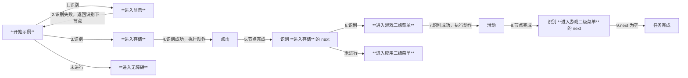
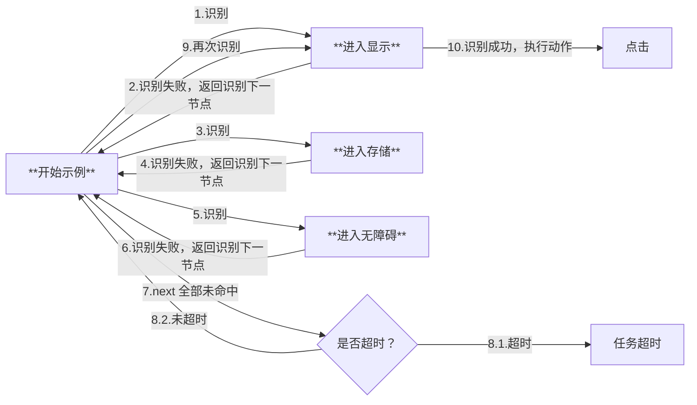

# 任务流水线（Pipeline）协议

## 基础格式

任务流水线采用 JSON 格式描述，由若干节点（Node）构成，每个节点包含以下核心属性：

```jsonc
{
    "NodeA": {
        "recognition": "OCR",    // 识别算法
        "action": "Click",       // 执行动作
        "next: [                 // 后继节点列表
            "NodeB",
            "NodeC"
        ],
        // 其他扩展属性...
    },
    // 其他节点定义...
}
```

## 执行逻辑

### 流程控制机制

1. **任务触发**

   - 通过 tasker.post_task 接口指定入口节点启动任务

2. **顺序检测**

   - 对当前节点的 next 列表进行顺序检测
   - 依次尝试识别每个子节点配置的 recognition 特征

3. **中断机制**

   - 当检测到某个子节点匹配成功时，立即终止后续节点检测
   - 执行匹配节点的 action 定义的操作

4. **后继处理**

   - 操作执行完成后，将激活节点切换为当前节点
   - 重复执行上述检测流程

### 终止条件

当满足以下任意条件时，任务流程终止：

- 当前节点的 next 列表为空
- 所有后继节点持续检测失败直至超时

## 应用示例

### 场景描述

Android 设置界面存在菜单 `显示`/`存储`/`无障碍`，其中 `存储` 打开后包含二级菜单 `游戏`/`应用`。

### 配置示例

```jsonc
{
    "开始示例": {
        "next": [
            "进入显示",
            "进入存储",
            "进入无障碍"
        ]
    },
    "进入显示": {
        "recognition": XXX,
        "action": "Click",
        // ...
    },
    "进入存储": {
        "recognition": XXX,
        "action": "Click",
        "next": [
            "进入游戏二级菜单",
            "进入应用二级菜单"
        ]
    },
    "进入无障碍": {
        // ...
    },
    "进入游戏二级菜单": {
        "action": "Swipe",
        "next": []
    },
    "进入应用二级菜单": {
        // ...
    },
    // ...
}
```

### 执行过程推演

#### 情况一



#### 情况二



## 属性字段

**注：对于必选字段，Pipeline JSON 文件中仍可为空，但需在实际执行前通过接口设置。**

- `recognition` : *string*  
    识别算法类型。可选，默认 `DirectHit` 。  
    可选的值：`DirectHit` | `TemplateMatch` | `FeatureMatch` | `ColorMatch` | `OCR` | `NeuralNetworkClassify` | `NeuralNetworkDetect` | `Custom`  
    详见 [算法类型](#算法类型)。

- `action`: *string*  
    执行的动作。可选，默认 `DoNothing` 。  
    可选的值：`DoNothing` | `Click` | `LongPress` | `Swipe` | `MultiSwipe` | `Key` | `InputText` | `StartApp` | `StopApp` | `StopTask` | `Command` | `Custom`  
    详见 [动作类型](#动作类型)。

- `next` : *string* | *list<string, >*  
    接下来要执行的节点列表。可选，默认空。  
    按顺序识别 next 中的每个节点，只执行第一个识别到的。

- `interrupt` : *string* | *list<string, >*  
    `next` 中全部未识别到时的候补节点列表，会执行类似中断操作。可选，默认空。  
    若 `next` 中的节点全部未识别到，则会按序识别该中断列表中的每个节点，并执行第一个识别到的。在后续节点全部执行完成后，重新跳转到该节点来再次尝试识别。  
    例如: A: { next: [B, C], interrupt: [D, E] }  
    当 B, C 未识别到而识别到 D 时，会去完整的执行 D 及 D.next。但当 D 的流水线完全执行完毕后。会再次回到节点 A，继续尝试识别 B, C, D, E 。  
    该字段多用于异常处理，例如 D 是识别 “网络断开提示框”，在点击确认并等待网络连接成功后，继续之前的节点流程。
  
- `is_sub`: *bool*  
    **（已在 2.x 版本中废弃，但保留兼容性，推荐使用 `interrupt` 替代）**  
    是否是子节点。可选，默认 false 。  
    如果是子节点，执行完本节点（及后续 next 等）后，会返回来再次识别本节点 **所在的** next 列表。  
    例如：A.next = [B, Sub_C, D]，这里的 Sub_C.is_sub = true，  
    若匹配上了 Sub_C，在完整执行完 Sub_C 及后续节点后，会返回来再次识别 [B, Sub_C, D] 并执行命中项及后续节点。
  
- `rate_limit`: *uint*  
    识别速率限制，单位毫秒。可选，默认 1000 。  
    每轮识别 `next` + `interrupt` 最低消耗 `rate_limit` 毫秒，不足的时间将会 sleep 等待。

- `timeout`: *uint*  
    `next` + `interrupt` 识别超时时间，毫秒。可选，默认 20 * 1000 。  
    具体逻辑为 `while(!timeout) { foreach(next + interrupt); sleep_until(rate_limit); }` 。

- `on_error` : *string* | *list<string, >*  
    当识别超时，或动作执行失败后，接下来会执行该列表中的节点。可选，默认空。

- `inverse`: *bool*  
    反转识别结果，识别到了当做没识别到，没识别到的当做识别到了。可选，默认 false 。  
    请注意由此识别出的节点，Click 等动作的点击自身将失效（因为实际并没有识别到东西），若有需求可单独设置 `target` 。  

- `enabled`: *bool*  
    是否启用该 node。可选，默认 true 。  
    若为 false，其他 node 的 next 列表中的该 node 会被跳过，既不会被识别也不会被执行。

- `pre_delay`: *uint*  
    识别到 到 执行动作前 的延迟，毫秒。可选，默认 200 。  
    推荐尽可能增加中间过程节点，少用延迟，不然既慢还不稳定。

- `post_delay`: *uint*  
    执行动作后 到 识别 next 的延迟，毫秒。可选，默认 200 。  
    推荐尽可能增加中间过程节点，少用延迟，不然既慢还不稳定。

- `pre_wait_freezes`: *uint* | *object*  
    识别到 到 执行动作前，等待画面不动了的时间，毫秒。可选，默认 0 ，即不等待。  
    连续 `pre_wait_freezes` 毫秒 画面 **没有较大变化** 才会退出动作。  
    若为 object，可设置更多参数，详见 [等待画面静止](#等待画面静止)。  
    具体的顺序为 `pre_wait_freezes` - `pre_delay` - `action` - `post_wait_freezes` - `post_delay` 。

- `post_wait_freezes`: *uint* | *object*  
    行动动作后 到 识别 next，等待画面不动了的时间，毫秒。可选，默认 0 ，即不等待。  
    其余逻辑同 `pre_wait_freezes`。

- `focus`: *any*  
    关注节点，会额外产生部分回调消息。可选，默认 null，不产生回调消息。  
    详见 [节点通知](#节点通知)。

## 默认属性

请参考 [default_pipeline.json](https://github.com/MaaXYZ/MaaFramework/blob/main/sample/resource/default_pipeline.json)  
`Default` 中可设置所有字段的默认值；算法/动作名 的对象中可设置对应算法/动作 的默认参数值。

## 算法类型

### `DirectHit`

直接命中，即不进行识别，直接执行动作。

### `TemplateMatch`

模板匹配，即“找图”。  

该算法属性需额外部分字段：

- `roi`: *array<int, 4>* | *string*  
    识别区域坐标。可选，默认 [0, 0, 0, 0] ，即全屏。  
  - *array<int, 4>*: 识别区域坐标，[x, y, w, h]，若希望全屏可设为 [0, 0, 0, 0] 。
  - *string*: 填写节点名，在之前执行过的某节点识别到的目标范围内识别。  

- `roi_offset`: *array<int, 4>*  
    在 `roi` 的基础上额外移动再作为范围，四个值分别相加。可选，默认 [0, 0, 0, 0] 。

- `template`: *string* | *list<string, >*  
    模板图片路径，需要 `image` 文件夹的相对路径。必选。  
    所使用的图片需要是无损原图缩放到 720p 后的裁剪。请参考 [这里](1.1-快速开始.md#图片文件)。  
    支持填写文件夹路径，将递归加载其中所有图片文件。

- `threshold`: *double* | *list<double, >*  
    模板匹配阈值。可选，默认 0.7 。  
    若为数组，长度需和 `template` 数组长度相同。

- `order_by`: *string*  
    结果排序方式。可选，默认 `Horizontal`。  
    可选的值：`Horizontal` | `Vertical` | `Score` | `Random` 。  
    可结合 `index` 字段使用。

- `index`: *int*  
    命中第几个结果。可选，默认 0 。  
    假设共有 N 个结果，则 `index` 的取值范围为 [-N, N - 1] ，其中负数使用类 Python 的规则转换为 N - index 。若超出范围，则视为当前识别无结果。

- `method`: *int*  
    模板匹配算法，即 cv::TemplateMatchModes。可选，默认 5 。  
    仅支持 1、3、5，可简单理解为越大的越精确，但也会更慢。  
    详情请参考 [OpenCV 官方文档](https://docs.opencv.org/4.x/df/dfb/group__imgproc__object.html)。

- `green_mask`: *bool*  
    是否进行绿色掩码。可选，默认 false 。  
    若为 true，可以将图片中不希望匹配的部分涂绿 RGB: (0, 255, 0)，则不对绿色部分进行匹配。

### `FeatureMatch`

特征匹配，泛化能力更强的“找图”，具有抗透视、抗尺寸变化等特点。  

该算法属性需额外部分字段：

- `roi`: *array<int, 4>* | *string*  
    同 `TemplateMatch`.`roi` 。

- `roi_offset`: *array<int, 4>*  
    同 `TemplateMatch`.`roi_offset` 。

- `template`: *string* | *list<string, >*  
    模板图片路径，需要 `image` 文件夹的相对路径。必选。  
    支持填写文件夹路径，将递归加载其中所有图片文件。

- `count`: *int*  
    匹配的特征点的最低数量要求（阈值）。可选，默认 4 。  

- `order_by`: *string*  
    结果排序方式。可选，默认 `Horizontal` 。  
    可选的值：`Horizontal` | `Vertical` | `Score` | `Area` | `Random` 。  
    可结合 `index` 字段使用。

- `index`: *int*  
    命中第几个结果。可选，默认 0 。  
    假设共有 N 个结果，则 `index` 的取值范围为 [-N, N - 1] ，其中负数使用类 Python 的规则转换为 N - index 。若超出范围，则视为当前识别无结果。

- `green_mask`: *bool*  
    是否进行绿色掩码。可选，默认 false 。  
    若为 true，可以将图片中不希望匹配的部分涂绿 RGB: (0, 255, 0)，则不对绿色部分进行匹配。

- `detector`: *string*  
    特征检测器。可选，默认 `SIFT` 。  
    目前支持以下算法：

  - SIFT  
    计算复杂度高，具有尺度不变性、旋转不变性。效果最好。  
  - KAZE  
    适用于2D和3D图像，具有尺度不变性、旋转不变性。  
  - AKAZE  
    计算速度较快，具有尺度不变性、旋转不变性。  
  - BRISK  
    计算速度非常快，具有尺度不变性、旋转不变性。  
  - ORB  
    计算速度非常快，具有旋转不变性。但不具有尺度不变性。  

  各算法特点详情可自行进一步查询。

- `ratio`: *double*  
    KNN 匹配算法的距离比值，[0 - 1.0] , 越大则匹配越宽松（更容易连线）。可选，默认 0.6 。

### `ColorMatch`

颜色匹配，即“找色”。  

该算法属性需额外部分字段：

- `roi`: *array<int, 4>* | *string*  
    同 `TemplateMatch`.`roi` 。

- `roi_offset`: *array<int, 4>*  
    同 `TemplateMatch`.`roi_offset` 。

- `method`: *int*  
    颜色匹配方式。即 cv::ColorConversionCodes。可选，默认 4 (RGB) 。  
    常用值：4 (RGB, 3 通道), 40 (HSV, 3 通道), 6 (GRAY, 1 通道)。  
    详情请参考 [OpenCV 官方文档](https://docs.opencv.org/4.x/d8/d01/group__imgproc__color__conversions.html)。

- `lower`: *list<int, >* | *list<list<int, >>*  
    颜色下限值。必选。最内层 list 长度需和 `method` 的通道数一致。

- `upper`:  *list<int, >* | *list<list<int, >>*  
    颜色上限值。必选。最内层 list 长度需和 `method` 的通道数一致。

- `count`: *int*  
    符合的像素点的最低数量要求（阈值）。可选，默认 1。

- `order_by`: *string*  
    结果排序方式。可选，默认 `Horizontal` 。  
    可选的值：`Horizontal` | `Vertical` | `Score` | `Area` | `Random` 。  
    可结合 `index` 字段使用。

- `index`: *int*  
    命中第几个结果。可选，默认 0 。  
    假设共有 N 个结果，则 `index` 的取值范围为 [-N, N - 1] ，其中负数使用类 Python 的规则转换为 N - index 。若超出范围，则视为当前识别无结果。

- `connected`: *bool*  
    是否是相连的点才会被计数。可选，默认 false 。  
    若为是，在完成颜色过滤后，则只会计数像素点 **全部相连** 的最大块。  
    若为否，则不考虑这些像素点是否相连。

### `OCR`

文字识别。  

该算法属性需额外部分字段：

- `roi`: *array<int, 4>* | *string*  
    同 `TemplateMatch`.`roi` 。

- `roi_offset`: *array<int, 4>*  
    同 `TemplateMatch`.`roi_offset` 。

- `expected`: *string* | *list<string, >*  
    期望的结果，支持正则。必选。

- `threshold`: *double*  
    模型置信度阈值。可选，默认 0.3 。

- `replace`: *array<string, 2>* | *list<array<string, 2>>*  
    部分文字识别结果不准确，进行替换。可选。

- `order_by`: *string*  
    结果排序方式。可选，默认 `Horizontal`。  
    可选的值：`Horizontal` | `Vertical` | `Area` | `Length` | `Random` 。  
    可结合 `index` 字段使用。

- `index`: *int*  
    命中第几个结果。可选，默认 0 。  
    假设共有 N 个结果，则 `index` 的取值范围为 [-N, N - 1] ，其中负数使用类 Python 的规则转换为 N - index 。若超出范围，则视为当前识别无结果。

- `only_rec`: *bool*  
    是否仅识别（不进行检测，需要精确设置 `roi`）。可选，默认 false 。

- `model`: *string*  
    模型 **文件夹** 路径。使用 `model/ocr` 文件夹的相对路径。可选，默认为空。  
    若为空，则为 `model/ocr` 根目录下的模型文件。  
    文件夹中需要包含 `rec.onnx`, `det.onnx`, `keys.txt` 三个文件。

### `NeuralNetworkClassify`

深度学习分类，判断图像中的 **固定位置** 是否为预期的“类别”。  

该算法属性需额外部分字段：

- `roi`: *array<int, 4>* | *string*  
    同 `TemplateMatch`.`roi` 。

- `roi_offset`: *array<int, 4>*  
    同 `TemplateMatch`.`roi_offset` 。

- `labels`: *list<string, >*  
    标注，即每个分类的名字。可选。  
    仅影响调试图片及日志等，若未填写则会填充 "Unknown" 。

- `model`: *string*  
    模型文件路径。使用 `model/classify` 文件夹的相对路径。必选。  
    目前仅支持 ONNX 模型，参考 [NNClassify 食谱](https://github.com/MaaXYZ/MaaNeuralNetworkCookbook/tree/main/NeuralNetworkClassify)。

- `expected`: *int* | *list<int, >*  
    期望的分类下标。

- `order_by`: *string*  
    结果排序方式。可选，默认 `Horizontal` 。  
    可选的值：`Horizontal` | `Vertical` | `Score` | `Random` 。  
    可结合 `index` 字段使用。

- `index`: *int*  
    命中第几个结果。可选，默认 0 。  
    假设共有 N 个结果，则 `index` 的取值范围为 [-N, N - 1] ，其中负数使用类 Python 的规则转换为 N - index 。若超出范围，则视为当前识别无结果。

举例：例如画面中 **固定位置** 可能出现 猫、狗、老鼠，我们训练了支持该三分类的模型。  
希望识别到 猫 或 老鼠 才点击，而识别到 狗 不点击，则相关字段为：

```jsonc
{
    "labels": ["Cat", "Dog", "Mouse"],
    "expected": [0, 2]
}
```

注意这些值需要与模型实际输出相符。

### `NeuralNetworkDetect`

深度学习目标检测，高级版“找图”。  

与分类器主要区别在于“找”，即支持任意位置。但通常来说模型复杂度会更高，需要更多的训练集、训练时间，使用时的资源占用（推理开销）也会成倍上涨。  

该算法属性需额外部分字段：

- `roi`: *array<int, 4>* | *string*  
    同 `TemplateMatch`.`roi` 。

- `roi_offset`: *array<int, 4>*  
    同 `TemplateMatch`.`roi_offset` 。

- `labels`: *list<string, >*  
    标注，即每个分类的名字。可选。  
    仅影响调试图片及日志等，若未填写则会填充 "Unknown" 。

- `model`: *string*  
    模型文件路径。使用 `model/detect` 文件夹的相对路径。必选。  
    目前支持 YoloV8 ONNX 模型，其他同样输入输出的 Yolo 模型理论上也可以支持，但未经测试。  
    训练参考 [NNDetect 食谱](https://github.com/MaaXYZ/MaaNeuralNetworkCookbook/tree/main/NeuralNetworkDetect)。

- `expected`: *int* | *list<int, >*  
    期望的分类下标。

- `threshold`: *double* | *list<double, >*  
    模型置信度阈值。可选，默认 0.3 。  
    若为数组，长度需和 `expected` 数组长度相同。

- `order_by`: *string*  
    结果排序方式。可选，默认 `Horizontal` 。  
    可选的值：`Horizontal` | `Vertical` | `Score` | `Area` | `Random` 。  
    可结合 `index` 字段使用。

- `index`: *int*  
    命中第几个结果。可选，默认 0 。  
    假设共有 N 个结果，则 `index` 的取值范围为 [-N, N - 1] ，其中负数使用类 Python 的规则转换为 N - index 。若超出范围，则视为当前识别无结果。

举例：例如画面中可能出现 猫、狗、老鼠，我们训练了支持该三分类的检测模型。  
希望检测到 猫 或 老鼠 才点击，而识别到 狗 不点击，则相关字段为：

```jsonc
{
    "labels": ["Cat", "Dog", "Mouse"],
    "expected": [0, 2]
}
```

注意这些值需要与模型实际输出相符。

### `Custom`

执行通过 `MaaResourceRegisterCustomRecognition` 接口传入的识别器句柄。

该算法属性需额外部分字段：

- `custom_recognition`: *string*  
    识别名，同注册接口传入的识别名。同时会通过 `MaaCustomRecognitionCallback`.`custom_recognition_name` 传出。必选。

- `custom_recognition_param`: *any*  
    识别参数，任意类型，会通过 `MaaCustomRecognitionCallback`.`custom_recognition_param` 传出。可选，默认空 json，即 `{}` 。

- `roi`: *array<int, 4>* | *string*  
    同 `TemplateMatch`.`roi`，会通过 `MaaCustomRecognitionCallback`.`roi` 传出。可选，默认 [0, 0, 0, 0] 。

- `roi_offset`: *array<int, 4>*  
    同 `TemplateMatch`.`roi_offset` 。

## 动作类型

### `DoNothing`

什么都不做。

### `Click`

点击。  

该动作属性需额外部分字段：

- `target`: *true* | *string* | *array<int, 4>*  
    点击的位置。可选，默认 true 。  
  - *true*: 点击本节点中刚刚识别到的目标（即点击自身）。  
  - *string*: 填写节点名，点击之前执行过的某节点识别到的目标。  
  - *array<int, 4>*: 点击固定坐标区域内随机一点，[x, y, w, h]，若希望全屏可设为 [0, 0, 0, 0] 。

- `target_offset`: *array<int, 4>*  
    在 `target` 的基础上额外移动再点击，四个值分别相加。可选，默认 [0, 0, 0, 0] 。

### `LongPress`

长按。  

该动作属性需额外部分字段：

- `target`: *true* | *string* | *array<int, 4>*  
    长按的位置。可选，默认 true 。值同上述 `Click`.`target` 。

- `target_offset`: *array<int, 4>*  
    在 `target` 的基础上额外移动再长按，四个值分别相加。可选，默认 [0, 0, 0, 0] 。

- `duration`: *uint*  
    长按持续时间，单位毫秒。可选，默认 1000 。

### `Swipe`

线性滑动。  

该动作属性需额外部分字段：

- `begin`: *true* | *string* | *array<int, 4>*  
    滑动起点。可选，默认 true 。值同上述 `Click`.`target` 。

- `begin_offset`: *array<int, 4>*  
    在 `begin` 的基础上额外移动再作为起点，四个值分别相加。可选，默认 [0, 0, 0, 0] 。

- `end`: *true* | *string* | *array<int, 4>*  
    滑动终点。可选，默认 true 。值同上述 `Click`.`target` 。

- `end_offset`: *array<int, 4>*  
    在 `end` 的基础上额外移动再作为终点，四个值分别相加。可选，默认 [0, 0, 0, 0] 。

- `duration`: *uint*  
    滑动持续时间，单位毫秒。可选，默认 200 。

### `MultiSwipe`

多指线性滑动。  

该动作属性需额外部分字段：

- `swipes`: *list<object,>*  
    多个滑动的数组。必选。  
    数组元素顺序没有影响，只基于 `starting` 确定顺序。

  - `starting`: *uint*  
    滑动起始时间，单位毫秒。可选，默认 0 。  
    `MultiSwipe` 额外字段，该滑动会在本 action 中第 `starting` 毫秒才开始。

  - `begin`: *true* | *string* | *array<int, 4>*  
    滑动起点。可选，默认 true 。值同上述 `Click`.`target` 。

  - `begin_offset`: *array<int, 4>*  
    在 `begin` 的基础上额外移动再作为起点，四个值分别相加。可选，默认 [0, 0, 0, 0] 。

  - `end`: *true* | *string* | *array<int, 4>*  
    滑动终点。可选，默认 true 。值同上述 `Click`.`target` 。

  - `end_offset`: *array<int, 4>*  
    在 `end` 的基础上额外移动再作为终点，四个值分别相加。可选，默认 [0, 0, 0, 0] 。

  - `duration`: *uint*  
    滑动持续时间，单位毫秒。可选，默认 200 。

举例：

```jsonc
{
    "A": {
        "action": "MultiSwipe",
        "swipes": [
            {
                "begin": xxx,
                "end": xxx
            },
            {
                "starting": 500,
                "begin": xxx,
                "end": xxx
            }
        ]
    }
}
```

### `Key`

按键。  

- `key`: *int* | *list<int, >*  
    要按的键，仅支持对应控制器的虚拟按键码。

  - [Adb 控制器](https://developer.android.com/reference/android/view/KeyEvent)
  - [Win32 控制器](https://learn.microsoft.com/en-us/windows/win32/inputdev/virtual-key-codes)

### `InputText`

输入文本。  

- `input_text`: *string*  
    要输入的文本，部分控制器仅支持 ascii 。

### `StartApp`

启动 App 。  

该动作属性需额外部分字段：

- `package`: *string*  
    启动入口。必选。  
    需要填入 package name 或 activity ，例如 `com.hypergryph.arknights` 或 `com.hypergryph.arknights/com.u8.sdk.U8UnityContext` 。

### `StopApp`

关闭 App 。  

该动作属性需额外部分字段：

- `package`: *string*  
    要关闭的程序。必选。  
    需要填入 package name ，例如 `com.hypergryph.arknights` 。

### `StopTask`

停止当前任务链（MaaTaskerPostTask 传入的单个任务链）。

### `Command`

执行命令。

该动作属性需额外部分字段：

- `exec`: *string*  
    执行的程序路径。必选。

- `args`: *list<string,>*  
    执行的参数。可选。  
    支持部分运行期参数替换：

  - `{ENTRY}`: 任务入口名。
  - `{NODE}`: 当前节点名。
  - `{IMAGE}`: 截图保存到文件的路径。该文件在进程退出前删除，若要持久保存请自行复制。
  - `{BOX}`: 识别命中的目标，格式为 `[x, y, w, h]`。
  - `{RESOURCE_DIR}`: 最后一次加载的资源文件夹路径。
  - `{LIBRARY_DIR}`: MaaFW 库所在的文件夹路径。

- `detach`: *bool*  
    分离子进程，即不等待子进程执行完成，直接继续执行后面的任务。可选，默认 false。

举例：

```jsonc
{
    "NodeA": {
        "action": "Command",
        "exec": "Python",
        "args": [
            "{RESOURCE_DIR}/my_script/test.py",
            "Haha",
            "{IMAGE}",
            "{NODE}",
            "{BOX}"
        ]
    },
    "NodeB": {
        "action": "Command",
        "exec": "{RESOURCE_DIR}/my_exec/my_exec.exe"
    }
}
```

实际将会执行命令

```bash
# NodeA
Python C:/MaaXXX/resource/my_script/test.py Haha C:/temp/123.png NodeA [0,0,0,0]

# NodeB
C:/MaaXXX/resource/my_exec/my_exec.exe
```

### `Custom`

执行通过 `MaaResourceRegisterCustomAction` 接口传入的动作句柄。

该动作属性需额外部分字段：

- `custom_action`: *string*  
    动作名，同注册接口传入的识别器名。同时会通过 `MaaCustomActionCallback`.`custom_action_name` 传出。必选。

- `custom_action_param`: *any*  
    动作参数，任意类型，会通过 `MaaCustomActionCallback`.`custom_action_param` 传出。可选，默认空 json，即 `{}` 。

- `target`: *true* | *string* | *array<int, 4>*  
    同 `Click`.`target`，会通过 `MaaCustomActionCallback`.`box` 传出。可选，默认 true 。

- `target_offset`: *array<int, 4>*  
    同 `Click`.`target_offset` 。

## 等待画面静止

等待画面静止。需连续一定时间 画面 **没有较大变化** 才会退出动作。  

字段值为 uint 或 object，举例：

```jsonc
{
    "A": {
        "pre_wait_freezes": 500,
    },
    "B": {
        "pre_wait_freezes": {
            // more properties ...
        },
    },
}
```

若值为 object，可设置部分额外字段：  

- `time`: *uint*  
    连续 `time` 毫秒 画面 **没有较大变化** 才会退出动作。可选，默认 1 。

- `target`: *true* | *string* | *array<int, 4>*  
    等待的目标。可选，默认 true。值同上述 `Click`.`target` 。

- `target_offset`: *array<int, 4>*  
    在 `target` 的基础上额外移动再作为等待目标，四个值分别相加。可选，默认 [0, 0, 0, 0] 。

- `threshold`: *double*  
    判断“没有较大变化”的模板匹配阈值。可选，默认 0.95 。  

- `method`: *int*  
    判断“没有较大变化”的模板匹配算法，即 cv::TemplateMatchModes。可选，默认 5 。  
    同 `TemplateMatch`.`method` 。

- `rate_limit`: *uint*  
    识别速率限制，单位毫秒。可选，默认 1000 。  
    每次识别最低消耗 `rate_limit` 毫秒，不足的时间将会 sleep 等待。

- `timeout`: *uint*  
    识别超时时间，毫秒。可选，默认 20 * 1000 。

## 节点通知

详见 [回调协议](2.2-回调协议.md)（还没写x
