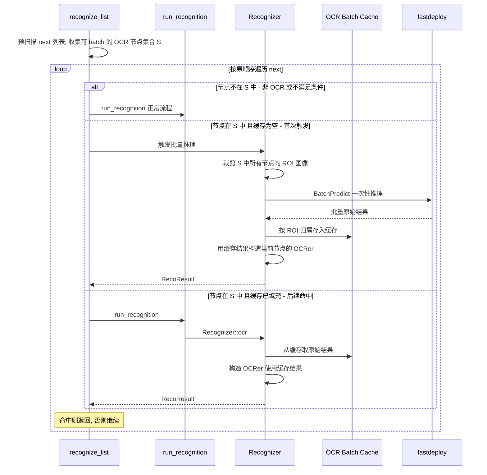
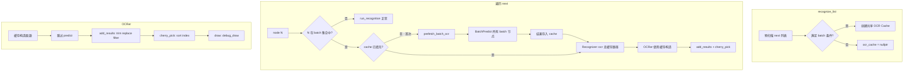

# 批量 OCR 识别优化方案（缓存预热版）

## 问题分析

当前 [`recognize_list()`](source/MaaFramework/Task/PipelineTask.cpp:228) 串行遍历 next 列表，每个 OCR 节点独立调用 `Predict()`，完全串行。当 next 中有多个 OCR 节点时性能瓶颈明显。

## 核心思路：缓存预热

**不改变 `recognize_list` 的遍历顺序和逻辑**，引入一个临时的"OCR 批量缓存"：

1. **预扫描**：遍历 next 列表前，收集满足条件的 OCR 节点（`only_rec` 一致、`model` 相同、ROI 不依赖当前 next 中其他节点的识别结果）
2. **正常遍历**：按原有顺序逐个识别 next 节点（前面可能有非 OCR 节点会直接命中）
3. **触发批量**：当遍历到第一个被收集的 OCR 节点时，**一次性调用 BatchPredict 识别所有收集的节点**，结果存入临时缓存
4. **缓存命中**：后续遍历到同组 OCR 节点时，OCRer 直接从缓存取推理结果，跳过 Predict 调用



## 详细设计

### 0. 预重构：抽象 Recognizer 结果构建

当前 [`Recognizer`](source/MaaFramework/Task/Component/Recognizer.cpp) 的 7 个识别方法（`template_match` / `feature_match` / `color_match` / `ocr` / `nn_classify` / `nn_detect` / `custom_recognize`）在创建 analyzer 后，都有一段**完全相同**的结果提取 boilerplate（~8 行 × 7 处）：

```cpp
// 以下在 7 个方法中逐字重复
sub_filtered_boxes_->insert_or_assign(name, get_boxes(analyzer.filtered_results()));
sub_best_box_->insert_or_assign(name, analyzer.best_result() ? analyzer.best_result()->box : cv::Rect {});

std::optional<cv::Rect> box = std::nullopt;
if (analyzer.best_result()) { box = analyzer.best_result()->box; }

return RecoResult { .reco_id = reco_id_, .name = name, .algorithm = "...",
                    .box = std::move(box),
                    .detail = gen_detail(...), .draws = std::move(analyzer).draws() };
```

**提取模板方法** `build_result`：所有 analyzer 都通过 `RecoResultAPI<T>` 提供相同的 `all_results() / filtered_results() / best_result()` 接口，天然适合泛型：

```cpp
template <typename Analyzer>
RecoResult build_result(const std::string& name, const std::string& algorithm, Analyzer&& analyzer)
{
    sub_filtered_boxes_->insert_or_assign(name, get_boxes(analyzer.filtered_results()));
    sub_best_box_->insert_or_assign(name, analyzer.best_result() ? analyzer.best_result()->box : cv::Rect {});

    return RecoResult {
        .reco_id = reco_id_,
        .name = name,
        .algorithm = algorithm,
        .box = analyzer.best_result() ? std::make_optional(analyzer.best_result()->box) : std::nullopt,
        .detail = gen_detail(analyzer.all_results(), analyzer.filtered_results(), analyzer.best_result()),
        .draws = std::move(analyzer).draws(),
    };
}
```

重构后每个方法从 ~20 行缩减到 ~5 行（只保留获取 ROI、创建 analyzer、`return build_result(...)`）。更关键的是：为 section 4 的缓存分支**消除了代码重复**——缓存路径和原路径只是 OCRer 构造参数不同，结果提取共用 `build_result`。

此步可独立提交，与 batch 功能解耦。

### 1. OCR 批量缓存结构

在 [`Recognizer`](source/MaaFramework/Task/Component/Recognizer.h:15) 中新增缓存字段：

```cpp
// Recognizer.h 新增

// 批量 OCR 缓存：key 是 { node_name, roi } 的组合标识
// value 是该 ROI 的原始推理结果（text + score + box）
// 生命周期：仅在单次 recognize_list 调用期间有效
struct OCRBatchCacheKey
{
    std::string node_name;
    cv::Rect roi;
    // operator== 和 hash
};

// 缓存的值：一个 ROI 对应的 OCR 原始推理结果
struct OCRBatchCacheValue
{
    // only_rec: 单个 Result
    // det+rec: 多个 Result（一个 ROI 可能检测到多个文字区域）
    std::vector<OCRerResult> results;
};

// 缓存容器
std::shared_ptr<std::unordered_map<std::string, OCRBatchCacheValue>> ocr_batch_cache_;
```

**生命周期**：缓存通过 `shared_ptr` 持有，在 `recognize_list` 调用 `Recognizer` 构造时传入，遍历结束后自然销毁。AND/OR 中的子 `Recognizer` 通过拷贝构造共享同一份缓存。

### 2. 预扫描逻辑：`collect_batchable_ocr_nodes`

在 [`PipelineTask`](source/MaaFramework/Task/PipelineTask.h:13) 中新增辅助方法：

```cpp
// PipelineTask.h 新增

// 收集 next 列表中可批量处理的 OCR 节点
// 返回 nullopt 表示不满足批量条件
struct BatchableOCRInfo
{
    std::string model;
    bool only_rec;
    // 参与批量的节点名集合
    std::set<std::string> node_names;
};

std::optional<BatchableOCRInfo> collect_batchable_ocr_nodes(
    const std::vector<MAA_RES_NS::NodeAttr>& list);
```

收集条件：

- `reco_type == OCR`（直接或在 AND/OR 的 sub_recognition 中）
- `enabled == true`
- `inverse == false`
- `max_hit` 未达上限
- ROI target 不引用当前 next 列表中的其他节点
- 所有收集的节点 `model` 相同、`only_rec` 一致
- ROIs >= 2（否则不需要 batch）

### 3. 批量推理触发：`Recognizer::prefetch_batch_ocr`

```cpp
// Recognizer.h 新增

// 预取批量 OCR 结果到缓存
// entries: 参与批量的节点列表（name + param + rois）
void prefetch_batch_ocr(
    const std::vector<BatchOCREntry>& entries);
```

实现：

1. 收集所有 entry 的 ROIs
2. **（仅 det+rec）ROI 合并**：构建包含关系分组（详见 3.5），减少实际推理的 ROI 数量
3. 裁剪每个需推理的 ROI 图像
4. 调用 `Recognizer::BatchPredict`（only_rec）或 `PPOCRv3::BatchPredict`（det+rec）
5. 将结果按 ROI 归属拆分
6. **（仅 det+rec）** 从父 ROI 结果中截取子 ROI 的结果（详见 3.5）
7. 所有结果存入 `ocr_batch_cache_`

### 3.5 ROI 合并优化（仅 det+rec）

在 `prefetch_batch_ocr` 的预处理阶段，对所有待推理的 ROI 做包含关系分析。如果 ROI_A 完全包含 ROI_B（包括完全相同），只对 ROI_A 执行推理，然后从 ROI_A 的检测结果中截取属于 ROI_B 的部分。

**仅针对 `only_rec = false`**：det+rec 返回带坐标的文字框，可按区域截取。`only_rec = true` 只返回整体 ROI 的识别文本，不含子区域信息，无法截取。

#### 合并算法

```cpp
struct RoiMergeGroup
{
    cv::Rect parent;
    std::vector<cv::Rect> children;
};
```

1. 将所有 ROI 按面积降序排列
2. 依次尝试归入已有 group 的 parent：
   - 如果 parent 完全包含当前 ROI → 归为 child
   - 否则 → 新建 group，当前 ROI 作为 parent

完全包含判定：`inner.x >= outer.x && inner.y >= outer.y && inner.br().x <= outer.br().x && inner.br().y <= outer.br().y`

#### 结果截取

从父 ROI 的 det+rec 结果中筛选 box 完全落在子 ROI 内的条目：

```cpp
for (const auto& res : parent_results) {
    if (child_roi contains res.box) {
        child_results.push_back(res);
    }
}
```

截取后的结果以子 ROI 对应的 node_name 为 key 存入 `ocr_batch_cache_`，**OCRer 从缓存取结果时完全无感知**。

#### 示例

```
Node "price_area"  → ROI_A: [10, 10, 200, 200]
Node "total_price" → ROI_B: [50, 50, 100, 100]  (B ⊂ A)
Node "name_area"   → ROI_C: [300, 10, 150, 150]  (独立)

合并结果：
  Group 1: parent=A, children=[B]
  Group 2: parent=C, children=[]

实际推理: ROI_A, ROI_C (2 次而非 3 次)
cache["total_price"] = clip(A 的结果, B 的区域)
```

### 4. OCRer 使用缓存

有了 `build_result`（section 0），`Recognizer::ocr()` 的缓存分支不产生任何代码重复：

```cpp
RecoResult Recognizer::ocr(const OCRerParam& param, const std::string& name)
{
    // ... 现有检查 ...
    std::vector<cv::Rect> rois = get_rois(param.roi_target);

    if (ocr_batch_cache_ && ocr_batch_cache_->contains(name)) {
        return build_result(name, "OCR",
            OCRer(image_, rois, param, ocr_batch_cache_->at(name), name));
    }

    return build_result(name, "OCR",
        OCRer(image_, rois, param,
              resource()->ocr_res().deter(param.model),
              resource()->ocr_res().recer(param.model),
              resource()->ocr_res().ocrer(param.model), name));
}
```

缓存路径与原路径的差异**仅在 OCRer 构造参数**，结果提取逻辑零重复。

### 5. OCRer 支持从缓存构造

给 [`OCRer`](source/MaaFramework/Vision/OCRer.h:41) 新增一个构造函数，接受预计算的原始结果：

```cpp
// OCRer.h 新增构造函数

// 从预计算的批量缓存结果构造，跳过 Predict 步骤
OCRer(
    cv::Mat image,
    std::vector<cv::Rect> rois,
    OCRerParam param,
    const OCRBatchCacheValue& cached_results,  // 缓存的原始推理结果
    std::string name = "");
```

这个构造函数的 `analyze()` 流程：

- **跳过 `predict()`**，直接使用 `cached_results` 中的原始结果
- **正常执行** `add_results()`（filter、trim、replace）和 `cherry_pick()`（sort、index）
- **正常执行** draw（如果 debug_draw_ 开启）

### 6. `recognize_list` 修改

`run_recognition` **增加可选的 cache 默认参数**（而非新增方法重载），所有现有调用点无需修改：

```cpp
// TaskBase.h —— 仅修改签名，增加默认参数
RecoResult run_recognition(const cv::Mat& image, const PipelineData& data,
                          std::shared_ptr<OCRBatchCache> ocr_cache = nullptr);

// TaskBase.cpp —— 将 cache 传入 Recognizer 构造
Recognizer recognizer(tasker_, *context_, image, std::move(ocr_cache));
// ... 其余逻辑不变 ...
```

`Recognizer` 构造函数同样增加可选参数，AND/OR 子 Recognizer 通过拷贝构造自动共享 cache：

```cpp
Recognizer(Tasker* tasker, Context& context, const cv::Mat& image,
           std::shared_ptr<OCRBatchCache> ocr_cache = nullptr);
```

`recognize_list` 修改：

```cpp
RecoResult PipelineTask::recognize_list(const cv::Mat& image, const vector<NodeAttr>& list)
{
    // ... 现有前置检查、回调 ...

    auto batch_info = collect_batchable_ocr_nodes(list);
    auto ocr_cache = batch_info ? std::make_shared<OCRBatchCache>() : nullptr;
    bool batch_triggered = false;

    for (const auto& node : list) {
        // ... 现有 need_to_stop / get_pipeline_data 检查 ...

        if (batch_info && !batch_triggered
            && batch_info->node_names.contains(pipeline_data.name)) {
            batch_triggered = true;
            Recognizer recognizer(tasker_, *context_, image, ocr_cache);
            recognizer.prefetch_batch_ocr(/* batch_info */);
        }

        RecoResult result = run_recognition(image, pipeline_data, ocr_cache);
        // ... 后续逻辑不变 ...
    }
    // ...
}
```

## 整体数据流



## 修改文件清单

### 新增文件

| 文件 | 说明 |
|------|------|
| `source/MaaFramework/Vision/OCRBatchAnalyzer.h` | 批量 OCR 推理 + 缓存结构定义 |
| `source/MaaFramework/Vision/OCRBatchAnalyzer.cpp` | 批量推理实现 |

### 修改文件

| 文件 | 修改内容 |
|------|----------|
| `source/MaaFramework/Vision/OCRer.h` | 新增缓存构造函数 |
| `source/MaaFramework/Vision/OCRer.cpp` | 实现缓存构造函数的 analyze 流程 |
| `source/MaaFramework/Task/Component/Recognizer.h` | 新增 `build_result` 模板、`ocr_batch_cache_` 字段、构造函数增加可选 cache 参数、`prefetch_batch_ocr` |
| `source/MaaFramework/Task/Component/Recognizer.cpp` | 用 `build_result` 简化全部 7 个识别方法、实现 `prefetch_batch_ocr`、`ocr()` 增加缓存分支 |
| `source/MaaFramework/Task/PipelineTask.h` | 新增 `collect_batchable_ocr_nodes` |
| `source/MaaFramework/Task/PipelineTask.cpp` | 修改 `recognize_list`，增加预扫描和触发逻辑 |
| `source/MaaFramework/Task/TaskBase.h` | `run_recognition` 增加可选 cache 默认参数 |
| `source/MaaFramework/Task/TaskBase.cpp` | 传递 cache 到 Recognizer 构造 |
| `source/MaaFramework/CMakeLists.txt` | 添加新源文件 |

### 不需要修改的文件

- `VisionBase` — 不改动基类
- `VisionTypes.h` — 不改动参数类型
- `OCRUtils`（不需要新增）— 后处理逻辑留在 OCRer 中，缓存构造只是跳过 predict
- Pipeline 解析/序列化、绑定、Agent、文档 — 纯内部优化

## 方案优势

1. **OCRer 改动最小**：只新增一个缓存构造函数，后处理逻辑完全不动
2. **AND/OR 自动受益**：AND/OR 的子 Recognizer 通过拷贝构造共享 `ocr_batch_cache_`，其中的 OCR 子节点也能从缓存取结果
3. **完全向后兼容**：不满足 batch 条件时走原有路径，无任何行为变化
4. **遍历顺序不变**：前面的非 OCR 节点仍然可以直接命中返回，batch 只是预热缓存
5. **ROI 去重**：det+rec 模式下自动合并包含关系的 ROI，减少冗余推理，且对 OCRer 完全透明
6. **重构收益**：`build_result` 模板不仅为 batch 消除缓存/非缓存路径的代码重复，还净减现有 Recognizer ~50 行冗余 boilerplate

## 实施步骤

1. **预重构 Recognizer**：提取 `build_result` 模板，简化现有 7 个识别方法（可独立提交）
2. 新增 `OCRBatchAnalyzer.h/cpp`：缓存结构定义 + 批量推理实现（含 ROI 合并）
3. 修改 `OCRer`：新增缓存构造函数
4. 修改 `Recognizer`：构造函数增加可选 cache 参数、新增 `prefetch_batch_ocr`、`ocr()` 缓存分支
5. 修改 `TaskBase` + `PipelineTask`：`run_recognition` 增加可选 cache 参数、`collect_batchable_ocr_nodes` + `recognize_list` 调度
6. 更新 CMakeLists.txt
7. 测试验证
